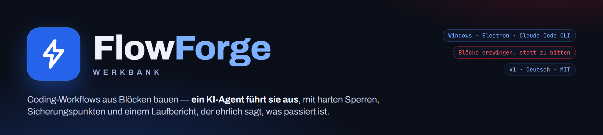
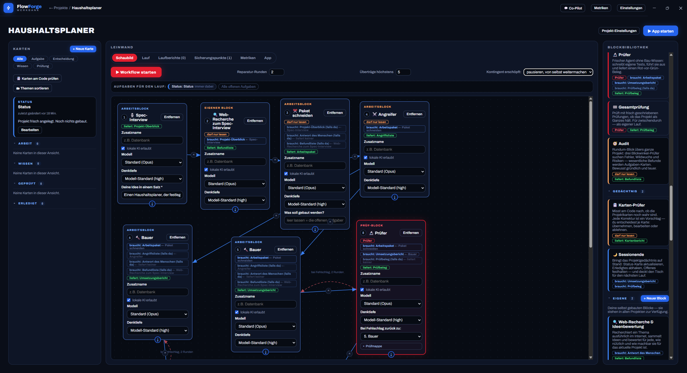
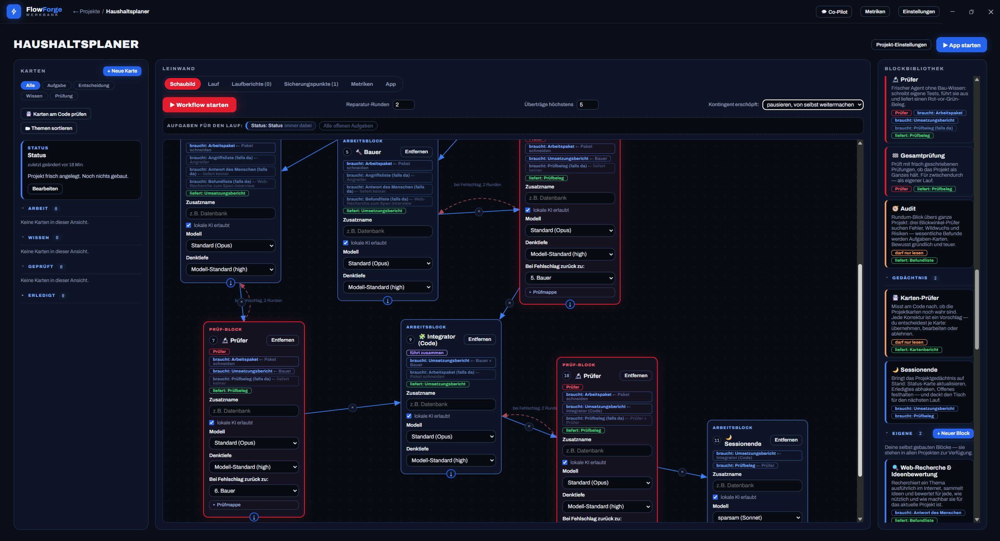
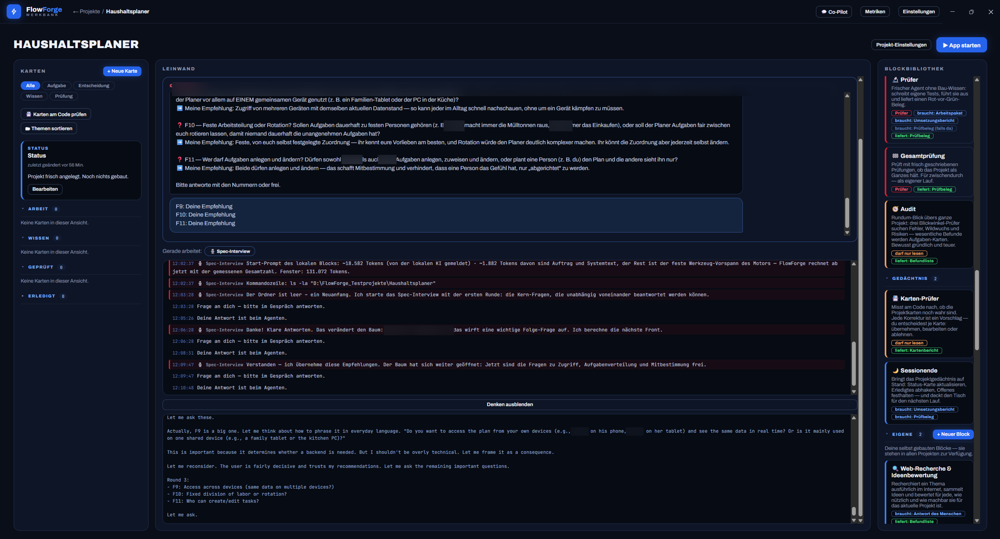
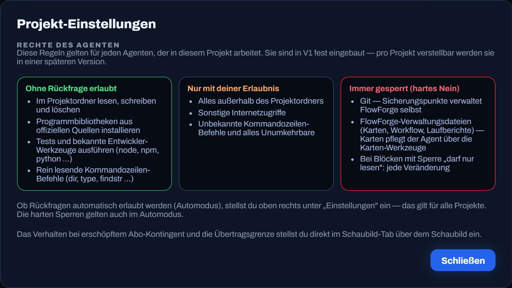
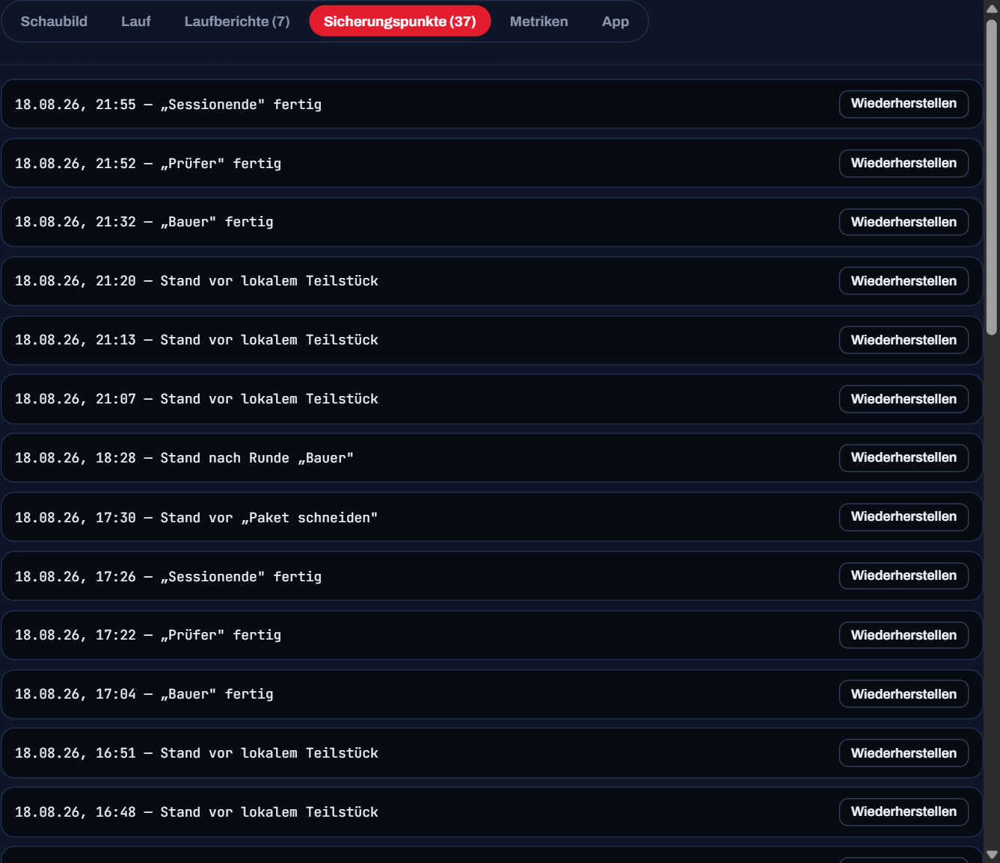
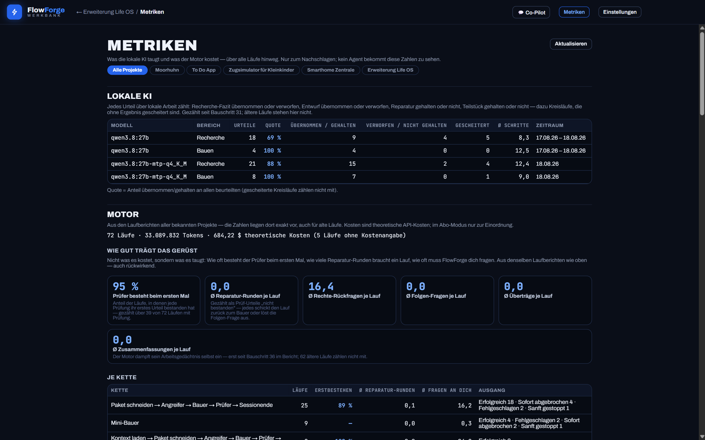
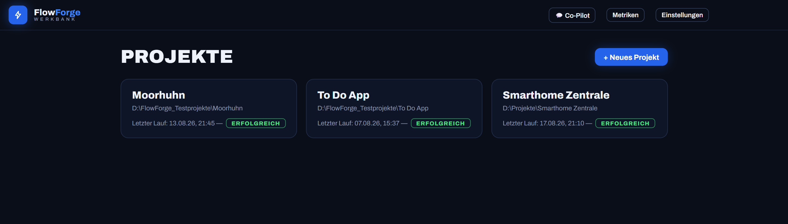
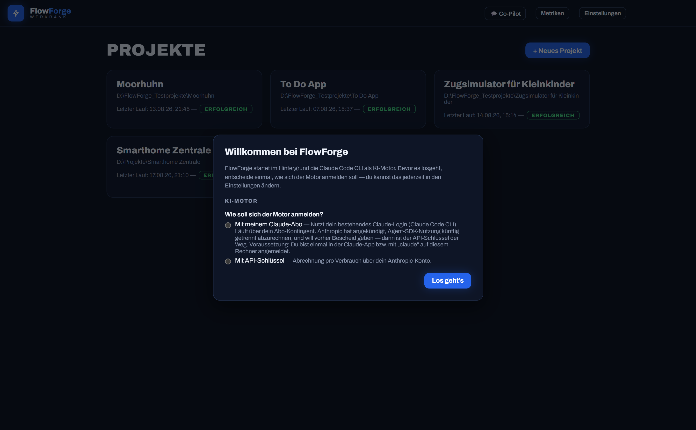

Eine Windows-Desktop-App, mit der Nicht-Programmierer per Drag & Drop
Coding-Workflows aus Blöcken bauen — Angreifer, Bauer, Prüfer, Sessionende … —
und ein KI-Agent führt sie aus: mit Sicherungspunkten, harten Sperren,
Rechte-Rückfragen und einem Laufbericht, der ehrlich sagt, was passiert ist.

Ich bin Georg, ich programmiere nicht. Den gesamten Code hat Claude geschrieben,
Schritt für Schritt nach [BAUPLAN.md](BAUPLAN.md); was die App heute tut, steht
in [SPEC.md](SPEC.md). Diese beiden Dateien sind die Dokumentation; dieses README
zeigt Bilder und verweist.

## So arbeitet FlowForge

Die Werkbank ist nicht der Arbeiter: FlowForge bekommt keine Tokens, entscheidet
aber alles, was zählt — Reihenfolge, Sperren, Sicherungspunkte, Reparatur-Runden.
Die KI ist die offizielle Claude Code CLI, über das Agent SDK im Hintergrund
gestartet; sie bekommt Block für Block genau einen Auftrag.

## Die Werkbank in Bildern

**Das Schaubild.** Block-Karten auf der Leinwand, Pfeile bestimmen die
Reihenfolge. An jeder Karte steht, was der Block **braucht** und **liefert**, und
woher es kommt („← Paket schneiden"); ein Prüfer ohne Arbeitspaket lässt sich gar
nicht erst starten. Je Karte wählst du außerdem **Modell** und **Denktiefe** —
vom sparsamen Sonnet bis zur lokalen KI auf deinem eigenen Rechner. Der rote
Prüf-Block schickt den Bauer bei Rot zurück („Fehlschlag, 2 Runden") — mechanisch,
ohne dass die KI darüber entscheidet.

Dieselbe Leinwand weitergescrollt: zwei Bauer laufen **parallel**, jeder mit
eigenem Prüfer; der **Integrator (Code)** führt ihre Teile zusammen und geht
selbst noch einmal durch einen Prüfer, bevor das **Sessionende** die Karten auf
Stand bringt.

**Ein Lauf, während er läuft.** Oben das **Gespräch**: Ein Block darf dich fragen,
wenn eine Entscheidung dir gehört — der Lauf hält an, bis du antwortest (hier
unscharf, es ging um private Haushaltsfragen). Darunter der **Liveticker**, der
jeden Schritt mitschreibt: gemessene Größe des Start-Prompts, jeder ausgeführte
Befehl, jede Frage. Ganz unten kannst du dem Agenten beim **Denken** zusehen.

**Rechte des Agenten.** Drei Stufen, die FlowForge je Werkzeugaufruf durchsetzt:
ohne Rückfrage · nur mit deiner Erlaubnis · immer gesperrt. Der Automodus betrifft
nur die mittlere Spalte — die harten Sperren gelten immer.

**Sicherungspunkte.** Vor dem Lauf und nach jedem schreibenden Block — technisch
Git, für dich eine Liste mit „Wiederherstellen" (mit Vorschau, selbst wieder
rückgängig). Aus zwei Punkten rechnet FlowForge den Diff, den die Reparatur-Runde
bekommt.

**Metriken.** Nicht was es kostet, sondern was es taugt: Prüfer besteht beim
ersten Mal, Reparatur-Runden je Lauf, Rückfragen je Lauf — und die Trefferquote
der lokalen KI. Kein Agent bekommt diese Zahlen zu sehen.

**Projektübersicht und erster Start.** Läuft etwas, liegt der Lauf als große
Kachel obenauf; beim allerersten Start fragt FlowForge, wie sich der Motor
anmelden soll (siehe unten).

## Die lokale KI: Opus an den Enden, dein Rechner in der Mitte

Seit Bauschritt 49–51 kann jeder Block auch von einer **lokalen KI über Ollama**
ausgeführt werden — auf demselben Rechner oder einem anderen im Heimnetz. Das
kostet kein Kontingent und keine Cent. Der Gedanke dahinter: Die teuren Modelle
stehen an den Enden der Kette (Paket schneiden, Prüfen, Abnahme), die lokale KI
arbeitet in der Mitte.

Damit das kein Vertrauensvorschuss bleibt, prüft FlowForge nach:

- **Lokaler Prüfer mit Abnahme.** Sagt eine lokale KI „bestanden", spielt
  FlowForge ihren Prüfbefehl selbst nach. Rot dreht das Urteil mechanisch um —
  ein „bestanden" gilt nie ungeprüft.
- **Der Lokal-Wächter.** Gemessen: Ollama schneidet oberhalb der Fensterkante
  still ab und meldet dann geschönte Zahlen, die eingebaute Verdichtung der CLI
  kann lokal also nie greifen. FlowForge schätzt den Füllstand deshalb selbst und
  löst die Übergabe rechtzeitig aus, statt den Block sterben zu lassen.
- **Speicher-Ehrlichkeit.** FlowForge fragt Ollamas Prozessliste, ob das Modell
  wirklich auf der Grafikkarte liegt — statt es aus der Modellgröße zu raten. Ein
  Lauf, der in den Arbeitsspeicher ausgelagert wird, kriecht sonst stundenlang.
- **Websuche für lokale Blöcke.** Zwei rein lesende Werkzeuge, wahlweise über eine
  eingebaute Quelle oder deine eigene SearXNG-Instanz. Harte Größendeckel, dein
  Rechner und dein Heimnetz gesperrt, jeder Zugriff im Liveticker.
- **Mehrere Rechner.** Eine Adress-Liste statt eines Feldes: je Adresse läuft ein
  lokaler Block, mit mehreren laufen sie parallel.

## Prüfungen, die nicht veralten

Nach jeder bestandenen Prüfung legt FlowForge eine **Prüfkarte** an und bewahrt
die Prüfdateien dahinter auf. Seit Bauschritt 52 spielt es sie **von selbst**
wieder ab — ohne KI, 0 Tokens —, direkt vor und nach jedem schreibenden Block.
Welche Prüfung dran ist, entscheidet eine Regel und kein Agent: Fasst das laufende
Paket eine Datei an, die diese Prüfung kennt, läuft sie; im Zweifel läuft sie.
Dazu laufen je Messpunkt zwei Karten reihum mit — die Gegenprobe gegen die
Blindheit eines Listenvergleichs. Das Ergebnis geht dem Prüfer in den Auftrag,
löst aber **keine** Reparatur-Runde aus: Zwischen zwei Bau-Runden darf Rot
legitim sein.

Was FlowForge **erzwingt**, statt darum zu bitten (die Lehre aus dem Vorgängerprojekt,
in dem Regeln nur als Text im Prompt standen):

| Regel | Wie sie gilt |
|---|---|
| „darf nur lesen" (Angreifer, Diagnose, Audit) | Schreib-Werkzeuge werden am Aufruf abgelehnt, nicht „bitte nicht" |
| braucht / liefert | Steck-Prüfung vor dem Start; Lieferungen gehen entlang der Pfeile |
| Ergebnis je Block | Lieferschein mit Pflichtfeldern — ein leeres Feld hält den Lauf an |
| Parallel schreiben | nur mit getrennten Dateilisten (Wirkbereich), Prüfer nie neben Bauer |
| Jeder Schritt rückholbar | Sicherungspunkt vor dem Lauf und nach jedem schreibenden Block |
| Kontext läuft über | bei ~85 % Füllstand der Lauf-Session Übergabe und frische Session, derselbe Block läuft weiter — automatisch |
| Lokales „bestanden" | wird mechanisch nachgespielt; rot dreht das Urteil um |
| Alte Prüfungen | laufen automatisch mit, ausgewählt per Dateivergleich — kein Agent schätzt, was betroffen ist |
| Prüfmappe `pruefung/` | gehört den Prüf-Blöcken; jeder Prüfer nur sein eigener Ordner — auch für Befehle, die dorthin schreiben |

## Was es ist — und was nicht

- **Ist:** ein Ein-Personen-Projekt, das ich für mich gebaut habe und benutze.
  Windows 11. Der KI-Motor ist die offizielle Claude Code CLI, über das Claude
  Agent SDK gebündelt und im Hintergrund gestartet. Optional übernimmt eine
  lokale KI über Ollama einzelne Blöcke ganz (siehe oben).
- **Ist nicht:** ein Produkt. Kein Support, keine Roadmap für andere, keine
  Beiträge erwartet (Issues und Pull Requests werden vermutlich nicht bearbeitet).
  Kein macOS, kein Linux.

### Warum alles auf Deutsch ist

V1 ist **bewusst deutsch** — Oberfläche, Blocknamen, Aufträge an die Agenten,
SPEC, BAUPLAN, Variablennamen, Kommentare. Der einzige Nutzer von V1 bin ich, und
ich denke auf Deutsch; jedes Wort, das ich erst übersetzen müsste, ist eine Hürde
mehr zwischen mir und dem, was der Agent gerade tut. Alle sichtbaren Texte liegen
zentral in `src/shared/texte.js`, damit eine englische Oberfläche in V2 kein Umbau
ist — aber sie ist nicht versprochen.

### Ehrlich zum Code

Der Code ist **gewachsen, nicht entworfen** — eher Spaghetti als Architektur.
`src/main/lauf.js` hat fast 7.000 Zeilen, der Motor-Adapter 3.300, die Texte
4.900; es gibt keine saubere Schichtung, vieles hängt an langen Funktionen mit
vielen Sonderfällen, die jeweils eine Lehre aus einem echten Lauf sind. Was ihn
zusammenhält: Jeder Bauschritt beginnt mit einer Angriffsliste (woran könnte genau
das scheitern?) und endet mit Prüfer-Agenten, die das Verhalten nachmessen statt
den Code zu lesen; `npm test` fährt über 1.500 Regel-Prüfungen in `pruefungen/`.
Das ist der Schutz, nicht die Struktur. Wer den Code lesen will: entlang der
SPEC-Paragraphen und der Prüfdateien, nicht entlang der Ordner. Ein Aufräumen
steht nicht im Bauplan — die fachlichen Schritte gehen vor.

## Starten

1. Installer aus den [Releases](../../releases) laden (`FlowForge-Setup-<Version>.exe`)
   und ausführen — ein Klick, kein Assistent.
2. Beim ersten Start fragt FlowForge, wie sich der Motor anmelden soll
   (siehe unten). Danach: neues Projekt anlegen, Ordner wählen, Blöcke aufs
   Schaubild ziehen, Lauf starten.

Aus dem Quellcode: `npm install`, `npm run dev` (Entwicklung) bzw.
`npm run installer` (Setup-Datei nach `dist/`). `npm test` fährt die
Regel-Prüfungen in `pruefungen/`. Die Bilder in `docs/bilder/` sind Screenshots
der App; Banner und Überblick rendert `npm run schaubilder` aus
`tools/schaubilder/` mit den Schriften und Farben der App.

## Abo oder API-Schlüssel

FlowForge kann den Motor auf zwei Wegen anmelden: mit deinem **Claude-Abo**
(dein bestehendes Claude-Code-Login, läuft über dein Abo-Kontingent) oder mit
einem **API-Schlüssel** (Abrechnung pro Verbrauch, mit Ausgaben-Obergrenze je
Lauf). Beim ersten Start wählst du selbst; in den Einstellungen kannst du wechseln.

Ehrlich gesagt, wie es mit dem Abo steht (Stand 19.08.2026):

- Anthropics Legal-Doku sagt, das Unternehmen erlaube Drittanbietern nicht,
  claude.ai-Login in ihren Apps anzubieten — ausdrücklich „including agents built
  on the Claude Agent SDK" ([code.claude.com/docs/en/legal-and-compliance](https://code.claude.com/docs/en/legal-and-compliance)).
- Chronologie 2026: Im Januar/Februar sperrte Anthropic Abo-Token, die außerhalb
  der Claude-CLI direkt gegen die API liefen; am 4. April flogen Drittanbieter-
  Harnesses wie OpenClaw aus dem Abo; im Mai kündigte Anthropic ein separates
  SDK-Guthaben an — auch für „third-party apps that authenticate with your
  Claude subscription through the Agent SDK".
- Am **15. Juni 2026** pausierte Anthropic das und schrieb im Hilfeartikel
  „Use the Claude Agent SDK with your Claude plan" ([support.claude.com](https://support.claude.com)):
  „For now, nothing has changed: Claude Agent SDK, `claude -p`, and third-party
  app usage still draw from your subscription's usage limits. […] When we have an
  update, we'll share it before anything takes effect."

FlowForge startet die offizielle CLI über das Agent SDK — genau dieser Weg. Das
Restrisiko ist ein Abrechnungs-, kein Verbotsrisiko: Anthropic will die
SDK-Nutzung irgendwann getrennt abrechnen und vorher Bescheid geben — dann ist der
API-Schlüssel der Weg. „Läuft" ist nicht „ist erlaubt"; hier sagt aber der Anbieter
selbst, dass es läuft und bis auf Weiteres so bleibt. Ich verstecke den Abo-Modus
deshalb nicht hinter einem Schalter — ein `false` im Code wäre ein Schild, kein
Schloss. Wer FlowForge nutzt, entscheidet selbst und sieht den Hinweis dazu in der App.

## Lizenz

[MIT](LICENSE). Bewusst so gewählt: Eine Nicht-Kommerziell-Lizenz wäre für mich
kaum durchsetzbar, und das Konzept ist mit KI ohnehin in Tagen nachbaubar. Was
bleibt, sind die Entscheidungen, die Prüfungen und die Person dahinter.

## Unterstützen

Wenn dir FlowForge etwas bringt: Kaffeegeld über den „Sponsor"-Knopf oben auf der
Repo-Seite oder direkt über [github.com/sponsors/georgwinter89-cloud](https://github.com/sponsors/georgwinter89-cloud). Ehrliche
Erwartung: keine Einnahmequelle — ein Signal, dass hier ein Mensch dahintersteht.
