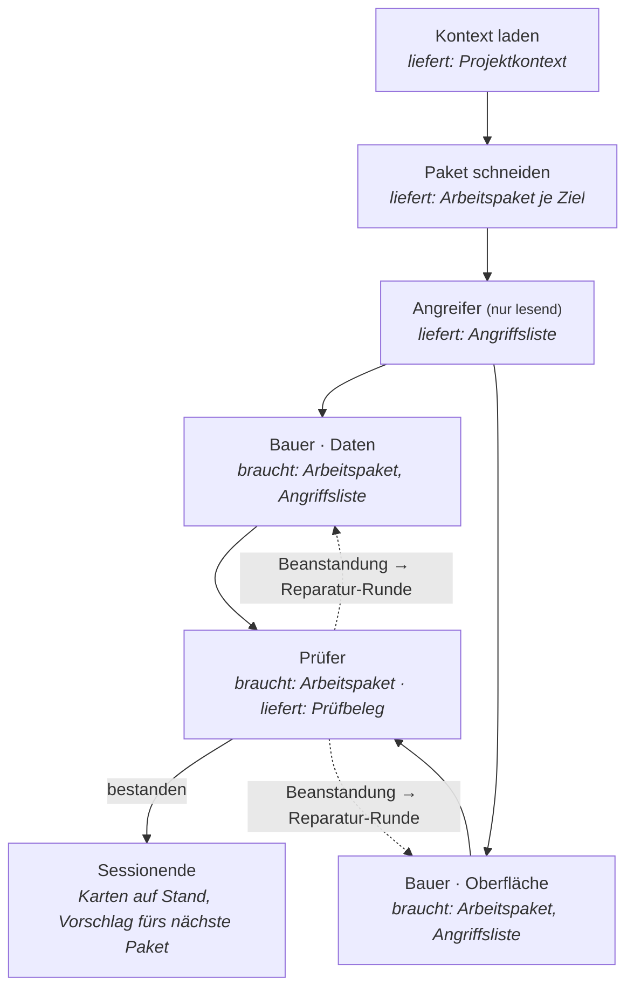
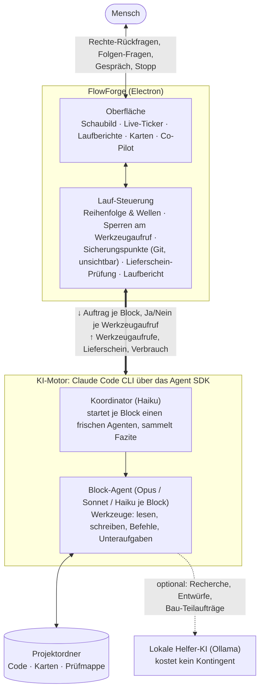
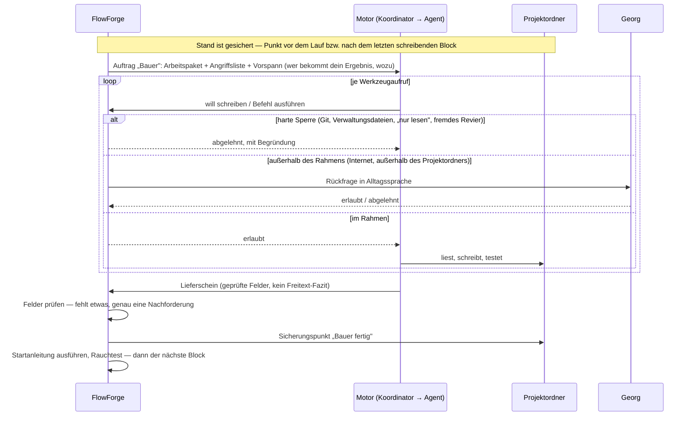

# FlowForge

Eine Windows-Desktop-App, mit der Nicht-Programmierer per Drag & Drop
Coding-Workflows aus Blöcken bauen — Angreifer, Bauer, Prüfer, Sessionende … —
und ein KI-Agent führt sie aus: mit Sicherungspunkten, harten Sperren,
Rechte-Rückfragen und einem Laufbericht, der ehrlich sagt, was passiert ist.

Ich bin Georg, ich programmiere nicht. Den gesamten Code hat Claude geschrieben,
Schritt für Schritt nach [BAUPLAN.md](BAUPLAN.md); was die App heute tut, steht
in [SPEC.md](SPEC.md) — dort ganz oben auch die Schaubilder zum ganzen System.
Diese beiden Dateien sind die Dokumentation; dieses README verweist nur.

## Die Idee in einem Bild

Man legt Block-Karten auf ein Schaubild und zieht Pfeile. Jeder Block ist ein
Arbeitsauftrag für einen frischen KI-Agenten; was er **braucht** und was er
**liefert**, ist an der Karte sichtbar und wird beim Stecken geprüft — ein
Prüfer ohne Arbeitspaket lässt sich gar nicht erst starten.

Zwei Bauer mit getrennten Dateilisten arbeiten gleichzeitig (eine „Welle"); ein
Prüfer urteilt nie über einen halben Stand. Schlägt er fehl, schickt FlowForge
den Bauer mit den Beanstandungen zurück — mechanisch, ohne dass die KI darüber
entscheidet.

## Wie es unter der Haube läuft

FlowForge ist die Werkbank, nicht der Arbeiter. Die KI kommt aus der offiziellen
Claude Code CLI, die FlowForge über das Claude Agent SDK im Hintergrund startet.
FlowForge behält Reihenfolge, Sperren, Sicherungspunkte und Prüfer-Urteile
selbst in der Hand; der Agent bekommt Block für Block genau einen Auftrag.

Und so sieht ein einzelner Block im Lauf aus — das Wichtige ist, **wer entscheidet**:

Was FlowForge **erzwingt**, statt darum zu bitten (die Lehre aus dem Vorgängerprojekt,
in dem Regeln nur als Text im Prompt standen):

| Regel | Wie sie gilt |
|---|---|
| „darf nur lesen" (Angreifer, Diagnose, Audit) | Schreib-Werkzeuge werden am Aufruf abgelehnt, nicht „bitte nicht" |
| braucht / liefert | Steck-Prüfung vor dem Start; Lieferungen gehen entlang der Pfeile |
| Ergebnis je Block | Lieferschein mit Pflichtfeldern — ein leeres Feld hält den Lauf an |
| Parallel schreiben | nur mit getrennten Dateilisten (Wirkbereich), Prüfer nie neben Bauer |
| Jeder Schritt rückholbar | Sicherungspunkt vor dem Lauf und nach jedem schreibenden Block |
| Kontext läuft über | bei ~85 % Füllstand der Lauf-Session Übergabe und frische Session, derselbe Block läuft weiter — automatisch |

## Was es ist — und was nicht

- **Ist:** ein Ein-Personen-Projekt, das ich für mich gebaut habe und benutze.
  Windows 11. Der KI-Motor ist die offizielle Claude Code CLI, über das Claude
  Agent SDK gebündelt und im Hintergrund gestartet. Optional hilft eine lokale KI
  über Ollama mit.
- **Ist nicht:** ein Produkt. Kein Support, keine Roadmap für andere, keine
  Beiträge erwartet (Issues und Pull Requests werden vermutlich nicht bearbeitet).
  Kein macOS, kein Linux.

### Warum alles auf Deutsch ist

V1 ist **bewusst deutsch** — Oberfläche, Blocknamen, Aufträge an die Agenten,
SPEC, BAUPLAN, Variablennamen, Kommentare. Der einzige Nutzer von V1 bin ich, und
ich denke auf Deutsch; jedes Wort, das ich erst übersetzen müsste, ist eine Hürde
mehr zwischen mir und dem, was der Agent gerade tut. Alle sichtbaren Texte liegen
zentral in `src/shared/texte.js`, damit eine englische Oberfläche in V2 kein Umbau
ist — aber sie ist nicht versprochen.

### Ehrlich zum Code

Der Code ist **gewachsen, nicht entworfen** — eher Spaghetti als Architektur.
`src/main/lauf.js` hat über 5.000 Zeilen, der Motor-Adapter 2.400, die Texte
3.300; es gibt keine saubere Schichtung, vieles hängt an langen Funktionen mit
vielen Sonderfällen, die jeweils eine Lehre aus einem echten Lauf sind. Was ihn
zusammenhält: Jeder Bauschritt beginnt mit einer Angriffsliste (woran könnte genau
das scheitern?) und endet mit Prüfer-Agenten, die das Verhalten nachmessen statt
den Code zu lesen; `npm test` fährt über 700 Regel-Prüfungen in `pruefungen/`.
Das ist der Schutz, nicht die Struktur. Wer den Code lesen will: entlang der
SPEC-Paragraphen und der Prüfdateien, nicht entlang der Ordner. Ein Aufräumen
steht nicht im Bauplan — die fachlichen Schritte gehen vor.

## Starten

1. Installer aus den [Releases](../../releases) laden (`FlowForge-Setup-<Version>.exe`)
   und ausführen — ein Klick, kein Assistent.
2. Beim ersten Start fragt FlowForge, wie sich der Motor anmelden soll
   (siehe unten). Danach: neues Projekt anlegen, Ordner wählen, Blöcke aufs
   Schaubild ziehen, Lauf starten.

Aus dem Quellcode: `npm install`, `npm run dev` (Entwicklung) bzw.
`npm run installer` (Setup-Datei nach `dist/`). `npm test` fährt die
Regel-Prüfungen in `pruefungen/`.

## Abo oder API-Schlüssel

FlowForge kann den Motor auf zwei Wegen anmelden: mit deinem **Claude-Abo**
(dein bestehendes Claude-Code-Login, läuft über dein Abo-Kontingent) oder mit
einem **API-Schlüssel** (Abrechnung pro Verbrauch, mit Ausgaben-Obergrenze je
Lauf). Beim ersten Start wählst du selbst; in den Einstellungen kannst du wechseln.

Ehrlich gesagt, wie es mit dem Abo steht (Stand 19.08.2026):

- Anthropics Legal-Doku sagt, das Unternehmen erlaube Drittanbietern nicht,
  claude.ai-Login in ihren Apps anzubieten — ausdrücklich „including agents built
  on the Claude Agent SDK" ([code.claude.com/docs/en/legal-and-compliance](https://code.claude.com/docs/en/legal-and-compliance)).
- Chronologie 2026: Im Januar/Februar sperrte Anthropic Abo-Token, die außerhalb
  der Claude-CLI direkt gegen die API liefen; am 4. April flogen Drittanbieter-
  Harnesses wie OpenClaw aus dem Abo; im Mai kündigte Anthropic ein separates
  SDK-Guthaben an — auch für „third-party apps that authenticate with your
  Claude subscription through the Agent SDK".
- Am **15. Juni 2026** pausierte Anthropic das und schrieb im Hilfeartikel
  „Use the Claude Agent SDK with your Claude plan" ([support.claude.com](https://support.claude.com)):
  „For now, nothing has changed: Claude Agent SDK, `claude -p`, and third-party
  app usage still draw from your subscription's usage limits. […] When we have an
  update, we'll share it before anything takes effect."

FlowForge startet die offizielle CLI über das Agent SDK — genau dieser Weg. Das
Restrisiko ist ein Abrechnungs-, kein Verbotsrisiko: Anthropic will die
SDK-Nutzung irgendwann getrennt abrechnen und vorher Bescheid geben — dann ist der
API-Schlüssel der Weg. „Läuft" ist nicht „ist erlaubt"; hier sagt aber der Anbieter
selbst, dass es läuft und bis auf Weiteres so bleibt. Ich verstecke den Abo-Modus
deshalb nicht hinter einem Schalter — ein `false` im Code wäre ein Schild, kein
Schloss. Wer FlowForge nutzt, entscheidet selbst und sieht den Hinweis dazu in der App.

## Lizenz

[MIT](LICENSE). Bewusst so gewählt: Eine Nicht-Kommerziell-Lizenz wäre für mich
kaum durchsetzbar, und das Konzept ist mit KI ohnehin in Tagen nachbaubar. Was
bleibt, sind die Entscheidungen, die Prüfungen und die Person dahinter.

## Unterstützen

Wenn dir FlowForge etwas bringt: Kaffeegeld über den „Sponsor"-Knopf oben auf der
Repo-Seite oder direkt über [github.com/sponsors/georgwinter89-cloud](https://github.com/sponsors/georgwinter89-cloud). Ehrliche
Erwartung: keine Einnahmequelle — ein Signal, dass hier ein Mensch dahintersteht.
