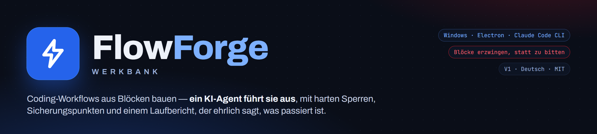
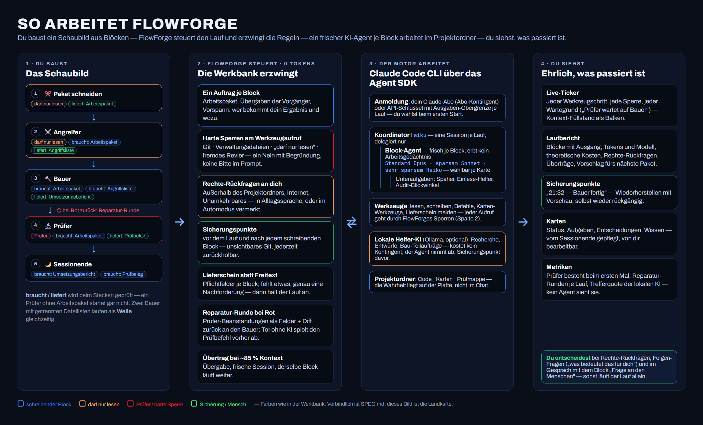
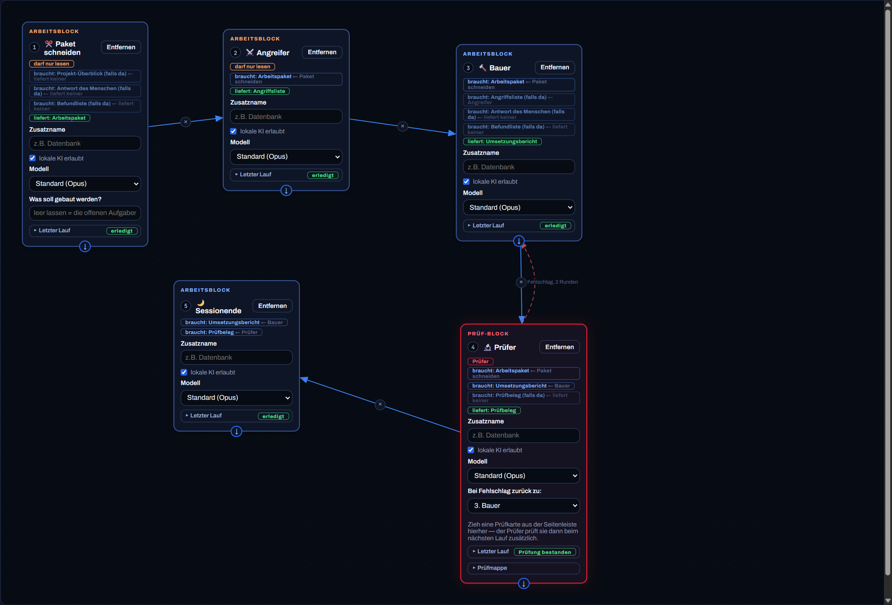
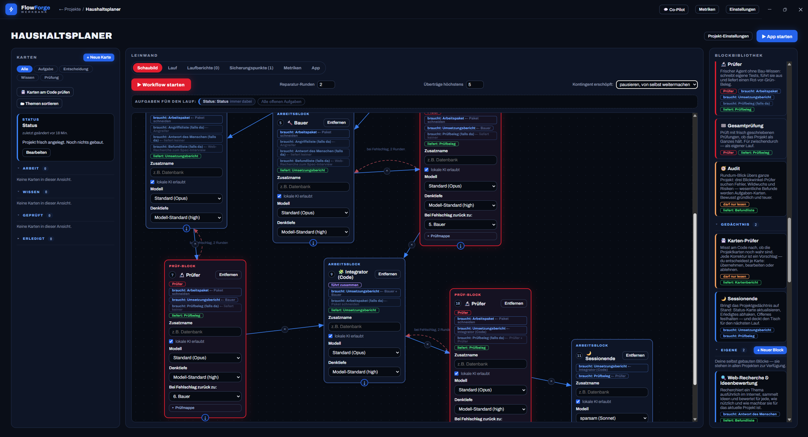
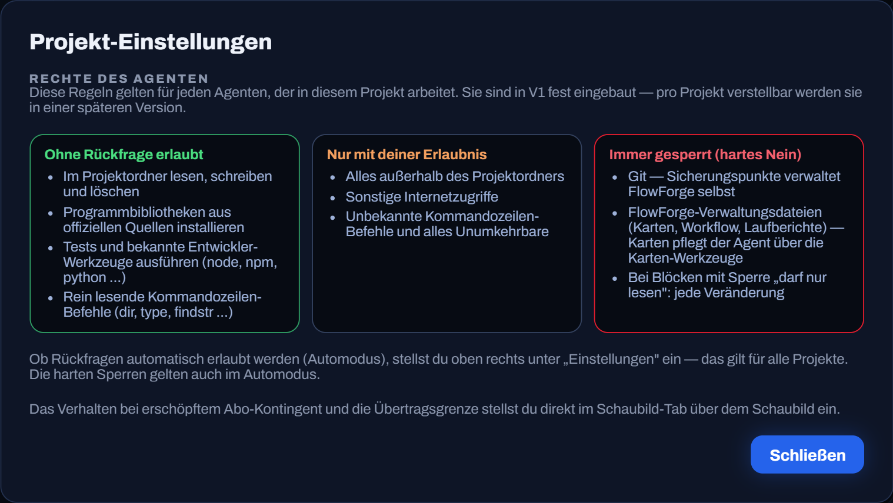
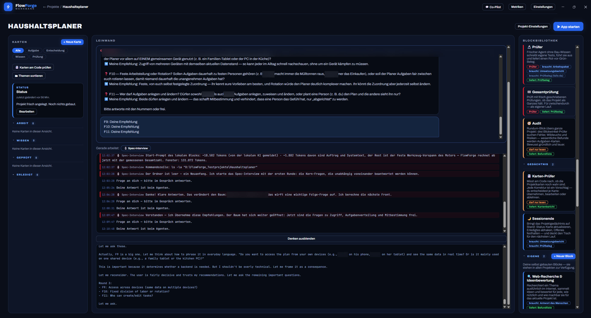
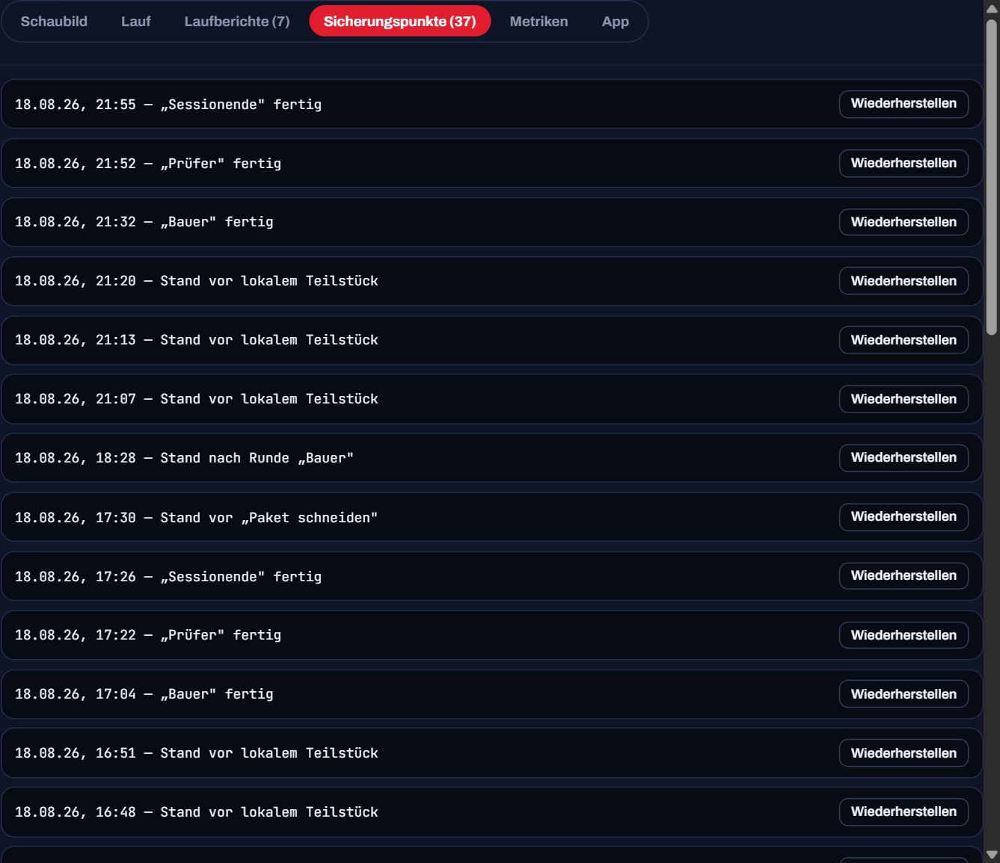
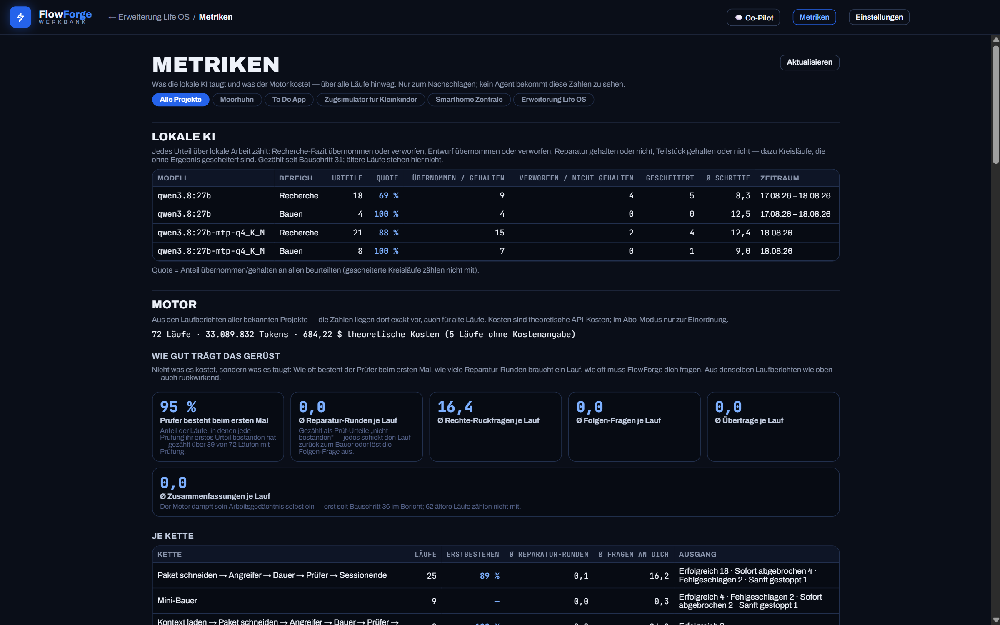
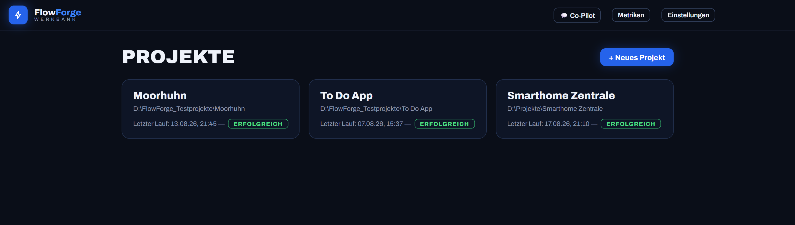
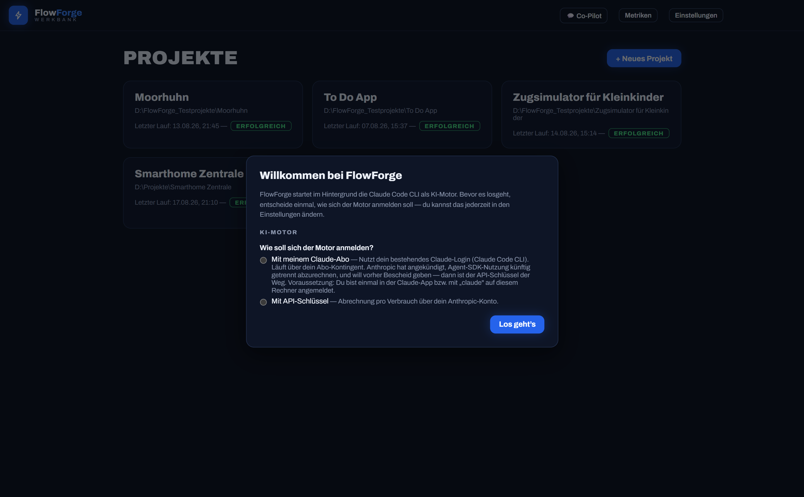

<p align="center"></p>

FlowForge ist eine Windows-Desktop-App (Electron), in der man Coding-Workflows
als Kette von Blöcken zusammensteckt: Paket schneiden, Angreifer, Bauer, Prüfer,
Sessionende. Die App startet dafür die offizielle Claude Code CLI über das Claude
Agent SDK und gibt ihr Block für Block genau einen Auftrag. Reihenfolge, Rechte,
Sicherungspunkte und Reparatur-Runden setzt FlowForge selbst durch, nicht der Agent.

Ich bin Georg und programmiere nicht. Den gesamten Code hat Claude geschrieben,
in nummerierten Bauschritten nach [BAUPLAN.md](BAUPLAN.md). Was die App heute
tut, steht vollständig in [SPEC.md](SPEC.md). Dieses README ist die technische
Kurzfassung.

| | |
|---|---|
| Plattform | Windows 11, Electron 43, React 19, electron-vite, Node 24 |
| KI-Motor | Claude Code CLI, gestartet über `@anthropic-ai/claude-agent-sdk` |
| Modelle je Block | Fable 5 · Opus · Sonnet · Haiku · OpenRouter (beliebiges Modell) · Ollama (lokal) |
| Anmeldung | Claude-Abo (bestehendes CLI-Login) oder API-Schlüssel |
| Sicherungspunkte | Git im Projektordner, über isomorphic-git |
| Tests | `npm test`, 102 Dateien, 2.058 Regel-Prüfungen (vitest) |
| Sprache | Oberfläche, Code, Kommentare und Doku auf Deutsch |
| Lizenz | MIT |

## So läuft ein Workflow ab



1. **Schaubild.** Blöcke liegen als Karten auf der Leinwand, Pfeile geben die
   Reihenfolge vor. Jede Karte trägt Modellklasse, Denktiefe, optional einen
   Zusatznamen und ein Rückführungsziel (Prüfer schickt bei Rot zum Bauer zurück).
   Gespeichert wird das als `workflow.json` im Projektordner.
2. **Steck-Prüfung.** Jeder Block deklariert, was er braucht und was er liefert
   (Arbeitspaket, Angriffsliste, Prüfergebnis, Diff). Fehlt einem Block seine
   Eingabe, startet der Lauf nicht. Lieferungen wandern entlang der Pfeile.
3. **Lauf-Session.** Der Hauptprozess startet eine Claude-Code-Session als
   Koordinator (immer Haiku). Jeder Block läuft darin als eigener Subagent mit dem
   Modell seiner Karte. Der Koordinator sieht nur Aufträge und Fazite, deshalb
   wächst sein Kontext langsam.
4. **Durchsetzung per Hook.** Ein `PreToolUse`-Hook prüft jeden Werkzeugaufruf des
   Agenten gegen die Rechte des Projekts: erlaubt, Rückfrage an den Menschen oder
   hartes Nein. Ein rein lesender Block (Angreifer, Diagnose, Audit) bekommt
   Schreibwerkzeuge abgelehnt, nicht per Bitte im Prompt.
5. **Lieferschein.** Jeder Block beendet sich über ein eigenes MCP-Werkzeug mit
   einem Ergebnis, das gegen ein Zod-Schema mit Pflichtfeldern geprüft wird. Ein
   leeres Feld hält den Lauf an.
6. **Sicherungspunkt.** Vor dem Lauf und nach jedem schreibenden Block legt
   FlowForge einen Git-Commit im Projekt an. Aus zwei Punkten entsteht der Diff,
   den ein Prüfer oder eine Reparatur-Runde bekommt.
7. **Übertrag bei vollem Kontext.** FlowForge misst den Füllstand der
   Lauf-Session aus den Token-Meldungen des Motors. Bei etwa 85 % schreibt der
   Koordinator eine Übergabe, und derselbe Block läuft in einer frischen Session
   weiter.
8. **Sessionende und Laufbericht.** Der letzte Block bringt die Projektkarten auf
   Stand und schlägt das nächste Paket vor. Der Laufbericht liegt als Datei unter
   `laufberichte/` im Projekt und nennt je Block Modell, Denktiefe, Tokens, Kosten
   und alle Rückfragen.

## Blöcke

| Block | Rechte | Aufgabe |
|---|---|---|
| Spec-Interview | schreibt Karten | Befragt den Nutzer über das Gespräch und legt erste Aufgaben-Karten an |
| Paket schneiden | schreibt Karten | Schneidet aus Wunsch oder offenen Karten ein Arbeitspaket mit Dateiliste und Fertig-Kriterien |
| Angreifer | nur lesend | Sucht vor dem Bauen, woran das Paket scheitern könnte; darf Testbefehle ausführen |
| Diagnose | nur lesend | Belegt die Ursache eines Fehlers mit Fundort, bevor etwas angefasst wird |
| Bauer | schreibt Code | Setzt genau das Paket um, begrenzt auf dessen Dateiliste (Wirkbereich) |
| Integrator (Code) | schreibt Code | Führt parallel gebaute Teile zusammen |
| Integrator (Recherche) | nur lesend | Führt Rechercheergebnisse zusammen |
| Prüfer | schreibt nur in `pruefung/` | Prüft das Paket gegen seine Fertig-Kriterien, hinterlässt einen Prüfbefehl |
| Gesamtprüfung | schreibt nur in `pruefung/` | Prüft das ganze Projekt statt eines Pakets |
| Audit | nur lesend | Drei Blickwinkel als Unteraufgaben, legt bei Befund Karten an |
| Karten-Prüfer | nur lesend | Vergleicht Karten mit dem Code und schlägt Korrekturen vor |
| Frage an den Menschen | nur lesend | Stellt eine Folgen-Frage mit Optionen, der Lauf wartet |
| Sessionende | schreibt Karten | Aktualisiert Karten, schreibt den Bericht, schlägt das nächste Paket vor |
| Zusatzbauer | schreibt Code | Wird automatisch angelegt, wenn Angreifer oder Prüfer Funde außerhalb der Dateiliste melden |

Eigene Blöcke lassen sich im Block-Editor anlegen, wahlweise mit KI-Assistent.
Vorlagen: „Neue App starten", „Feature hinzufügen", „Bug jagen",
„Feature hinzufügen · lokal".

Blöcke arbeiten parallel, wenn ihre Dateilisten disjunkt sind. FlowForge weist
überlappende Zuschnitte beim Paketschneiden ab. Ein Prüfer läuft nie neben einem
Bauer.




## Was FlowForge erzwingt

| Regel | Mechanismus |
|---|---|
| Nur lesen | Schreibwerkzeuge werden im Hook abgelehnt |
| braucht / liefert | Steck-Prüfung vor dem Start, Lieferungen entlang der Pfeile |
| Ergebnis je Block | Lieferschein mit Zod-Schema, Pflichtfelder |
| Parallel schreiben | nur mit disjunkten Dateilisten |
| Verwaltungsdateien | `projekt.json`, `karten.json`, `workflow.json`, `laufberichte/` und weitere sind für den Agenten gesperrt, Karten ändert er nur über Werkzeuge |
| Prüfmappe | jeder Prüfer schreibt nur in seinen eigenen Ordner unter `pruefung/` |
| Prüfbefehl | Pflicht-Artefakt des Prüfers; FlowForge spielt ihn nach einem „bestanden" selbst nach, Rot dreht das Urteil um |
| Alte Prüfungen | Prüfkarten laufen vor und nach jedem schreibenden Block automatisch mit, ausgewählt per Dateivergleich, ohne KI |
| Kontext | Übertrag bei ~85 % Füllstand, lokal bei 80 % geschätzt |
| Kein stiller Rückfall | Ist Ollama oder OpenRouter nicht erreichbar, startet der Lauf nicht, statt still auf Claude zu laufen |
| Eigenpflege | Ein Deckel begrenzt, wie oft ein Serienlauf nur an seinen eigenen Karten arbeitet statt am Projektziel |

<p align="center"></p>

## Modelle und Anbieter

**Claude.** Sechs Modellklassen je Karte. Standard ist fest Opus, damit Läufe über
Monate vergleichbar bleiben. Denktiefe (low bis max) ist ein Feld der
Agent-Definition; FlowForge definiert je Stufe einen Subagent-Typ und liest beim
ersten Werkzeugaufruf zurück, welche Stufe wirklich gilt. Der Koordinator läuft
immer auf Haiku, Unteraufgaben standardmäßig auf Sonnet.

**Ollama.** Ein lokaler Block läuft in einer zweiten CLI-Instanz mit
`ANTHROPIC_BASE_URL` auf Ollamas Anthropic-Schnittstelle. Davor sitzt eine
Zählstelle im Hauptprozess, die jede Anfrage mitmisst. Vor dem Lauf legt FlowForge
per Ollama-API ein abgeleitetes Modell `flowforge-<basis>` mit Kontextfenster und
Sampling-Werten an. Gemessene Eigenheiten, die FlowForge abfängt:

- Ollama kappt Prompts oberhalb des Fensters still und meldet danach falsche
  Token-Zahlen. FlowForge schätzt den Füllstand selbst und übergibt bei 80 %.
- Passt das Fenster nicht in den Grafikspeicher, lagert Ollama in den RAM aus.
  FlowForge fragt `/api/ps` ab und warnt, wenn das Modell unter 99 % im VRAM liegt.
- Die Werkzeug-Schicht der CLI bricht nach Stille ab, nicht nach Dauer.
  `API_TIMEOUT_MS` ist einstellbar, Standard 30 Minuten.
- Mehrere Ollama-Adressen bilden einen Pool: ein lokaler Block je Adresse.
- Ein lokaler Prüfer bekommt einen Claude-Prüfer als Abnahme dahinter.

**OpenRouter.** Ein eingebauter Übersetzer im Hauptprozess (127.0.0.1, freier
Port, je Motor frisch) dolmetscht Anthropic `/v1/messages` nach OpenAI
`/chat/completions` und zurück, inklusive Werkzeugdefinitionen, Streaming und
Token-Zählung. Der OpenRouter-Schlüssel bleibt im Hauptprozess und geht nie in die
Umgebung des Kindprozesses. Kosten kommen gemessen aus `usage.cost` des Anbieters,
nicht aus einer Preisliste, und werden getrennt von Abo und API ausgewiesen.

**Websuche für Fremdmodelle.** WebSearch und WebFetch der CLI laufen über
Anthropics Server und stehen Ollama und OpenRouter nicht zur Verfügung. FlowForge
gibt diesen Motoren zwei eigene, rein lesende Werkzeuge (`web_suche`,
`webseite_lesen`) mit Größendeckel, wahlweise über eine eingebaute Quelle oder eine
eigene SearXNG-Instanz. Eigener Rechner und Heimnetz sind gesperrt.

## Werkbank



Oben das Gespräch, in dem ein Block Rückfragen stellt; der Lauf wartet auf die
Antwort. Darunter der Liveticker mit jedem Werkzeugaufruf, jeder Rückfrage und der
gemessenen Größe des Start-Prompts. Ganz unten das Denken des Agenten.

<p align="center"></p>

Sicherungspunkte sind Git-Commits mit Vorschau und Wiederherstellen. Die
Wiederherstellung ist selbst ein Sicherungspunkt.



Metriken je Kette: Prüfer besteht beim ersten Mal, Reparatur-Runden je Lauf,
Rückfragen je Lauf, Trefferquote der lokalen KI, Urteil lokal gegen Abnahme.
Kein Agent sieht diese Seite. Die Werkstatt zeigt daneben live, welche
Ollama-Adressen erreichbar sind, welches Modell geladen ist und zu welchem Anteil
im VRAM, sowie den Übersetzer-Verkehr der OpenRouter-Blöcke.



**Serienlauf.** Mehrere Runden hintereinander; der Vorschlag des Sessionendes
steuert die nächste Runde. Ein Serienstart verlangt ein gesetztes Projektziel
(eine feste Karte je Projekt), gegen das jeder Bericht den Stand nennt.

## Dateien

Im Projektordner:

```
projekt.json          Projektname, Rechte, Einstellungen
karten.json           Projektkarten (Status, Aufgaben, Entscheidungen, Projektziel)
workflow.json         Schaubild: Blöcke, Pfeile, Modell und Denktiefe je Karte
laufstand.json        Zustand eines laufenden oder unterbrochenen Laufs
naechster-lauf.json   Vorschlag des Sessionendes für das nächste Paket
chat.json             Verlauf des Co-Piloten
pruefbefehl.json      Prüfbefehl des Tors
laufberichte/         ein Bericht je Lauf
pruefung/             Prüfmappe, ein Unterordner je Prüf-Instanz
```

Im Datenordner `%APPDATA%\flowforge`:

```
einstellungen.json    Motor-Modus, API-Schlüssel, Ollama-Adressen, OpenRouter, Websuche
projekte.json         Liste der bekannten Projekte
metriken/             eine Datei je Lauf, Anhänge-Format für die lokale KI
```

Der Datenordner ist für die Werkzeuge des Agenten hart gesperrt.

## Quellcode

```
src/main/               Hauptprozess (Electron)
  lauf.js               Ablaufsteuerung eines Laufs, 9.000 Zeilen
  sicherungspunkte.js   Git-Sicherungspunkte über isomorphic-git
  pruefkarten*.js       Prüfkarten anlegen, auswählen, abspielen
  werkstatt.js          Zustand der Ollama-Rechner und Übersetzer-Verkehr
  motor/
    claudeCodeMotor.js  Adapter zum Agent SDK: Sessions, Hooks, Subagents, 3.900 Zeilen
    uebersetzer.js      Anthropic-nach-OpenAI-Übersetzer für OpenRouter
    zaehlstelle.js      Weiterleiter mit Token-Messung für Ollama
    lokalesModell.js    abgeleitetes Ollama-Modell anlegen
    websuche.js         web_suche und webseite_lesen
    *Werkzeuge.js       MCP-Werkzeuge: Lieferschein, Karten, Mensch, Prüfbefehl, Start
src/renderer/src/       Oberfläche (React)
  Leinwand.jsx          Schaubild mit Karten und Pfeilen, 3.000 Zeilen
  Einstellungen.jsx, BlockEditor.jsx, Metriken.jsx, Werkstatt.jsx, Chat.jsx
src/shared/             Regeln ohne Electron-Abhängigkeit, von Main und Renderer genutzt
  blockKatalog.js       Blockbibliothek mit Voreinstellungen
  kettenRegeln.js       Steck-Prüfung braucht/liefert, Parallelität
  lieferschein.js       Zod-Schemata der Blockergebnisse
  texte.js              alle sichtbaren Texte, 5.700 Zeilen
pruefungen/             102 vitest-Dateien
tools/schaubilder/      rendert Banner und Überblicksbild per Electron
```

Der Code ist gewachsen, nicht entworfen. Es gibt keine saubere Schichtung, dafür
lange Funktionen mit vielen Sonderfällen, die jeweils aus einem echten Lauf
stammen. Jeder Bauschritt beginnt mit einer Angriffsliste (woran könnte genau das
scheitern) und endet mit Prüfer-Agenten, die das Verhalten ausführen statt den
Code zu lesen. Wer den Code lesen will, kommt über die SPEC-Paragraphen und die
Prüfdateien weiter als über die Ordner.

## Installieren und bauen

Installer aus den [Releases](../../releases) laden (`FlowForge-Setup-<Version>.exe`).
Ein-Klick-Setup ohne Assistent. Beim ersten Start fragt FlowForge, wie sich der
Motor anmelden soll.



Aus dem Quellcode:

```bash
npm install
npm run dev          # Entwicklung mit electron-vite
npm test             # Regel-Prüfungen in pruefungen/
npm run installer    # Setup-Datei nach dist/
npm run schaubilder  # Banner und Überblicksbild neu rendern
```

Die Versionsnummer folgt dem Bauschritt: Bauschritt N ergibt 0.N.0. Die native
`claude.exe` des SDK liegt entpackt neben dem asar-Archiv (`asarUnpack` in
`electron-builder.yml`), sonst ließe sie sich nicht als Prozess starten.

## Abo oder API-Schlüssel

FlowForge startet die offizielle CLI über das Agent SDK, wahlweise mit dem
bestehenden Claude-Code-Login (Abo-Kontingent) oder mit einem API-Schlüssel
(Abrechnung pro Verbrauch, Ausgaben-Obergrenze je Lauf einstellbar).

Stand 19.08.2026, was Anthropic dazu schreibt:

- Die Legal-Doku ([code.claude.com/docs/en/legal-and-compliance](https://code.claude.com/docs/en/legal-and-compliance))
  untersagt Drittanbietern, claude.ai-Login in ihren Apps anzubieten, ausdrücklich
  „including agents built on the Claude Agent SDK".
- Der Hilfeartikel „Use the Claude Agent SDK with your Claude plan"
  ([support.claude.com](https://support.claude.com)) vom 15. Juni 2026 sagt:
  „For now, nothing has changed: Claude Agent SDK, `claude -p`, and third-party
  app usage still draw from your subscription's usage limits. […] When we have an
  update, we'll share it before anything takes effect."

FlowForge zeigt diesen Hinweis im Erststart und in den Einstellungen und
überlässt die Wahl dem Nutzer. Fällt der Abo-Weg weg, ist der API-Schlüssel
derselbe Motor mit einem Umschalter in den Einstellungen.

Fable 5 kann je nach Abo Guthaben statt Kontingent kosten. Vor dem ersten Lauf
mit einem Fable-Block im Abo-Modus fragt FlowForge einmal nach.

## Grenzen

- Ein-Personen-Projekt, das ich für mich gebaut habe und benutze. Kein Support,
  keine Roadmap für andere. Issues und Pull Requests werden vermutlich nicht
  bearbeitet.
- Nur Windows. Kein macOS, kein Linux.
- Alles auf Deutsch, auch Variablennamen und Kommentare. Die sichtbaren Texte
  liegen in `src/shared/texte.js`; eine englische Oberfläche wäre kein Umbau, ist
  aber nicht geplant.
- Die CLI ist auf Claude-Modelle gebaut. Ob ein Fremdmodell über OpenRouter die
  Werkzeug-Disziplin der Blöcke trägt, zeigt der Alltag. Bilder wandern nur als
  Platzhalter durch den Übersetzer.

## Lizenz

[MIT](LICENSE).

## Unterstützen

Wer FlowForge nutzt und etwas zurückgeben will:
[github.com/sponsors/georgwinter89-cloud](https://github.com/sponsors/georgwinter89-cloud).
