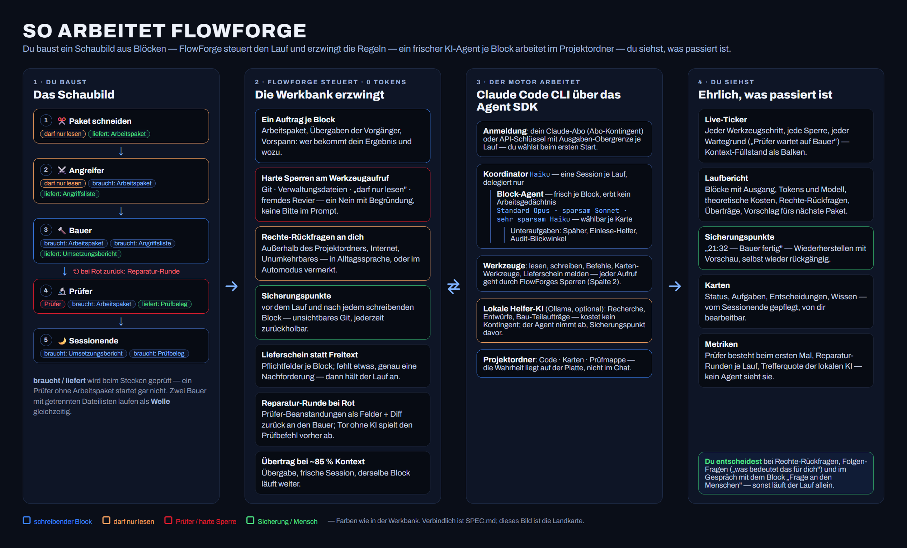

# FlowForge — Produkt-Spezifikation V1

Stand: 19.08.2026 (Zwischenschritt 0.48.1) · Ursprung: Grilling-Session vom 07.08.2026 (von Georg freigegeben) ·
fortlaufend gepflegt — dieses Dokument beschreibt die Gegenwart, Verhaltensänderungen
werden hier nachgezogen (Historie liefert git).

## Überblick im Bild

Das Bild ist die Landkarte, die Paragraphen sind das Gesetz: (1) Du baust das
Schaubild aus Blöcken — braucht/liefert wird beim Stecken geprüft (§4). (2) FlowForge
steuert den Lauf ohne Tokens: ein Auftrag je Block, harte Sperren am Werkzeugaufruf,
Rechte-Rückfragen, Sicherungspunkte, Lieferschein, Reparatur-Runde, Übertrag (§3.3, §5,
§7). (3) Der Motor — die Claude Code CLI über das Agent SDK, Abo-Login oder
API-Schlüssel — arbeitet mit einem Koordinator und je Block einem frischen Agenten im
Projektordner, optional mit lokaler Helfer-KI (§2, §4.3). (4) Du siehst Live-Ticker,
Laufbericht, Sicherungspunkte, Karten und Metriken (§3, §6, §9). Die echten Ansichten
zeigt das README (docs/bilder/); gerendert wird das Überblicksbild mit
`npm run schaubilder` aus tools/schaubilder/.

## 1. Was FlowForge ist

Eine Desktop-App, mit der Nicht-Programmierer per Drag & Drop Coding-Workflows aus Blöcken
zusammenbauen, die ein KI-Agent ausführt. FlowForge ist die Werkbank, auf der über viele
Sitzungen hinweg Software entsteht — ohne dass dem Agenten der Kontext überläuft.

**V1-Nutzer:** ausschließlich Georg. **Output:** beliebige Software (nicht auf Web-Apps begrenzt).
**Sprache:** Deutsch (Texte zentral gehalten; Englisch kommt in V2).

## 2. Plattform & Motor

- **Desktop-App mit eigenem Fenster und Installer ab V1** (Technik: Electron — wie VS Code, Slack).
- **Motor-Anschluss:** Eine feste Adapter-Schnittstelle trennt FlowForge vom ausführenden
  KI-Agenten. Die Schnittstelle liefert u.a. den **Kontext-Füllstand** (berechnet aus den
  Token-Verbrauchsdaten des Motors) als Messwert.
  - **V1-Motor:** Die offizielle Claude-Code-CLI, von FlowForge über das Claude Agent
    SDK im Hintergrund gestartet — wahlweise unter dem Claude-Login des Nutzers
    (**Abo-Modus**, Abo-Kontingent) oder mit **API-Schlüssel** (Abrechnung pro
    Verbrauch; statt der Kontingent-Pause gilt eine einstellbare **Ausgaben-Obergrenze**
    pro Lauf). Beide Modi bleiben auch in veröffentlichten Versionen; die Konstante
    `ABO_MODUS_ERLAUBT` bleibt `true` und ist nur noch Notbremse, falls Anthropic den
    Weg wirklich sperrt (Entscheidung Georg, 19.08.2026 — ersetzt die Regel vom
    07.08.2026 „in weitergegebenen Versionen ist der Abo-Modus deaktiviert": Anthropic
    sagt seit dem 15.06.2026 selbst, dass Agent-SDK- und Drittanbieter-Nutzung bis auf
    Weiteres über das Abo-Kontingent läuft und Änderungen vorher angekündigt werden;
    das Restrisiko ist ein Abrechnungs-, kein Verbotsrisiko. Chronologie und Zitate:
    README.md. Ein `false` wäre ein Schild, kein Schloss).
  - **Erststart-Wahl, kein stiller Standard:** Bis der Nutzer gewählt hat, ist der
    Motor-Modus leer; beim ersten Start fragt ein Dialog (§9) — Abo-Login oder
    API-Schlüssel —, ohne „Abbrechen". Lauf, Co-Pilot und Block-Assistent verweigern
    ohne Wahl mit Klartext („Wähle zuerst, wie sich der Motor anmelden soll …") statt
    still über das Abo zu laufen; die Einstellungen nehmen ebenfalls keine leere Wahl
    an. Beim Abo steht — im Erststart wie in den Einstellungen — derselbe ehrliche Satz:
    „Läuft über dein Abo-Kontingent. Anthropic hat angekündigt, Agent-SDK-Nutzung
    künftig getrennt abzurechnen, und will vorher Bescheid geben — dann ist der
    API-Schlüssel der Weg." Der API-Modus ist damit die **Rückfalllinie**: derselbe
    Motor, Umschalter in den Einstellungen, kein Umbau.
  - **Lokale KI schon in V1 — aber nur als Helfer** (Experiment, seit 13.08.2026): Die
    Block-Agenten können Recherche-, Entwurfs- und Bau-Aufträge — auch mittelgroße,
    zusammenhängende Teilaufträge und Neues mit klarer Beschreibung — an eine lokale KI
    über Ollama abgeben (§4.3 „Lokale Helfer-KI") — eigene kleine Helfer-Kreisläufe von
    FlowForge, kein Motor; die Abnahme durch den Block-Agenten bleibt der Schiedsrichter.
    Der Motor selbst bleibt die Claude-CLI — seit Bauschritt 49 kann die lokale KI
    darüber hinaus **ganze Blöcke übernehmen** (Modellklasse „lokal", unten).
  - **Modellklasse je Block** (seit Bauschritt 37, Entscheidung Georg: frei je Block
    wählbar — auch Bauer und Prüfer, gegen die Empfehlung „nur Nebenrollen fest"; die
    Folge einer zu sparsamen Wahl sind mehr Reparatur-Runden, und genau die zeigen die
    Kennzahlen aus §3.4). Fünf Klassen (bis 0.48.1 drei, bis Bauschritt 49 vier):
    **Extra (Fable 5)** · **Standard (Opus)** · **sparsam (Sonnet)** · **sehr sparsam
    (Haiku)** · **lokal (Ollama)**. Jeder Katalog-Block trägt eine Voreinstellung — Standard
    für Bauer, Prüfer, Gesamtprüfung, Diagnose, Paket schneiden, Angreifer und Audit;
    sparsam für Sessionende, Frage an den Menschen, Karten-Prüfer (inkl. Sortiermodus)
    und Kontext laden. An jeder **Blockkarte im Schaubild** ist sie umstellbar (wie das
    Häkchen „lokale KI erlaubt", gespeichert je Karte in workflow.json); eigene Blöcke
    wählen ihre Voreinstellung im Block-Editor (§4.5). FlowForge trägt die Wahl beim
    Start des Block-Agenten ein; Ticker und Laufbericht nennen sie (§3.2).
    **Nebenrollen billigst:** Der Koordinator der Lauf-Session (§5) läuft immer auf
    Haiku, die Einmal-Frage des Block-Editors auf Sonnet. „Standard" ist bewusst fest
    auf Opus genagelt statt „was die CLI gerade als Standard nimmt" — sonst erbte jeder
    Block-Agent still das Billigmodell des Koordinators, und Läufe wären über Monate
    nicht vergleichbar. **Unteraufgaben** der Block-Agenten (Späher des Angreifers,
    Einlese-Helfer von Bauer, Prüfer und Diagnose) haben eine eigene Einstellung
    („sparsam" — Standard — oder „wie der Block"): der Motor-Zwilling der lokalen
    Helfer-KI. Ein Block, der schon sparsamer läuft, wird dabei nie teurer gemacht, und
    die drei Blickwinkel des Audits folgen immer der Klasse ihres Blocks (Georgs
    „bewusst teuer" betraf die Lesetiefe, §4.3). Ehrliche Grenze: Im Abo-Modus zählt
    Kontingent, keine Dollar — Sonnet und Haiku entlasten es trotzdem.
    **Klasse „Extra (Fable 5)" mit Kosten-Wahrheit** (seit 0.48.1, Wunsch Georg
    „Fable 5 für Extrapower freigeben"): das stärkste Modell, im Katalog nirgends
    vorbelegt, an jeder Blockkarte und als Voreinstellung eigener Blöcke wählbar; der
    KI-Assistent des Block-Editors schlägt sie nie von sich aus vor. Laut Claude-Code-Doku
    kann Fable 5 je nach Abo **Guthaben statt Kontingent** kosten, und über das Agent SDK
    gibt es dafür keinen Einwilligungs-Dialog — die Anfrage wird ohne Nachfrage abgerechnet.
    Deshalb: Karte und Editor tragen den Kosten-Hinweis, der Abo-Satz in Erststart und
    Einstellungen nennt die Ausnahme, und vor dem **ersten Lauf mit einem Extra-Block im
    Abo-Modus** stellt FlowForge einmal die Folgen-Frage („kann Guthaben statt Kontingent
    kosten — trotzdem starten?", Empfehlung dabei); „Trotzdem starten" wird gemerkt
    (Einstellung), Abbrechen nicht. Im API-Modus entfällt die Frage (dort zahlt ohnehin
    jeder Block pro Verbrauch). **Kein stiller Rückfall:** Ist Fable 5 für das Konto nicht
    verfügbar (CLI-Fehlertext „requires usage credits"), bleibt der Block mit Klartext
    stehen — nie still billiger oder teurer. Lehnt Fable eine Antwort über den
    Inhaltsfilter ab (Cyber/Biologie), wiederholt die CLI sie von selbst auf einem
    Rückfall-Modell; der Ticker nennt den Wechsel. „Unteraufgaben nie verteuern" gilt
    weiter: Ein Extra-Block mit Unteraufgaben „wie der Block" gibt Fable bewusst auch
    seinen Helfern, mit „sparsam" bekommen sie Sonnet.
  - **Denktiefe je Block** (seit 0.48.1, Wunsch Georg „den Effort bei den Cloud-Modellen
    einstellen können"): Zusatz zur Modellklasse an jeder Blockkarte (Auswahlfeld) und als
    Voreinstellung eigener Blöcke — **Modell-Standard** (= high) · low · medium · high ·
    xhigh · max, mit Folgen-Texten aus der Claude-Code-Doku (low „kurz, klar umrissen",
    medium „spart Tokens, etwas weniger klug", xhigh „tiefer, teurer", max „für harte
    Aufgaben, neigt zum Überdenken — vorher testen"). Technisch ist sie ein Feld der
    Agent-Definition: FlowForge definiert seinen Block-Agenten je Denktiefe einmal
    (`block`, `block-low` … `block-max`) und wählt beim Start des Blocks den Typ nach
    der Karte — der Koordinator bleibt unberührt. Sehr sparsam (Haiku) und lokal (Ollama)
    kennen keine Denktiefe: Dort wird die Wahl ignoriert, Editor und Ticker sagen es, und der
    Laufbericht schreibt „Denktiefe: gilt hier nicht" statt einer Messung. **Nachweisbar,
    nicht nur gewünscht:** Beim ersten Werkzeugaufruf des Block-Agenten meldet die CLI die
    wirksame Stufe (Hook-Feld `effort.level`, in der Bausession gemessen) — der Ticker
    nennt sie („Denktiefe wirksam: xhigh"), Laufbericht und Metriken führen Wahl und
    Messwert. Eine Umgebungsvariable `CLAUDE_CODE_EFFORT_LEVEL` könnte alles übersteuern;
    der Motor räumt beim Start ohnehin alle CLAUDE*-Variablen weg.
  - **Klasse „lokal (Ollama)"** (seit Bauschritt 49; Machbarkeitsprobe 19.08.2026 auf
    Georgs Gaming-PC mit qwen3.8:27b bestanden): ein Block läuft **komplett auf der
    lokalen KI** — dieselbe Claude-CLI, gestartet als **zweite Motor-Instanz mit
    Ollama-Umgebung** (`ANTHROPIC_BASE_URL` auf den Ollama-Rechner, Platzhalter-Token,
    kein API-Schlüssel, alle Modell-Aliase auf das lokale Modell), gegen Ollamas
    Anthropic-Schnittstelle. Werkzeuge, Hooks, Sperren, Lieferschein, Rechte-Rückfragen,
    Sicherungspunkte und Unteraufgaben arbeiten unverändert (gemessen: echte
    tool_use-Aufrufe, Agent-Werkzeug mit `subagent_type`, Bauer-Auftrag mit Zuschnitt und
    Übergabe korrekt). Zwei Eigenheiten der Schnittstelle fängt FlowForge ab: Listen-Argumente
    der Melde-Werkzeuge, die Ollama als JSON-Text statt als Liste liefert (gemessen, sobald ein
    Eintrag typografische Anführungszeichen trägt), nimmt FlowForge an — der Agent sieht
    weiter ein Listen-Schema; und weil das Agent-Werkzeug nur Claude-Aliase als Modell kennt,
    bekommen Unteraufgaben lokaler Blöcke kein Modell genannt und laufen damit auf dem lokalen
    Modell (die Startzeile des Tickers sagt es). Im Katalog nirgends vorbelegt, an jeder
    Blockkarte und als Voreinstellung eigener Blöcke wählbar; der KI-Assistent des Editors
    schlägt sie nie vor.
    **Voraussetzung und kein stiller Rückfall:** Die lokale Helfer-KI (§4.3) muss
    eingeschaltet und das Häkchen „Lokale KI als Block-Agent" (§9) gesetzt sein; Modell,
    Adresse und Kontextfenster sind dieselben. Fehlt eines, ist Ollama nicht erreichbar
    oder das Modell nicht da, **startet der Lauf nicht** — mit Klartext, nie still auf
    Claude (sonst bezahlt Georg, was er lokal wollte). **Kosten-Wahrheit:** Die CLI
    meldet für das fremde Modell ein erfundenes Kontextfenster (200k) und erfundene
    Dollar; der lokale Motor nimmt das Fenster aus den Einstellungen, setzt die Kosten auf
    0, merkt sich kein Fenster und setzt keine Ausgaben-Obergrenze (sie bräche lokale
    Läufe ab). Es gibt keinen Prompt-Cache: Jeder Turn verarbeitet den vollen Kontext neu
    — lokale Blöcke sind langsamer, nicht teurer. **Abgeleitetes Modell:** Weil die CLI
    keine Sampling-Optionen mitschickt, legt FlowForge vor dem Lauf per Ollama-API ein
    Modell `flowforge-<basis>` an (Kontextfenster + Feineinstellungen als
    Modell-Standardwerte: Temperatur, Top-p, Top-k, Min-p, Wiederholungsstrafe,
    Antwortlänge, Entwurfs-Tokens/MTP; Vorlagen „Qwen3.8 Denken", „Qwen3.8 Coding",
    „Ollama-Standard") — ohne das lädt Ollama das Modell mit seinem Maximalkontext und
    spillt aus dem Grafikspeicher; gleiche Werte laden nicht neu. **Denken bleibt an**
    (gemessen 19.08.2026: über diesen Weg nicht abschaltbar) — deshalb kein Schalter,
    und die Denktiefe gilt für lokale Blöcke nicht. Ein lokaler Block läuft **immer in
    einer eigenen Motor-Instanz** (nie in der Lauf-Session), und je Ollama-Adresse läuft
    **ein lokaler Block zur Zeit** (§5). Der Ticker nennt „lokal (<Ollama-Modell>)";
    Laufbericht und Metriken führen die Klasse „lokal (Ollama)" und das Ollama-Modell als
    eigene Modellzeile, mit „Denktiefe: gilt hier nicht" und „Kosten: keine" (§3, §3.4).
    **Lokaler Prüfer mit Opus-Abnahme** (seit Bauschritt 50): Auch der Prüfer darf lokal
    laufen — sein Urteil hängt dann an zwei Ankern: dem **Tor-Anker** (sein Prüfbefehl wird
    nach einem „bestanden" mechanisch nachgespielt, Rot dreht das Urteil; §4.1) und der
    **Abnahme** durch einen Claude-Prüfer dahinter (Zweitaudit-Muster; §4.3). Fehlt die
    Abnahme, sagt es das Schaubild als Hinweis ohne Sperre; die Vorlage „Feature hinzufügen ·
    lokal" (§4.4) bringt sie mit. Die Metrik „Urteil lokal vs. Abnahme" (§3.4) ist die Zahl,
    an der Georg entscheidet, ob der lokale Prüfer bleibt.
  - **V2-Motoren:** eigene Agenten-Kreisläufe gegen beliebige Anbieter-APIs. Der
    lokale Weg ist keine V2-Arbeit mehr, sondern die zweite Motor-Instanz mit
    Ollama-Umgebung (seit Bauschritt 49 gebaut). Die restliche App merkt nicht,
    welcher Motor dranhängt.

## 3. Projekte

- Jede gebaute App = ein Projektordner. **Ablageort frei wählbar in der App.**
- Ein Projekt enthält: App-Code, Karten, Workflows, Laufberichte, Sicherungspunkte.
- **Keine Prosa-Chronik, nirgends.** (Lehre aus Life OS: wuchernde Markdown-Dateien ohne Mehrwert.)

### 3.1 Karten (ersetzen jede Prosa-Dokumentation)

Fünf Sorten, als strukturierte Datensätze in der App — nicht als Textdateien gepflegt:

| Sorte | Zweck |
|---|---|
| **Aufgabe** | Offen/erledigt; erscheint in der Seitenleiste, wird in Workflows gezogen |
| **Entscheidung** | „X festgelegt, weil Y" — verhindert, dass der Agent Entscheidungen wieder aufrollt |
| **Wissen** | Fakten übers Projekt |
| **Status** | Genau **eine** pro Projekt: „Wo stehen wir gerade" |
| **Prüfung** | Legt FlowForge automatisch nach jeder bestandenen Prüfung an; dahinter bewahrt es die Prüfdateien des Laufs auf (§4.3) |

**Harte Längengrenze pro Karte (Richtwert 3–5 Sätze; durchgesetzt als 400 Zeichen Inhalt,
80 Zeichen Titel) — gilt auch für den Agenten.** Wer mehr zu
sagen hat, legt mehrere fokussierte Karten an. Die Status-Karte wird beim Anlegen des Projekts
automatisch erzeugt und kann weder gelöscht noch doppelt angelegt werden. Weitere Sorten erst, wenn der Alltag sie einfordert.

**Prüfkarten** (seit Bauschritt 18): legt ausschließlich FlowForge an — automatisch nach
jeder bestandenen Prüfung. Titel und Text kommen aus den Feldern `pruefkarteTitel`
und `pruefkarteText` des gemeldeten Prüfbelegs (§4.3, Alltagssprache: was geprüft
wurde, woran „in Ordnung" erkennbar ist); fehlen sie, setzt FlowForge einen
Ersatztext ein. Dahinter
bewahrt FlowForge die Prüfdateien dieses Laufs im verwalteten Bereich **außerhalb des
Projektordners** auf (wie die Sicherungspunkte) — kein Agent sieht das Archiv, es kostet
keinen Lauf Kontext. Der Nutzer kann Prüfkarten bearbeiten und löschen; **Löschen räumt
die aufbewahrten Prüfdateien mit weg.** Agenten können Prüfkarten weder anlegen noch
ändern (die Übersicht listet sie mit). Wiederholungsprüfung per Ziehen auf den Prüfer: §4.3.

**Ordnung in der Karten-Seitenleiste** (seit Bauschritt 30): Die Karten stehen in vier
festen, ausklappbaren **Gruppen**, die sich aus der Sorte ergeben (nichts zu pflegen):
„Arbeit" (Status-Karte obenauf + offene Aufgaben) · „Wissen" (Entscheidungen + Wissen) ·
„Geprüft" (Prüfkarten) · „Erledigt" (erledigte Aufgaben, standardmäßig eingeklappt). Der
Sorten-Filter bleibt. In „Arbeit" und „Wissen" gibt es **Themen als zweite Ebene**: ein
freies Schlagwort je Karte (höchstens 30 Zeichen), **Pflicht beim Anlegen** von Aufgaben-,
Entscheidungs- und Wissens-Karten — im Formular wie für den Agenten (Parameter `thema` von
`karte_anlegen`, hart durchgesetzt; Status- und Prüfkarten tragen kein Thema; das Bearbeiten
alter Karten ohne Thema bleibt möglich, sie liegen unter „Sonstiges"). FlowForge
normalisiert Groß-/Kleinschreibung und Leerzeichen; die kanonische Schreibweise ist die der
zuerst angelegten Karte. Die vorhandenen Themen stehen im Blockauftrag, in
`karten_uebersicht` und in der Ablehnungsmeldung („thema fehlt — vorhanden: …") — bewusst
NICHT in der Werkzeugbeschreibung (Prompt-Cache). Regel für alle Agenten: primär
einsortieren, ein neues Thema nur, wenn keines passt; das Spec-Interview bündelt seine
ersten Karten in 3–6 Themen. Der Nutzer kann ein **Thema umbenennen** (alle Karten wandern
mit; ein vorhandener Name legt zusammen) und eine **Karte per Drag & Drop** in eine andere
Themengruppe ziehen. Die Einklapp-Zustände (Gruppen, Themen, Bibliotheks-Klappen) merkt
FlowForge **je Projekt im Datenordner** — nicht in projekt.json, die ist Teil der
Sicherungspunkte.

**Aufräum-Knöpfe** in der Karten-Seitenleiste (Entscheidung Georg, 15.08.2026: Aufräumen
gehört zu den Karten, nicht aufs Schaubild): **„Karten am Code prüfen"** startet den
Karten-Prüfer (§4.3) und **„Themen sortieren"** seinen nur-lesenden Sortiermodus — jeweils
als **Sonderlauf**: ein fester Ein-Block-Workflow im Hintergrund mit Lauf-Tab, Ticker,
Abnahme-Dialog und Sperren wie bei jedem Lauf, aber die Leinwand bleibt unangetastet (der
Laufbericht trägt die Marke „Sonderlauf"). Läuft oder wartet das Projekt, sind die Knöpfe
gesperrt. Der Sortiermodus klassifiziert alle Karten ohne oder mit offensichtlich falschem
Thema **ohne Code-Nachmessen** (bevorzugt vorhandene Themen) und schlägt sie in **einem
Sammel-Dialog** vor (Vorschlagsart `thema` von `karte_vorschlagen`, Sammelform): Tabelle
aller betroffenen Karten mit vorgeschlagenem Thema, je Zeile änderbar oder ablehnbar,
„Alle übernehmen" / „Alle ablehnen". Thema setzen ist kein Umformulieren — auch
Entscheidungs-Karten dürfen ein Thema vorgeschlagen bekommen.

**Herkunft je Karte** (seit Bauschritt 30): FlowForge stempelt jede angelegte oder geänderte
Karte mit ihrer Herkunft — vom Nutzer („von dir"), vom Co-Pilot (Chat), vom Karten-Prüfer
(übernommener Vorschlag), von FlowForge (Prüfkarten) oder von einem Block-Agenten: dann
**Aufgabe(n) · Block · Lauf**. Die Aufgaben sind die Aufgaben-Karten, an denen der Lauf
gerade arbeitet — die Auftragsquellen-Blöcke (Paket schneiden, Diagnose) melden sie
strukturiert über das Werkzeug `paket_melden` (nur dort rückfragefrei — dasselbe
Freischalt-Muster wie `karten_zuteilen`, im selben Werkzeug-Server; hart validiert: nur
offene Aufgaben-Karten der Kartenauswahl, leer erlaubt, wenn das Wunsch-/Fehlerbild-Feld die
Quelle war); Titel als Schnappschuss, falls die Aufgabe später gelöscht wird; die Meldung
wandert in Laufstand, Ticker und Laufbericht („Paket von Block 1 ‚Paket schneiden': …").
Seit Bauschritt 44 wird sie **je Auftragsquelle** geführt statt einmal je Lauf: Liegen
zwei Auftragsquellen im Schaubild, überschrieben sie sich vorher wortlos, und jede Karte
trug nur das zuletzt gemeldete Paket als Herkunft. Gestempelt wird jetzt mit dem Paket des
nächstgelegenen Auftragsquellen-Vorfahren des Blocks, der die Karte anfasst. Anzeige als kompakte
Kopfzeile unter dem Titel („zuletzt geändert vor 2 Std. · angelegt von Sessionende bei
‚Login bauen' (Lauf 14.08., 11:08)"), klickbar zum Laufbericht; alte Karten ohne Herkunft
zeigen nur das Datum. Die Herkunft wandert **nie** in Aufträge oder `karten_uebersicht`.

Der Agent liest und schreibt Karten über eingebaute **Karten-Werkzeuge** (Übersicht, anlegen,
aktualisieren, erledigen) — dieselben Regeln, hart durchgesetzt; abgelehnte Versuche sind im
Liveticker sichtbar. FlowForges Verwaltungsdateien im Projektordner (projekt.json, karten.json,
workflow.json, startanleitung.json, laufstand.json, naechster-lauf.json, chat.json — der
Verlauf des Co-Piloten, §6 —, pruefbefehl.json — der Prüfbefehl des Tors, §4.3 — und die
Laufberichte) sind für direkte Schreibzugriffe des
Agenten gesperrt (hartes Nein, keine Rückfrage) — sonst ließen sich die Kartenregeln umgehen.

### 3.2 Laufberichte

Jeder Workflow-Lauf hinterlässt automatisch einen kompakten, strukturierten Bericht (Workflow,
Blöcke, Ergebnisse, Fehlschläge). Reines Nachschlagewerk in der App — wird **niemals automatisch
in den Kontext künftiger Sessions geladen** und nie von Hand gepflegt. Zusätzlich ist das
Ergebnis des letzten Laufs direkt an jeder Block-Karte auf der Leinwand aufklappbar.
Seit Bauschritt 42 wird das Blockergebnis **gegliedert** angezeigt — Fazit, Urteil,
Beanstandungen mit Fundort, Erledigt/Offen, Anmerkung — statt als Textblock
(Läufe von davor zeigen weiterhin ihren Text).
Seit Bauschritt 41 steht je Block **Katalogname und Zusatzname** (§4.1) getrennt im
Bericht — angezeigt zusammen („Prüfer · Datenbank"), gezählt wird der Blocktyp (§3.4).
Seit 0.46.2 trägt das Blockergebnis eines Bauers das **Rauchtest-Ergebnis** (§8): grün,
rot mit Fehlercode und letzter Ausgabezeile, oder übersprungen mit Grund — die Ausgabe des
Startversuchs aufklappbar; bei einer Welle mit dem Vermerk, an welchem Bauer gemessen wurde.
Der Verbrauch steht je Block und für den ganzen Lauf im Bericht — seit 13.08.2026 mit
**Token-Aufschlüsselung** (Eingabe, Ausgabe, Cache gelesen, Cache geschrieben) und den
**theoretischen API-Kosten**, die der Motor aus den Preisen der genutzten Modelle berechnet
(im Abo-Modus nur zur Einordnung ausgewiesen). Die Lokale-Helfer-Zeile nennt seit
Bauschritt 31 das **Modell** der lokalen KI. Seit Bauschritt 36 steht **je Block das
Modell des Motors**, das diesen Anlauf gearbeitet hat (bei Mischung mit Anteilen);
Anläufe ohne Motor (Tor ohne KI, §4.1) und Läufe von vor Bauschritt 36 stehen ehrlich
als „Modell: nicht vermerkt". Seit 0.48.1 steht darunter je Block die **gewählte
Klasse und Denktiefe** („Klasse: Extra (Fable 5) · Denktiefe: xhigh (wirksam: xhigh)") —
die Wahl an der Karte neben dem, was der Motor gemeldet hat; bei Klassen ohne Denktiefe
(Haiku, lokal) steht „Denktiefe: gilt hier nicht". Bei einem lokalen Block (Bauschritt 49)
ersetzt „Kosten: keine — lief auf deiner lokalen KI" die theoretischen API-Kosten. Seit
Bauschritt 50 stehen bei einem **lokalen Prüfer** sein eigenes Urteil und das Ergebnis des
Tor-Ankers nebeneinander („Urteil des lokalen Prüfers: bestanden · Tor ohne KI: grün / rot —
mechanisch gedreht / kein Prüfbefehl"), dazu die Zeile der **Abnahme** („Abnahme durch ‚Prüfer ·
Abnahme': bestätigt / widerspricht"); am Eintrag des Abnahme-Prüfers steht je lokalem Partner
„lokal ‚bestanden' · Abnahme ‚fehlgeschlagen' — Widerspruch", mit Tor-Kurzwort und dem Vermerk,
wenn das Urteil der Abnahme aus ihrem eigenen Vor-Tor kam. Widersprüche sind farblich
hervorgehoben; Berichte von vor Bauschritt 50 tragen die Zeilen nicht. Ebenfalls seit Bauschritt 36 führt der Bericht die
**Zusammenfassungen des Motors** als eigenen Abschnitt (der Motor dampft ein volles
Arbeitsgedächtnis selbst ein — das erklärt später, warum ein Agent Details vergessen
hat). Seit Bauschritt 27 vermerkt der Bericht
außerdem die **Session-Kennung des Laufs** (über sie setzt der Co-Pilot die
Lauf-Session fort, §6) und trägt den **Chat-Verlauf** des Co-Piloten (Abschnitt seit der letzten Marke) als eigenen
Abschnitt nach (Bilder als Marker, nicht als Daten). Seit Bauschritt 28 steht auch der
**Karten-Vorschlag fürs nächste Paket** (§5) samt Empfehlung und Begründung im Bericht
des erzeugenden Laufs.

### 3.3 Sicherungspunkte

- Automatische Sicherungspunkte des Projektordners: beim Anlegen des Projekts, **vor jedem
  Lauf** und **nach jedem erfolgreichen schreibenden Block** (technisch Git, für den Nutzer
  unsichtbar — sichtbar nur als Liste: „14:32 — Prüfer bestanden"). Nur-lesende Blöcke
  ändern nichts und erzeugen deshalb keinen Punkt — ein Punkt, während parallel ein
  schreibender Block arbeitet, würde dessen halbfertige Änderungen einfrieren. Die
  Garantie „ändern nichts" gilt nicht, wenn die Einstellung „Nur-lesende Blöcke dürfen
  Befehle ausführen" (§7) an ist: Ein ausgeführtes Skript kann dann Dateien verändern —
  einen Sicherungspunkt gibt es für solche Blöcke trotzdem nicht.
- Technik-Absicherung: Die Verwaltung nutzt ein eigenes, verstecktes Git-Verzeichnis
  **außerhalb** des Projektordners — das Projekt darf selbst ein Git-Repo sein oder werden.
  Dem Agenten ist Git-Benutzung per Sperre untersagt (hartes Nein, keine Rückfrage).
- Ausgenommen von Sicherung und Wiederherstellung: Laufberichte (bleiben immer erhalten),
  `node_modules` (per Installation wiederherstellbar), `arbeitsablage`
  (Wegwerf-Fläche der Agenten, wird am Lauf-Ende geleert) und `pruefbefehl.json`
  (der Prüfbefehl gehört zum Lauf und zeigt auf die Prüfmappe, die der nächste
  Laufstart leert — §4.3; sein Gedächtnis über Läufe hinweg ist das Archiv
  außerhalb des Projektordners).
- **Wiederherstellen-Knopf** mit Vorschau (was ändert sich, was verschwindet, was kommt
  zurück): Projektstand von jedem Sicherungspunkt zurückholen. Vorher wird der jetzige
  Stand automatisch gesichert — eine Wiederherstellung ist selbst wieder rückgängig machbar.
  Während ein Lauf aktiv ist, ist Wiederherstellen gesperrt.
- **Die Sicherungspunkte liefern den Diff** (seit Bauschritt 34): Aus zwei Punkten rechnet
  FlowForge den exakten Unterschied — Dateiliste (neu/geändert/gelöscht, +n/−m Zeilen) plus
  Ausschnitte der geänderten Stellen mit Umgebung. Dieselbe Technik wie die
  Wiederherstellen-Vorschau (zwei Bäume plus ein eigener kleiner Zeilen-Vergleich, kein
  externes Git nötig). Das speist die Reparatur-Runde (§5). Ausgenommen sind zusätzlich
  `pruefung/` (die Prüfer-Tests liegen beim Rückführen uncommittet im Ordner und wären
  sonst „Bauer-Änderungen") und `arbeitsablage/`.
- **Ein eigener Punkt-Strang je Schreiber** (seit Bauschritt 45): Ein schreibender Block,
  von dem FlowForge weiß, welche Dateien ihm gehören (sein **Wirkbereich**: die Dateiliste
  seines Arbeitspakets — beim Prüfer sein eigener Prüfordner), bekommt für die Dauer seines
  Anlaufs einen eigenen Sicherungsstrang. Alle seine Punkte laufen darauf; **am Blockende
  wird er auf den gemeinsamen Stand zusammengeführt**, bevor der nächste Block startet. Der
  Projektordner selbst wird dabei nie umgeschrieben — er ist die Wahrheit, der Strang nur ein
  Zeiger. **Diese Zusammenführung IST der Punkt am Blockende** — die Liste bekommt weiterhin
  genau einen Eintrag je beendetem Anlauf, und seine Beschriftung folgt dem tatsächlichen
  Ausgang: „fertig" nur, wenn der Block auch fertig wurde — endet der Anlauf anders (ein
  Prüfer, der zurückweist), heißt der Punkt „Stand nach Runde …". Ein Schreiber ohne Wirkbereich
  (kein Arbeitspaket mit Dateiliste, alter Laufstand) bekommt keinen Strang und verhält sich
  wie zuvor; **das steht so im Ticker**, damit niemand eine Trennung annimmt, die nicht gilt.
  Dasselbe gilt, wenn das Anlegen oder das Zusammenführen eines Strangs technisch scheitert:
  beides wird gemeldet statt verschluckt, und ein nicht zusammengeführter Strang wird am
  Laufende erneut eingeholt.
- **Nur die unmittelbare Nachprüfung hält einen Strang offen:** Schickt eine lokale
  Vorreparatur ihren Prüfer sofort in die Nachprüfung, bleibt dessen Strang über das
  Blockende hinweg **offen** und wird beim nächsten Anlauf nicht neu angesetzt.
  Zusammenführen hieße, den Arbeitsordner von genau jetzt als neue gemeinsame Spitze
  einzufrieren — dann wäre der Stand, auf den der Rückroll zielt, der verbastelte. Offen
  bleibt er **auch dann, wenn er gar keinen eigenen Punkt festhält** (der Prüfer hat in
  dieser Runde nichts geschrieben) und deshalb, sobald ein anderer Block zusammenführt, wie
  ein liegengebliebener Zeiger aussieht: Frisch angesetzt zeigte er auf den Stand **mit**
  dem Gebastel, und der Rückroll fände nichts mehr zurückzunehmen. Neu angesetzt wird nur
  ein Strang, auf den kein wartender Anlauf mehr zurückgreift (sein Zusammenführen ist
  gescheitert) und den der gemeinsame Stand längst enthält. Jeder
  andere Weg zurück auf „offen" (Reparatur-Runde, Nachforderung, Eskalation zum
  Motor-Bauer) beginnt dagegen einen wirklich **neuen Anlauf**: Dort endet der Strang ganz
  normal am Blockende, und der nächste Anlauf bekommt einen frisch angesetzten. Sonst zeigte
  er in die nächste Runde hinein auf einen Punkt aus der Runde davor — der Änderungs-Überblick
  des Prüfers läse beide Enden auf demselben Punkt und fiele lautlos auf leer, und ein
  Rückroll zielte auf einen Stand, der die inzwischen fertige Arbeit anderer Blöcke nicht
  kennt. **Am Laufende wird ausnahmslos jeder Strang geschlossen**, auch der eines Blocks,
  der noch auf „offen" steht.
- **Mehrere Stränge gleichzeitig offen — und die ehrliche Grenze dabei:** Weil ein wartender
  Prüfer den Schreiber-Platz nicht belegt, kann ein anderer Block in der Zwischenzeit eine
  ganze Runde fahren und zusammenführen. Der wartende Strang zeigt dann auf einen
  Ordnerstand von **vor** dieser Zusammenführung. Ein voller Rückroll dorthin nähme die
  fertige, abgenommene Arbeit des anderen Blocks mit aus dem Projektordner, während ihr
  Sicherungspunkt weiter in der Liste stünde. Deshalb erkennt FlowForge den **überholten
  Rückroll-Punkt** und nimmt dann nur noch zurück, was es dem betroffenen Block selbst
  zuordnen kann (seinen Wirkbereich); ohne benannten Wirkbereich gar nichts. Was
  stehenbleibt, steht im Ticker, und der Agent liest es im Werkzeug-Ergebnis — der Preis
  ist, dass verbastelte Stellen sichtbar liegenbleiben, nicht dass fremde Arbeit still
  verschwindet.
- **Zurückgerollt wird ohne fremdes Revier:** Rollt FlowForge den Stand eines Blocks zurück
  (verworfenes lokales Teilstück, gescheiterte Nachprüfung nach lokaler Vorreparatur, harter
  Stopp, Wiederaufnahme), fasst der Rückroll **alles an außer den Wirkbereichen der anderen
  Block-Instanzen** dieses Laufs — heute also außer deren Prüfmappen. Das gilt ohne Ausnahme,
  auch wenn der betroffene Block gar keinen eigenen Strang hat. Bewusst die Umkehrung
  einer Beschränkung auf die eigene Dateiliste: Ausgeführte Befehle und der Schreibpfad der
  lokalen KI schreiben an der Dateilisten-Sperre vorbei (§7), ihr Gebastel bliebe sonst liegen.
  Was dabei stehenbleibt, sagt der Ticker — bei der Wiederaufnahme am Laufstart, weil es dort
  vorher noch keinen gibt. Und **ein gescheiterter Rückroll wird gemeldet**, statt als
  „zurückgerollt" durchzugehen. Der Agent liest im Werkzeug-Ergebnis beides: dass ein Rückroll
  nicht geklappt hat — und dass Reste im Arbeitsbereich anderer Blöcke stehengeblieben sind.
  Auch der stille Gegenfall steht im Ticker: Wo ein Rückroll versprochen war und **nichts
  zurückzunehmen** war, sagt FlowForge genau das, statt wortlos zur nächsten Zeile zu springen.
  Dabei werden **zwei Lagen auseinandergehalten**: Stand der Projektordner wirklich schon auf
  dem Sicherungspunkt, heißt es genau so; blieb dagegen etwas stehen, weil alles in fremdem
  Revier oder hinter einem überholten Rückroll-Punkt lag, sagt der Ticker stattdessen, dass
  **nichts angefasst wurde und der verworfene Stand sichtbar liegenbleibt** — sonst
  widerspräche der Satz der Zeile direkt darunter, die aufzählt, was blieb.
  Am harten Stopp bleibt die Zeile aus — dort ist „nichts zurückzunehmen" der Normalfall.
  Maßgeblich ist am harten Stopp der Strang **des abgebrochenen Blocks** — nie der eines
  fremden, der gerade auf seine Nachprüfung wartet: Dessen Anlauf bricht hier gar nicht ab,
  und sein Punkt kennt die fertige Arbeit der anderen nicht.
- **Der Diff ist auf die eigene Dateiliste gefiltert:** Ein **Umsetzer** sieht in der
  Reparatur-Runde nur seine Änderungen. **Ausgenommen ist der Prüfer:** Sein Wirkbereich ist
  seine Prüfmappe, und die ist im Diff ohnehin ausgeschlossen — filterte FlowForge darauf,
  bliebe von „das hat sich seit deinem Urteil geändert" nichts übrig und er ginge blind in die
  Nachprüfung. Er sieht den Überblick deshalb ungefiltert. Ehrliche Grenze: Fällt beim
  Umsetzer etwas weg, steht die Zahl im Auftrag und im Ticker („n Änderungen außerhalb deiner
  Dateiliste sind hier nicht gezeigt") — auch dann, wenn nach dem Filtern gar nichts übrig
  bleibt.
- **Ein Punkt sammelt fremdes laufendes Revier nicht ein** (seit Bauschritt 46): Seit mehrere
  Schreiber gleichzeitig laufen (§5), enthält der Punkt am Blockende von A — die
  Zusammenführung seines Strangs — **nicht** den Arbeitsordner-Stand in den Wirkbereichen der
  anderen Schreiber, die gerade noch laufen oder auf ihren Nachlauf warten. Dort nimmt er den
  **Stand der Basis** (die Spitze des gemeinsamen Stands — also den Stand von *vor* diesen
  Blöcken). „Nach Block A" trägt damit genau A's Arbeit; und stürzt die App mitten in der
  Welle ab, startet B beim Wiederaufnehmen sauber auf „vor B", statt auf einem eingefrorenen
  Halbstand seiner selbst. Dasselbe gilt für die **Zwischenpunkte der lokalen Helfer-KI**
  („vor lokalem Teilstück") auf dem eigenen Strang. Der Arbeitsordner bleibt dabei unberührt —
  B arbeitet einfach weiter. Folge, sichtbar in der Wiederherstellen-Vorschau: Wer den Punkt
  „Nach Block A" zurückholt, während B noch schreibt, holt B's Bereich auf den Stand vor B —
  nicht auf B's Halbstand. Auch die Regel „ein Punkt statt Zwilling" prüft das mit: Der
  Strangpunkt wird nur dann zur gemeinsamen Spitze vorgezogen, wenn er auch in den fremden
  Bereichen auf der Basis steht; sonst entsteht der Punkt mit zwei Eltern.
- **Wiederherstellen nur innerhalb eines Bereichs** (seit Bauschritt 46): Für die
  zweigbezogene Folgen-Frage (§4.1) kann FlowForge einen Sicherungspunkt **auf einen Bereich
  begrenzt** zurückholen — Dateilisten und Prüfordner der Blöcke eines Zweigs. Innerhalb des
  Bereichs geschieht alles, was Wiederherstellen sonst auch tut (ändern, zurückholen, löschen);
  außerhalb wird nichts angefasst, und die Zahl des Übersprungenen ist bekannt. Vorher entsteht
  dasselbe Sicherheitsnetz wie beim vollen Wiederherstellen (der jetzige Stand, falls
  ungesichert). Ohne benannten Bereich fasst diese Form gar nichts an — dafür gibt es das
  volle Wiederherstellen.
- **Sicherungspunkt-Operationen laufen je Projektordner nacheinander** (seit Bauschritt 46):
  Alle Stränge eines Projekts teilen sich technisch einen Index; zwei Blöcke, die gleichzeitig
  Punkte anlegen, zusammenführen oder zurückrollen, arbeiteten sonst verschränkt darauf und
  bekämen Punkte, die halb den einen und halb den anderen Stand tragen (gemessen). Deshalb
  stellt sich jede dieser Operationen je Projektordner in eine Warteschlange — für den Lauf
  unsichtbar, außer dass zwei gleichzeitige Punkte beide vollständig sind.
- Rechner-Neustart mitten im Lauf → App bietet an, am letzten Sicherungspunkt weiterzumachen.
  Ein Strang, der aus dem Abbruch liegengeblieben ist, gehört zu dem Block, dessen Arbeit
  ohnehin fällt. Der nächste Laufstart macht damit reinen Tisch, **bevor** dieser Lauf eigene
  Stränge anlegt — sonst überschriebe der nächste Anlauf desselben Blocks den alten Strang
  gleichen Namens: weggeräumt wird, was der gemeinsame Stand ohnehin schon kennt; **eingeholt
  wird, was er noch nicht kennt** — erst dann steht diese Arbeit als Sicherungspunkt in der
  Liste und ist wiederherstellbar. Stehen bleibt ein Strang nur, wenn auch das Einholen
  klemmt; dann sagt der Ticker, dass er liegenbleibt und nicht in der Liste steht. Klemmt das
  Aufräumen als Ganzes, wird auch das gemeldet — der Lauf läuft weiter, der nächste Start
  versucht es erneut.

### 3.4 Metriken (seit Bauschritt 31)

Das Messinstrument des Nutzers — nur Nachschlagewerk, **nichts davon wandert je in einen
Auftrag** (das Verbot der Prozess-Selbstvermessung in §10 meint den Agentenprozess, nicht
dieses Instrument). Zugang: Knopf **„Metriken" in der Titelleiste** → globale Seite über alle
bekannten Projekte (Filter nach Projekt); im Projekt ein **Tab „Metriken"**, der dieselbe
Seite aufs Projekt vorgefiltert zeigt (eigener Baustein, nicht Teil der Leinwand).

- **Abschnitt 1 — Lokale KI:** FlowForge schreibt **jedes Urteil über lokale Arbeit**
  strukturiert in eine **globale Metrik-Datei im verwalteten Bereich** (Datenordner,
  `metriken/lokale-ki.jsonl` — Anhänge-Format, weil bis zu 3 Läufe parallel schreiben;
  nicht im Projektordner, keine Karten): Zeitpunkt, Projekt, Lauf, Block, **Modell**,
  **Bereich** (Recherche · Entwurf · Reparatur · Bauen), **Ausgang** (übernommen/verworfen
  bei Recherche-Fazit und Entwurf, gehalten/nicht gehalten bei Reparatur-Nachprüfung und
  Teilstück, gescheitert bei Kreisläufen ohne Ergebnis) und die **Schritte** des
  Kreislaufs. Die Urteile fallen ohnehin mechanisch (`recherche_bewerten`,
  `entwurf_abnehmen`, `teilstueck_abnehmen`, Nachprüfung der Vorreparatur). Anzeige als
  Tabelle **Modell × Bereich**: Urteile, Quote (Anteil übernommen/gehalten an allen
  beurteilten — gescheiterte zählen nicht in die Quote), Ø Schritte, Fehlschläge, Zeitraum.
  **Erst ab Bauschritt 31 gezählt** (Entscheidung Georg) — keine Rückrechnung aus
  Ticker-Texten alter Berichte. Ohne Trefferquoten-Schalter (§4.3) gibt es für Recherchen
  kein Urteil und damit keinen Eintrag; Entwürfe und Teilstücke werden immer abgenommen.
- **Abschnitt 2 — Motor:** liest die **Laufberichte aller bekannten Projekte** (die Daten
  liegen dort exakt vor, auch für alte Läufe) — im Hauptprozess mit Zwischenspeicher je
  Datei; Projekte, deren Ordner fehlt, werden mit Hinweis übersprungen („nur bekannte
  Projekte"). Schnitte: **je Blocktyp** (Erstläufe: Anzahl, Ø Tokens, Ø theoretische
  Kosten — **Wiederholungen** desselben Blocks im Lauf, also Reparatur-Runden,
  Nachprüfungen und Nachforderungen, stehen getrennt daneben, sonst verzerren sie den
  Durchschnitt), **je Workflow-Kette**, **je Projekt** (nur ungefiltert) und ein
  **Zeitverlauf je Kalenderwoche** als einfache Balken („wird es billiger?"). Ehrlichkeit:
  Berichte ohne Kostenangabe und Block-Einträge ohne Verbrauch (ältere Läufe) werden als
  „ohne Kosten"/„ohne Verbrauch" gezählt und fallen aus den Durchschnitten heraus, statt
  sie zu verfälschen. Im Abo-Modus sind es theoretische Kosten wie überall.
- **Abschnitt 3 — Wie gut trägt das Gerüst** (Harness-Kennzahlen, seit Bauschritt 36):
  Nicht nur Kosten messen, sondern auch, was das Gerüst taugt. Als Kacheln: Anteil der
  Läufe, in denen **jede Prüfung ihr erstes Urteil bestanden** hat · Ø **Reparatur-Runden**
  je Lauf (gezählt als Prüf-Urteile „nicht bestanden" — jedes schickt den Lauf zurück zum
  Bauer oder löst die Folgen-Frage aus) · Ø **Rechte-Rückfragen**, **Folgen-Fragen** und
  **Überträge** je Lauf · Ø **Zusammenfassungen** des Motors je Lauf. Dazu dieselben
  Kennzahlen samt **Lauf-Ausgang je Kette und je Kalenderwoche**. Alles rückwirkend aus
  denselben Laufberichten gerechnet — nur die Zusammenfassungen gibt es erst ab
  Bauschritt 36 (ältere Läufe zählen dort sichtbar als „ohne Angabe"). Feinheit: Der erste
  Anlauf eines Prüfers ist nicht immer sein erstes Urteil (eine Prüfbefehl-Nachforderung
  trägt keines) — gezählt wird das erste echte Urteil.
- **Blocktyp × Modell** (seit Bauschritt 36): dieselbe Tabellen-Idee wie Modell × Bereich
  bei der lokalen KI, nur für den Motor — Erstläufe, Ø Tokens, Ø Kosten, Wiederholungen
  und bei Prüf-Blöcken die Erstbestehen-Quote als „schafft es"-Signal. Einträge ohne
  Modell (Läufe vor Bauschritt 36, Anläufe ohne Motor) stehen als „(ohne Modell)".
  Ehrlichkeits-Notiz seit Bauschritt 37: Ein Block-Anlauf mischt fast immer mehrere
  Modelle — den Koordinator (Haiku), den Block-Agenten (seine Klasse) und seine
  Unteraufgaben. Gezählt wird das Modell mit dem größten Token-Anteil, also praktisch
  immer das des Block-Agenten; die vollen Anteile stehen im Laufbericht (§3.2).
  Seit 0.48.1 trennt die Tabelle zusätzlich nach **Denktiefe** (§2): eigene Spalte, die
  Zeilen teilen sich je wirksamer Stufe (gemessen, sonst die Wahl — bei Haiku, das keine
  kennt, bleibt sie leer) — die Reparatur-Runden je Denktiefe sind die Zahl, an der Georg
  sie einstellt. „Extra (Fable 5)" erscheint damit von selbst als eigene Modell-Zeile.
  Seit Bauschritt 49 ebenso die Klasse **„lokal"**: Ihre Modell-Anteile tragen den
  Ollama-Modellnamen (das abgeleitete `flowforge-<basis>`), die Zeile zeigt Erstläufe,
  Reparatur-Runden, Dauer und die von Ollama gemeldeten Tokens — bei **Kosten 0**
  (die erfundenen CLI-Kosten verwirft der Motor), Denktiefe leer. So sieht Georg, ob
  sich die Karte rechnet: Tokens und Zeit statt Dollar.
- **Lokaler Prüfer × Abnahme** (seit Bauschritt 50): zwei Kacheln in der Harness-Reihe —
  **„Abnahme widerspricht dem lokalen Prüfer"** (Paare lokaler Prüfer → Claude-Abnahme,
  davon Widersprüche, Quote) und **„Tor widerspricht dem lokalen Prüfer"** (Nachspiele des
  Prüfbefehls nach einem lokalen „bestanden", davon rot) — dazu eine Tabelle lokales
  Modell × Abnahme-Modell (Paare, einig, Widersprüche, Quote). Aus den Laufberichten
  gerechnet (§3.2, keine zweite Wahrheit): je lokalem Prüfer und Abnahme zählt nur das
  **erste** Urteil der Abnahme im Lauf; Reparatur-Runden und Urteile aus dem Vor-Tor der
  Abnahme zählen nicht. Ohne Paare steht „—" statt 0. Das ist die Zahl, an der Georg
  entscheidet, ob der lokale Prüfer bleibt.
- **Zusatznamen zerfasern die Metriken nicht** (seit Bauschritt 41): Der Laufbericht
  führt Katalognamen und **Zusatzname** (§4.1) getrennt. Gezählt wird ausschließlich
  der Katalogname — „Bauer · Datenbank" und „Bauer · Oberfläche" sind derselbe
  Blocktyp, und der Wochenverlauf vergleicht weiter Gleiches mit Gleichem.
  Auseinandergehalten werden sie über die Instanz-Kennung: Zwei verschieden benannte
  Prüfer in einem Lauf sind zwei Erstläufe, keine Wiederholung.

## 4. Workflows & Blöcke

### 4.1 Form

- Die Leinwand ist ein **Schaubild** (Entscheidung Georg, 07.08.2026): gerahmte Block-Karten,
  **frei platzierbar** (Positionen werden gespeichert), verbunden durch von Hand gezogene
  **Pfeile**, die die Reihenfolge bestimmen. Datenformat: Karten + Pfeile.
- **Zusatzname je Blockkarte** (seit Bauschritt 41): ein freies Feld an der Karte
  (höchstens 30 Zeichen, einzeilig) — die Sorte bleibt, aus „Bauer" wird
  „Bauer · Datenbank". Er macht mehrere gleiche Blöcke in einem Lauf
  unterscheidbar und sagt dem Zuschnitt, wonach zu schneiden ist. FlowForge
  reicht ihn überall durch, wo sonst der Katalogname steht: Ticker, Aufträge und
  Übergaben („von Block ‚Bauer · Datenbank'"), Karten-Zuteilung, Herkunft der
  Karten, Sicherungspunkt-Beschriftungen und Laufbericht. In den **Metriken**
  bleibt er getrennt (§3.4), und ein geänderter Zusatzname macht einen
  gespeicherten Laufstand ungültig (die Wiederaufnahme bietet ihn nicht mehr an —
  Übergaben und Zuteilungen des unterbrochenen Laufs zeigten sonst auf Namen, die
  es nicht mehr gibt).
- **Modellklasse und Denktiefe an der Karte** (§2): zwei Auswahlfelder je Blockkarte
  (seit Bauschritt 37 bzw. 0.48.1), gespeichert je Karte in workflow.json wie das Häkchen
  „lokale KI erlaubt" (§4.3); ohne Wahl gilt die Voreinstellung des Blocks. Bei „Extra
  (Fable 5)" steht der Kosten-Hinweis sichtbar unter dem Feld, bei „sehr sparsam (Haiku)"
  mit gewählter Denktiefe der Hinweis, dass sie dort ignoriert wird. Bei „lokal (Ollama)"
  (seit Bauschritt 49) steht der Hinweis, dass der Block auf der lokalen KI läuft, kein
  Kontingent kostet, die Denktiefe nicht gilt und der Lauf ohne eingeschaltete und
  erreichbare lokale KI nicht startet (§2).
- **Parallele Zweige** (seit Bauschritt 13): Von einer Karte dürfen mehrere Pfeile
  ausgehen und mehrere an einer ankommen; Kreise sind verboten. Ein Block startet,
  sobald alle seine Vorgänger fertig sind — ein Block mit mehreren eingehenden Pfeilen
  führt die Zweige zusammen (er wartet auf alle). Gleichzeitig laufen dürfen mehrere
  lesende Blöcke immer; schreibende seit Bauschritt 46 als **Welle**, wenn ihre
  Dateilisten getrennt sind — Prüfer nur neben Prüfern, nie neben einem Bauer (Regel und
  Grenzen in §5) — Achtung: Ist die Einstellung
  „Nur-lesende Blöcke dürfen Befehle ausführen" (§7) an, kann auch ein „lesender"
  Block über ausgeführte Skripte Dateien verändern; die Parallel-Regel bleibt dann
  bewusst auf eigene Gefahr. Ein sichtbarer Hinweis im
  Ticker warnt, dass parallele Blöcke den Verbrauch vervielfachen. Seit Bauschritt 36
  sagt der Ticker auch, **worauf ein Block gerade wartet** („Prüfer wartet auf Audit",
  seit 46 die Gründe der Welle: Überschneidung samt Paaren, fehlender Datenvertrag,
  „ein Prüfer urteilt nie über einen halben Stand") — je Block und Grund genau einmal, und
  nur dort, wo es etwas erklärt: an Zusammenführungen, deren einer Zweig schon fertig
  ist, und wenn die Wellen-Regel bremst. braucht/liefert
  gilt entlang der Pfeile: Was ein Block braucht, muss einer seiner Vorfahren liefern
  — ein Block mit dem Kennzeichen „führt zusammen" (§4.3 „Integrator", seit
  Bauschritt 47) braucht je Pflicht-Etikett **mindestens zwei** liefernde Vorfahren
  (streng beim Start; beim Zeichnen ist einer ein erlaubter Zwischenstand).
  Seit Bauschritt 36 steht das **an den braucht-Chips der Blockkarte**: „← Paket
  schneiden" (bei mehreren gleich nahen Lieferanten alle; bei „führt zusammen" alle
  Lieferanten, bei genau einem „← nur Bauer · A — zwei nötig"), „← fehlt" bzw. bei
  optionalen Etiketten „← liefert keiner".
  **Zustellung adressierter Arbeitspakete** (seit Bauschritt 44): Trägt eine
  Lieferung mehrere Zuschnitte mit je eigener Zieladresse (§4.3 „Zuschnitt je
  benanntem Ziel"), entscheidet eine Regel, welcher bei welchem Block ankommt —
  dieselbe Regel für Auftrag, Vorspann und Lauf: Ein an Block X adressierter
  Zuschnitt geht an X **und** an dessen Nachfahren, solange dort kein näher
  adressierter Zuschnitt liegt (so bekommt ein Prüfer das Paket genau des
  Blocks, dessen Arbeit er prüft, statt irgendeines). Ein Zuschnitt **ohne**
  Adresse gilt für alle — er kommt **zusätzlich** zum adressierten an, nicht
  ersatzweise. Ein Block, für den weder er selbst noch ein Vorfahre
  adressiert ist — der Angreifer sitzt vor allen Umsetzern —, bekommt **alle**
  adressierten Zuschnitte: Er soll alles angreifen, was gebaut wird. Bekommt ein Block auf
  diese Weise mehrere Zuschnitte, gelten sie **alle**: Ihre Dateilisten
  zusammen beschreiben seinen Arbeitsbereich, nicht eine davon.
  **Vollständigkeit des Zuschnitts** (seit Bauschritt 44): Bevor ein
  Auftragsquellen-Block (Paket schneiden, Diagnose) als fertig gilt, rechnet
  FlowForge nach, ob **jede Aufgabe des gemeldeten Pakets** (`paket_melden`) in
  mindestens einem Zuschnitt vorkommt und ob **jedes benannte Ziel** eines
  bekommen hat. Gemessen wird über die Aufgaben-Kennungen im Zuschnitt
  (`aufgabenIds`, §4.3) — eine Rechnung, kein Textvergleich; eine erfundene
  Kennung weist FlowForge schon am Melde-Werkzeug ab. Fehlt etwas, greift das
  erprobte Nachforderungs-Muster: Der Block läuft **genau einmal** kurz erneut
  und trägt nur nach; die Nachforderung nennt die übergangenen Aufgaben und die
  leer ausgegangenen Ziele **namentlich**, und seine eigene Meldung von eben
  liegt als Vorlage bei. Danach macht der Lauf ehrlich vermerkt weiter — ein zu
  enger Zuschnitt ist kein fehlendes Ergebnis und lässt den Lauf, anders als
  eine fehlende Meldung, nicht scheitern. Die verbrauchte Runde wandert in den
  Laufstand und wird nach einem App-Neustart nicht erneut gewährt. Die
  **Paket-Meldung ist damit Pflicht** für diese Blöcke: Ohne sie liefe die
  Prüfung still leer und ein grüner Lauf sähe aus wie eine bestandene Prüfung —
  fehlt sie, wird sie auf demselben Weg einmal nachgefordert. Jede dieser
  Ticker-Zeilen nennt den Block mit **Blocknummer und Namen** („Block 1 ‚Paket
  schneiden'"): Zwei Auftragsquellen gleichen Namens ergäben sonst im
  Laufbericht zwei Zeilen, die niemand auseinanderhalten kann.
  **Zwei ehrliche Grenzen**, beide sichtbar im Ticker: (1) Kommt der Auftrag
  allein aus dem Wunsch- bzw. Fehlerbild-Feld, gibt es gar keine
  Aufgaben-Karten — dann wird nur die Ziel-Abdeckung gemessen, und der Ticker
  sagt das. (2) Gemessen wird gegen die **erste** Paket-Meldung des Blocks: Ein
  zweiter Aufruf mit weniger Aufgaben besteht die Prüfung nicht, sondern steht
  als eigene Zeile im Ticker — sonst wäre die Prüfung eine Selbstauskunft.
  **Rückfall ohne Bruch:** Bei höchstens einem benannten Ziel bedient ein
  Zuschnitt ohne Adresse alles; erst ab zwei Zielen ist ein Paket ohne Adresse
  eine Lücke.
  **Zwischenstände beim Umbauen sind erlaubt:** Beim Bearbeiten darf das Schaubild
  vorübergehend in Stücke zerfallen (z.B. um einen Block herauszunehmen); die
  braucht/liefert-Steck-Prüfung greift, sobald die Pfeile wieder alle Karten zu einem
  zusammenhängenden Schaubild verbinden — und spätestens beim Start, der immer streng
  prüft. **Hinweis ohne Sperre** (seit Bauschritt 50, „Rückfrage statt Sperre"): Steht ein
  Prüfer der Klasse „lokal" ohne **Claude-Abnahme** — kein nicht-lokaler Prüf-Block bekommt
  seinen Prüfbeleg als Eingang (Sessionende und Gesamtprüfung zählen nicht, ein zweiter
  lokaler Prüfer auch nicht) —, zeigt das Schaubild es an der Karte (mit Knopf
  **„Abnahme-Prüfer einfügen"**, der einen Standard-Prüfer „Abnahme" dahinter einhängt: seine
  Pfeile übernimmt die neue Karte, Rückführung auf das Ziel des lokalen Prüfers) und als
  ⚠-Zeile im Schaubild-Kopf; der Laufstart lehnt nicht ab, sondern schreibt den Hinweis in
  den Ticker. Parallelität **innerhalb** eines Blocks gibt es beim Audit (seit Bauschritt 25):
  Sein Agent startet die drei Blickwinkel-Prüfer als gleichzeitige Unteraufgaben —
  ob der Motor sie wirklich parallel ausführt, entscheidet das Modell; sonst laufen
  sie nacheinander (jede Unteraufgabe steht sichtbar im Ticker, seit Bauschritt 25
  samt ihrem Ziel), das Ergebnis ist dasselbe.
- **Fehlschlag-Rückführung:** „bei Fehlschlag zurück zu Block X" (braucht der Prüfer sofort).
  Urteil und Beanstandungen kommen seit Bauschritt 42 aus den **gemeldeten Feldern**
  des Prüfbelegs (§4.3). Die Rückmeldung an den Zielblock enthält **alle
  Beanstandungen vollständig**, je eine Zeile mit Einstufung und Fundort —
  ohne Deckel (seit 0.46.1; der frühere Deckel von 3.000 Zeichen riss im
  Alltag knapp und kostete Runden).
  Ein Urteil „fehlgeschlagen" **ohne eine einzige Beanstandung** kommt gar nicht
  mehr durch: FlowForge weist die Meldung schon am Werkzeug ab (sichtbar im
  Ticker), und der Prüfer korrigiert im selben Anlauf — die Nachforderung aus
  Bauschritt 34 ist damit überflüssig geworden.
  Sind alle Beanstandungen mechanisch, versucht zuerst die lokale Vorreparatur (§4.3) —
  ohne reguläre Runden zu verbrauchen.
  **Gebündelte Rückführung** (seit Bauschritt 47, reine Mechanik, 0 Tokens): Schicken
  zwei Prüfer denselben Block zurück — der zweite fällt durch, während die Rückmeldung
  des ersten beim Ziel noch **unverbraucht** liegt (das Ziel ist seit dem ersten Urteil
  nicht wieder angelaufen; bei Prüfer∥Prüfer hinter einem Bauer ist das der Regelfall,
  denn ein Bauer startet nie neben einem Prüfer, §5) —, sammelt FlowForge die
  Beanstandungen und schickt ihn **einmal** mit allen zurück: **eine** Reparatur-Runde
  statt zwei, keine lokale Vorreparatur für den zweiten Prüfer (der erste hat den Weg
  schon festgelegt), und der Ticker sagt es („‚Prüfer · B' schickt ‚Bauer' ebenfalls
  zurück — gebündelt in dieselbe Reparatur-Runde (3 Beanstandungen dazu), keine zweite
  Runde."). In der Rückmeldung steht jede Kritik unter ihrem Absender („Von ‚Prüfer ·
  A': …"), auch wenn es nur einer ist; ein rotes Tor-Protokoll des zweiten Prüfers wird
  angehängt, nicht überschrieben. Beide Prüfer prüfen in der gemeinsamen Reparatur-Runde
  je ihre eigenen Beanstandungen nach. **Nachgeholte Rückführung:** Ist das Ziel nach
  dem ersten Urteil schon wieder angelaufen (ein nur-lesendes oder prüfendes Ziel
  startet sofort neben Prüfern), nimmt der zweite Prüfer seine eigene Runde — die erste
  Rückmeldung ist verbraucht —, und seine Kritik geht nicht verloren: Das Ziel läuft
  nach dem laufenden Anlauf gleich noch einmal, mit ihr (Ticker: „‚Angreifer' lief
  schon, als diese Rückmeldung kam — der Block läuft mit ihr gleich noch einmal.");
  fällt derweil ein dritter Prüfer durch, hängt er sich an diese wartende Rückmeldung.
  Ehrliche Grenzen: Ist der erste Prüfer gerade in einer lokalen Vorreparatur, liegt
  beim Ziel keine Rückmeldung, der zweite geht seinen eigenen Weg. Ist das
  Runden-Budget leer, stellt jeder Prüfer seine eigene Folgen-Frage (je Zweig, unten).
  **Tor ohne KI vor dem Prüfer-Agenten** (seit Bauschritt 35): Vor jeder Nachprüfung — der
  Reparatur-Runde des Prüfers wie der Nachprüfung einer lokalen Vorreparatur — spielt
  FlowForge den **Prüfbefehl** des Prüfers (§4.3) selbst ab, ohne Motor und ohne Tokens.
  Bleibt er rot, geht das Fehlerprotokoll sofort als Rückmeldung an den Rückführungs-Ziel-Block,
  ohne dass ein Prüfer-Agent startet (der Block-Anlauf steht mit 0 Tokens im Laufbericht) —
  eine reguläre Reparatur-Runde verbraucht er trotzdem, sonst liefe das Paar Bauer/Tor endlos.
  Erst bei Grün startet der Prüfer-Agent und prüft dann nur noch die **grundsätzlichen**
  Beanstandungen nach; was seine Tests abdecken, gilt mit Grün als erledigt. Nach einer
  lokalen Vorreparatur bleibt es bewusst bei der vollen Nachprüfung (ein kleines Modell
  könnte den Test statt des Codes angefasst haben). Ohne Prüfbefehl läuft alles wie zuvor.
  **Tor-Anker des lokalen Prüfers** (seit Bauschritt 50): Meldet ein Prüfer der Klasse
  „lokal" (§2) **„bestanden"**, spielt FlowForge seinen Prüfbefehl noch im selben Anlauf
  einmal ohne KI ab — sein Urteil hängt nicht allein an seiner Urteilskraft. Grün oder nur
  Altlasten: bestätigt (Ticker „Tor-Anker: … grün"). Rot mit neuen Fehlerzeilen: FlowForge
  **dreht das Urteil mechanisch auf „fehlgeschlagen"** (die Tor-Zeilen werden seine
  Beanstandungen, das Protokoll geht ans Rückführungs-Ziel, eine reguläre Reparatur-Runde
  wird verbraucht — wie beim Vor-Tor); das selbst gemeldete Urteil bleibt im Laufbericht
  daneben stehen. Kein Prüfbefehl hinterlegt: keine mechanische Bestätigung möglich, der
  Ticker sagt es, das Urteil gilt ungeprüft. War das Vor-Tor einer Nachprüfung in diesem
  Anlauf schon grün, wird nicht doppelt abgespielt (es zählt als bestätigt). Meldet der
  lokale Prüfer „fehlgeschlagen", gibt es kein Nachspiel. Ehrliche Grenzen: Prüfkarte und
  Prüfbefehl-Archiv entstehen nach dem bestätigten lokalen „bestanden" auch dann, wenn die
  Abnahme (§4.3) später widerspricht; nach einer Wiederaufnahme aus dem Laufstand liest die
  Abnahme „kein Nachspiel"; Drehung und Abnahme-Fehlschlag können zwei Reparatur-Runden
  desselben Ziels verbrauchen.
  Standard **2 Reparatur-Runden** (pro Workflow verstellbar) — seit Bauschritt 41
  **je Rückführungs-Ziel** statt je Lauf: Zwei Prüfer hinter zwei Bauern aßen sich
  sonst die Runden gegenseitig weg, und der zweite Zweig bekam die Folgen-Frage,
  ohne je repariert zu haben. Danach stellt der Lauf
  eine Folgen-Frage („Weitermachen, zurückstellen oder Stand wiederherstellen?"). Im
  Verzweigten laufen genau die Blöcke auf den Wegen von X zum Prüfer erneut — parallele
  Zweige daneben behalten ihr Ergebnis; als Ziel wählbar sind alle Vorfahren des Prüfers.
  Ohne gespeicherte Wahl gilt seit Bauschritt 50 der **nächste nicht-prüfende Vorfahre**
  als Ziel (Rückfall: der nächste Vorfahre) — ein Prüfer hinter einem Prüfer (Zweitaudit,
  Abnahme) schickt damit zum Bauer zurück, nicht zum Prüfer davor, der nichts repariert;
  das Auswahlfeld an der Karte und der gestrichelte Bogen zeigen denselben Standard.
  Seit Bauschritt 36 ist der Weg zurück **im Schaubild sichtbar**: ein gestrichelter,
  roter Bogen vom Prüfer zu seinem Ziel, beschriftet mit „bei Fehlschlag, 2 Runden"
  (bei 0 Runden: „es folgt sofort die Folgen-Frage").
  **Folgen-Frage je Zweig** (seit Bauschritt 46): Die Frage hält nicht mehr den ganzen
  Lauf an. Nur der fragende Prüfer wartet (seine Nachfolger starten nicht); alle anderen
  Zweige laufen derweil weiter, und mehrere Fragen können nacheinander offen sein — das
  Fenster zeigt eine nach der anderen. Jede der drei Wahlen gilt für **diesen Zweig**:
  **Weitermachen** — der Prüfer gilt als erledigt, sein Zweig macht mit dem nächsten Block
  weiter. **Zurückstellen** — dieser Zweig endet hier, alle anderen laufen zu Ende; der
  Lauf heißt am Ende „zurückgestellt", wenn nichts Schlimmeres vorliegt. **Stand
  wiederherstellen** — FlowForge setzt **sofort** und **nur** die Wirkbereiche der
  Zweig-Blöcke (die Dateilisten der Bauer auf den Wegen vom Ziel zum Prüfer und die
  Prüfmappe des Prüfers, §3.3) auf den Punkt „Stand vor Lauf" zurück; die erfolgreichen
  Zweige daneben bleiben unberührt, und der Ticker nennt Zweig und Dateizahl. Der Dialog
  sagt **vorher**, was die Wahl trifft („trifft: Bauer · UI (4 Dateien), Prüfordner
  pruefung/pruefer-3/"). Hat ein Bauer des Zweigs keinen Datenvertrag, geht es nicht
  zweigbezogen: Dann sagt der Dialog „trifft den ganzen Projektordner", und es bleibt bei
  der alten Wirkung — der ganze Ordner am Laufende, nichts Neues startet mehr. Ein harter
  Stopp löst eine offene Folgen-Frage mit „zurückstellen" auf; zurückgesetzt wird ohnehin
  zentral. Prüfer und Bauer laufen nie gleichzeitig (§5): Ein Prüfer startet erst, wenn
  kein Bauer mehr schreibt — er urteilt nicht über einen halben Stand.

### 4.2 Anatomie eines Blocks

Name · Symbol · **Arbeitsauftrag** (Anweisung an den Agenten) · **braucht / liefert**
(z.B. „braucht: Angriffsliste, liefert: geprüften Code") · je braucht-Etikett ein
**„wozu"** (ein Satz aus der Sicht dieses Blocks, gelesen wird er vom Lieferanten —
§4.3 Auftrags-Vorspann) · optionale **Sperren**
(„darf nur lesen", „Pflichtfeld leer = Lauf hält an") · **Modellklasse** und
**Denktiefe** (§2) · Kennzeichen **„führt zusammen"** (§4.3 „Integrator", seit Bauschritt 47) und die weiteren
Katalog-Kennzeichen (§4.5, seit Bauschritt 48 auch für eigene Blöcke) · optionale
**braucht-Etiketten** („falls da") · **Formularfelder** an der Blockkarte.
Ein **Etikett** ist seit Bauschritt 48 ein Eintrag der Etiketten-Bibliothek (§4.5) mit
eindeutigem Namen und optionaler **Form** (bis zu acht Felder, §4.3 Lieferschein).
Der **Zusatzname** (§4.1) gehört nicht zum Block, sondern zu seiner Karte im
Schaubild — derselbe Block darf mehrfach mit verschiedenen Zusatznamen liegen.

Kernprinzip (Life-OS-Lehre): **Blöcke erzwingen, statt zu bitten** — Sperren und Pflichtfelder
blockieren den Weiterlauf, Regeln stehen nicht nur als Text im Prompt.

### 4.3 Blockbibliothek V1

**Arbeitsblöcke** (echte Arbeitsaufträge, seit Bauschritt 8/9): Kontext laden ·
Spec-Interview · Paket schneiden · Angreifer (nur lesend) · Diagnose (nur
lesend) · Bauer · Integrator (Code) (führt zusammen) · Integrator (Recherche)
(nur lesend, führt zusammen) · Prüfer · Gesamtprüfung · Audit (nur lesend, legt
Karten an) · Karten-Prüfer (nur lesend, macht Vorschläge) · Frage an den
Menschen (nur lesend) · Sessionende (bringt die Karten auf Stand und schlägt die
Kartenauswahl fürs nächste Paket vor, §5).
Auftragsquelle von Paket schneiden und Diagnose (Entscheidung Georg,
07.08.2026): das Wunsch- bzw. Fehlerbild-Feld am Block **oder**, wenn es leer
ist, die offenen Aufgaben-Karten der Kartenauswahl — sind beide leer, startet
der Lauf gar nicht erst (freundlicher Hinweis). Ein früherer Block, der selbst
Aufgaben-Karten erzeugt (Spec-Interview), zählt dabei als Quelle; seine neuen
offenen Aufgaben rutschen nach seinem Lauf automatisch in die Kartenauswahl.

**Paketgröße** (Entscheidung Georg, 12.08.2026): Paket schneiden misst die Größe
an Zusammengehörigkeit und Prüfbarkeit, **nicht** an der Sitzungslänge — der
automatische Übertrag (§5) trägt lange Pakete, während jeder eigene Lauf mehrere
Sessions Grundaufwand kostet. Zusammengehörige Aufgaben-Karten dürfen zu einem
Paket gebündelt werden (Fertig-Kriterien je Teilstück); kleiner geschnitten wird
nur bei wirklich unabhängigen Baustellen oder wenn mittendrin eine Entscheidung
des Nutzers nötig wäre.

**Zuschnitt je benanntem Ziel** (seit Bauschritt 44): Paket schneiden und
Diagnose liefern nicht mehr ein Arbeitspaket für alle, sondern **je benanntem
Ziel eines** — mit eigenem Ziel-Satz, eigenen Fertig-Kriterien und eigenem
Datenvertrag. Ein **benanntes Ziel** ist nicht jeder, der das Etikett
„Arbeitspaket" bekommt, sondern nur der Block, der das Paket **umsetzt** (weder
nur-lesend noch prüfend — in der Bibliothek genau der Bauer). Grund
(Entscheidung Georg, 16.08.2026): Bekäme der Prüfer ein eigenes Paket, misst er
die Arbeit an anderen Fertig-Kriterien, als der umsetzende Block sie gebaut hat
— ein stiller Maßstab-Bruch, den niemand bemerkt. **Prüfer und Angreifer
bekommen deshalb kein eigenes Paket**, sondern das ihres nächstgelegenen
Umsetzer-Vorfahren (Zustellung: §4.1 „Übergaben"). Adressiert wird über die
**Blocknummer** (`zielBlock: "3"`), nicht über den Zusatznamen: Zwei Bauer ohne
Zusatznamen wären über den Namen nicht auseinanderzuhalten, und eine
Zusatznamen-Pflicht hielte jedes schon gespeicherte Schaubild an. Der Auftrag
nennt die Ziele mit ihrer Adresse — je Zeile eine, denn Zusatznamen dürfen
Kommas enthalten. Dieser Auftragszusatz ist **zweigeteilt**: Ziel-Adressierung
und `erlaubteDateien` bekommt **jeder** Block, der ein Arbeitspaket liefert —
der Zuschnitt je Ziel ist auch ohne Aufgaben-Karten sinnvoll. Die Sätze zu
`aufgabenIds` und zur Nachforderung bekommen nur **Auftragsquellen** (Paket
schneiden, Diagnose): Nur sie dürfen `paket_melden` rufen, und nur sie werden
auf Vollständigkeit geprüft (§4.1). In der Bibliothek fällt beides zusammen;
ein im Block-Editor **selbstgebauter** Block darf „Arbeitspaket" als freien Text
liefern und bekam sonst ein Versprechen, das er nicht einlösen kann — zu
`aufgabenIds` aufgefordert, an der Rechte-Rückfrage von `paket_melden`
hängengeblieben und für den Gehorsam abgewiesen. **Alle** Pakete gehen in
**einem** Aufruf von
`melde_arbeitspaket` (Feld `pakete`); ein zweiter Aufruf ersetzt den ersten, wie
bei jeder Meldung. Zwei Pakete für dasselbe Ziel weist FlowForge ab.
**Überschneidende Zuschnitte nebenläufiger Ziele weist FlowForge ab** (seit
Bauschritt 46): Zwei benannte Ziele, von denen keines Vorfahr des anderen ist
(zwei Bauer im Fächer hinter Paket schneiden), laufen im Lauf gleichzeitig
(§5) — genau dann, wenn ihre Dateilisten sich ausschließen. Überschneiden sich
die **effektiven** Listen zweier solcher Ziele (der adressierte Zuschnitt plus
ein adressloser, der für alle gilt), wird die ganze Meldung abgewiesen, **bevor
ein Token in die Bauer fließt**; die Abweisung nennt beide Ziele und die
überlappenden Einträge. Aus derselben Rechnung folgt: Ein adressloser Zuschnitt
**mit** Dateiliste neben zwei oder mehr nebenläufigen Zielen wird abgewiesen —
dieselbe Liste stünde bei beiden —, mit dem Hinweis, ihn zu adressieren oder
`erlaubteDateien` dort wegzulassen. Zwei Ziele **hintereinander** (Bauer A →
Bauer B) dürfen dieselbe Datei nennen: Sie schreiben nacheinander. Die Frage
„überschneiden sich zwei Listen?" rechnet dieselbe Stelle, die im Lauf die
Welle bildet (§5) — zwei verschiedene Antworten wären die nächste stille
Fehlerquelle.
**Rückfall ohne Bruch:** Gibt es kein benanntes Ziel oder lässt der Agent die
Adresse leer, ist es genau ein Paket, das für alle gilt — Läufe und Laufstände
von vor Bauschritt 44 laufen unverändert weiter; mit einem Ziel oder ohne
Dateilisten ändert die Überschneidungs-Prüfung nichts.

**Datenvertrag im Paket** (seit Bauschritt 44): Je Zuschnitt nennt das
Arbeitspaket **welche Dateien angefasst werden dürfen** (`erlaubteDateien`,
auch die, die erst entstehen), **welche Bausteine entstehen** (`bausteine`) und
**was rein- und rausgeht** (`schnittstellen`). Dateilisten werden als Pfade und
Ordner genannt — **Glob-Muster** (`src/**/*.js`) weist FlowForge mit Beispiel
ab, denn es gibt keinen Abgleicher dafür und die Sperre träfe später ins Leere.
Aus demselben Grund weist es einen Eintrag ab, der **aus dem Projektordner
hinausführt** (`..`, Laufwerksbuchstabe, UNC-Freigabe): Er stünde sichtbar im
Vertrag, träfe aber nie eine Datei. Ebenso einen Eintrag, der auf den
**Projektordner selbst** zeigt (`.`, `./`, `.\`, `/` allein — und jede
Schreibweise, die sich darauf zusammenkürzen lässt, etwa `.//`, `.\\` oder
`./././`: Gekürzt wird so lange, bis nichts mehr wegzukürzen ist, sonst bliebe
ein Schrägstrich stehen, den erst das Wegkürzen des Punkt-Vorsatzes freilegt):
Ein Vertrag, der
alles erlaubt, ist kein Vertrag — und als Schreibsperre (§7) träfe der Eintrag
keine einzige Datei, während die Liste als „nicht leer" gälte und damit den
Bauer an jedem Schreibversuch stoppte. Die Abweisung nennt den Ist-Wert und den
sauberen Weg für diesen Fall: `erlaubteDateien` ganz weglassen, dann gilt „keine
Liste = keine Sperre". Schreibweisen, die dasselbe meinen, gelten
als dasselbe — Schrägstriche in beide Richtungen, `./` davor und ein führender
`/` („relativ zum Projektordner"); Melden und Schreibsperre (§7) rechnen dabei
mit **derselben** Normalisierung, sonst sperrte die Liste eine Datei, die
sichtbar in ihr steht.
Die Liste hat keine Anzahl-Grenze: Sie **ist** die Schreibsperre (§7), und ein
Deckel wäre kein gekürzter Text, sondern ein blockierter Bauer.
Zieladresse und Datenvertrag stehen sichtbar im übergebenen Lieferschein und im
Laufbericht. Je Zuschnitt nennt `aufgabenIds` außerdem die Aufgaben-Karten aus
der `paket_melden`-Meldung, die dieses Paket abdeckt — daraus rechnet FlowForge
die Vollständigkeit (§4.1); erfundene Kennungen weist es am Werkzeug ab. Auch
`aufgabenIds` hat keine Anzahl-Grenze, und dasselbe gilt für `paket_melden`
selbst: Beide Enden derselben Rechnung reichen gleich weit, sonst entstünde ein
Paket, dessen Vollständigkeit niemand mehr erfüllen kann.

**Spec-Interview:** grillt den Nutzer über das Gespräch (§6) nach der
Entscheidungsbaum-Methode (Entscheidung Georg, 07.08.2026: originalgetreu nach
Matt Pococks Grilling-Vorgehen): Jede Festlegung verzweigt in Folge-Entscheidungen;
pro Runde kommt die komplette „Front" — alle Fragen, deren Voraussetzungen schon
geklärt sind — nummeriert auf einmal, jede mit Empfehlung (❓/➡️-Muster). Fakten
recherchiert der Agent selbst, nur Entscheidungen gehen an den Nutzer; Folgen-Fragen
in Alltagssprache, keine Technik-Fragen. Fertig erst, wenn keine Frage mehr offen
ist und der Nutzer das zusammengefasste Verständnis bestätigt hat; dann legt das
Interview das Ergebnis als erste Karten an (Entscheidungen, Aufgaben, Status);
gemeldet wird der Projekt-Überblick für die Folgeblöcke.

**Diagnose:** belegt die Ursache eines Fehlers (nur lesend, mit Fundort und
Herleitung), bevor etwas angefasst wird, und liefert als Arbeitspaket den
minimalen Fix samt Fertig-Kriterien (inkl. Rot-vor-Grün-Test des Fehlers).

**Frage an den Menschen:** stellt genau eine Folgen-Frage mit Antwort-Optionen
und Empfehlung über das Gespräch (§6) und liefert die Antwort an die Folgeblöcke
(„Antwort des Menschen" ist optionaler Bedarf von Paket schneiden, Diagnose und
Bauer — wie die „Befundliste" des Audits).

**Integrator — die Nähte zwischen parallel gebauten Teilen** (seit Bauschritt 47;
Entscheidung Georg: eigene **Blockart**, nicht ein fester Block — eine geteilte
Recherche zusammenzuführen ist etwas anderes als Code). Die Blockart ist das
Kennzeichen **„führt zusammen"** (`fuehrtZusammen`): Der Block erwartet **mehrere**
Lieferungen desselben Etiketts und macht eine daraus. Das Kennzeichen ändert
drei Dinge: (1) Die Distanz-Regel der Übergaben gilt nicht — **alle** Lieferungen
seiner braucht-Etiketten kommen nummeriert an (unten, „Übergaben"), (2) sie kommen
vollständig an (kein Übergabe-Deckel, seit 0.46.1), und (3) die **Steck-Prüfung
verlangt je Pflicht-braucht-Etikett mindestens zwei liefernde Vorfahren** —
sonst „führt er zusammen", was nie geteilt war. Streng gilt das beim **Start**;
beim Zeichnen und Speichern des Schaubilds ist **genau ein** Lieferant ein
erlaubter Zwischenstand (sonst ließe sich „zwei Bauer → Integrator" in keiner
Reihenfolge stecken — jeder einzelne Pfeil wäre „nur einer"), und der
braucht-Chip sagt dann „← nur Bauer · A — zwei nötig" statt grün „kommt von";
ohne jeden Lieferanten lehnt schon das Schaubild ab. Die Fehlermeldung nennt die
Zahl und den Weg (Lieferanten davorlegen oder einen Block ohne das Kennzeichen
nehmen). Gezählt werden verschiedene Vorfahren-Blöcke (drei Bauer-Karten sind
drei); transitive Vorfahren zählen mit. Drei Folgen der Zustellung: Ein
„führt zusammen"-Block ist **kein benanntes Ziel** des Zuschnitts (§oben) — er
bekommt kein eigenes Paket, sondern die adressierten Zuschnitte **aller**
Umsetzer-Vorfahren, auch bei ungleicher Entfernung (die Distanz-Verengung der
Zustellregel, §4.1, ist für ihn ausgesetzt); ihre Dateilisten zusammen sind sein
Arbeitsbereich. Ein Block **hinter** ihm, dessen nächster zusammenführender
Vorfahre nicht weiter entfernt ist als sein nächster adressierter, **erbt dessen
Zuschnitte** — ein Prüfer hinter dem Integrator misst den Gesamt-Bericht an
denselben Paketen, die der Integrator hatte, nicht an einem davon. Und als
schreibender Block bekommt er wie ein Bauer alle Baselines „vorher schon rot"
(Altlasten benennt er, behebt sie nicht).
Der Katalog liefert zwei Blöcke, beide im Bereich „Bauen": **Integrator (Code)**
(schreibend, Standard-Modell; braucht Umsetzungsbericht, nimmt optional die
Arbeitspakete mit ihren Datenverträgen) prüft jede Naht zwischen den gelieferten
Teilen gegen die Datenverträge (Schnittstellen, Bausteine, Dateilisten) und
repariert, was nicht zusammenpasst — Namen, Signaturen, Importe, Aufrufe, Formate.
Er baut **keine Features nach**: Was ein liefernder Block schuldig blieb, steht
als Beanstandung im Feld `offen` seines Umsetzungsberichts (Block, Fundort, was
fehlt) — FlowForge stellt diese Beanstandungen nicht selbst zu, sie stehen im
Laufbericht und in seiner Übergabe; die Rückführung bleibt Sache eines
Prüf-Blocks dahinter. Und er wirft **keine Festlegungen um**: Der Vertrag steht —
passt ein Teil nicht zum Vertrag, wird der Teil angepasst, nicht der Vertrag.
Sein Umsetzungsbericht trägt die Dateien **aller** gelieferten Teile plus seine
Anpassungen, denn hinter ihm zählt nur noch sein Bericht (Verdrängung durch
Weiterverarbeitung, „Übergaben"). **Integrator (Recherche)** (nur lesend,
sparsames Modell; braucht und liefert Projekt-Überblick) führt mehrere
Projekt-Überblicke einer geteilten Recherche zu einem zusammen — nichts
erfinden, nichts verlieren, Widersprüche benennen statt glätten, Fundorte
behalten. Eigene „führt zusammen"-Blöcke baut der Nutzer im Block-Editor (§4.5).

**Auftrags-Vorspann — Empfänger, Kette, Position** (seit Bauschritt 43): Vor
jedem Blockauftrag stehen Angaben, die FlowForge **aus dem Schaubild rechnet** —
aus Blöcken und Pfeilen, nicht aus dem Koordinator und nicht aus dem Laufstatus
(derselbe Block liest in einer Reparatur-Runde dasselbe wie beim ersten Anlauf):
die **Empfänger** je liefert-Etikett (Block mit Nummer und Zusatzname, Etikett,
und **wozu** er es braucht), die **Kette** in einer Zeile (verzweigungstreu:
parallele Blöcke stehen in geschweiften Klammern nebeneinander) und die
**Position** („Du bist Block 2 von 5"). Das „wozu" stammt aus dem Feld
**brauchtWozu** des empfangenden Blocks (§4.2); fehlt es, steht ein ehrlicher
Rückfall-Satz statt einer Erfindung.
**Formulierungsregel, verbindlich:** immer aus der Empfängersicht („Er misst
deine Arbeit an den Fertig-Kriterien — schreib den Bericht so, dass er jedes bei
dir findet"), nie als „danach kommt noch wer"; Kette und Position sind reine
Ortsangaben ohne Erzählung. Die Aufträge anderer Blöcke werden **nie**
mitgegeben.
Mehrere Empfänger, die in **Etikett, Verbindlichkeit und „wozu" übereinstimmen**,
stehen seit Bauschritt 44 in **einer** Zeile („Block 2 ‚Bauer · UI', Block 3
‚Bauer · Motor' bekommen deine Lieferung …") — der lange „wozu"-Satz steht dann
einmal statt dreimal, und zwar in jedem Anlauf. Gebündelt wird nur der Satz:
**Weggelassen wird nie ein Empfänger**, denn sie tragen die
Verantwortungssprache. Bei genau einem Empfänger je Gruppe bleibt der Wortlaut
unverändert.
Empfänger ist nur, wer die Lieferung wirklich bekommt: Verdrängt die
Distanz-Regel (unten, „Übergaben") die Lieferung, steht genau das im Vorspann
statt eines Empfängers. Kommt niemand, steht „geht an niemanden — du bist der
letzte Schritt"; liefert der Block überhaupt kein Etikett (Sessionende, die
Proben, selbstgebaute Blöcke ohne Etikett), sagt der Vorspann genau das, denn an
ihm kann nichts andocken; liegen dahinter Blöcke mit anderen Etiketten, nennt der
Vorspann sie als Ursache (so wird ein vertippt geschriebenes eigenes Etikett
sofort sichtbar). Auch diese Aufzählung hat einen Deckel, denn sie steht in jedem
Anlauf des Blocks erneut: namentlich stehen dort höchstens die ersten vier Blöcke,
die übrigen werden gezählt („… und 35 weitere") statt verschwiegen.
**Prüf-Blöcke** bekommen eine vierte gerechnete Angabe: an welchen Block ihre
Kritik bei „fehlgeschlagen" zurückgeht (die gespeicherte Wahl, sonst der nächste
Vorfahre). Bei **genau einem Block** im Schaubild entfallen Kette und Position.
Die Kettenzeile hat einen Deckel: Bei mehr als zwölf Blöcken wird sie gekürzt —
Ausgelassenes steht als „…", und der Sprung in den Blocknummern zeigt, was fehlt;
Empfänger, Position und Rückführung bleiben von dieser Kürzung unberührt. Denselben Vorspann
tickert FlowForge beim Start jedes Blocks **einmal als eine Zeile** — Wort für Wort
den Text, den der Agent vorn in seinem Auftrag liest; er steht damit im Ticker und
im Laufbericht, sonst wäre nirgends nachlesbar, was FlowForge gerechnet hat.
**Zuständigkeits-Grenzen bleiben** in den Aufträgen („Projektkarten fasst du
nicht an", „die Prüfmappe gehört den Prüf-Blöcken") — sie gelten auch ohne den
zugehörigen Block auf der Leinwand; nur der fremde Blockname als Begründung ist
weg.

**Lieferschein — Blockergebnisse als geprüfte Felder** (seit Bauschritt 42):
Jeder Block meldet sein Ergebnis über ein **Werkzeug**, nicht als Fließtext. Beim
Laufstart steht das Schaubild fest, also registriert FlowForge genau die
Melde-Werkzeuge, die diese Kette braucht — **eines je liefert-Etikett**
(`melde_arbeitspaket`, `melde_pruefbeleg`, `melde_umsetzungsbericht`,
`melde_angriffsliste`, `melde_befundliste`), für alles Übrige den Rahmen
`melde_ergebnis`. Eigene Etiketten **mit Feldern** (§4.5 Etiketten-Bibliothek, seit
Bauschritt 48) bekommen ein eigenes Werkzeug (`melde_<name>`), das den Rahmen plus
ihre Felder trägt; Pflichtfelder und Auswahlwerte prüft FlowForge wie bei den festen
Teilen (Abweisung im Ticker, der Agent korrigiert), und die Meldung bleibt
selbsttragend lesbar (Bezeichnung + Wert je Feld), auch wenn das Etikett später
geändert wird. Freigeschaltet ist je Block nur das zu seinem Etikett passende;
ein fremdes löst die übliche Rechte-Rückfrage aus. Gemeinsamer Rahmen für alle:
`fazit` (ein Satz für Ticker, Blockkarte und Bericht), `getan`, `offen` und
`anmerkung` — das Freifeld gegen die Formular-Falle, für alles, was in kein Feld
passt und trotzdem ankommen soll. Einen nächsten Block behauptet die
Feldbeschreibung nicht: Sie steht im Werkzeugkasten **jedes** Agenten, und beim
letzten Block widerspräche sie dem Vorspann („geht an niemanden") im selben
Auftrag. Darunter je Etikett ein eigener Teil: Arbeitspaket (Ziel,
Fertig-Kriterien, Schritte, Fundstellen, nicht
dabei), Prüfbeleg (Urteil als Auswahl, Beanstandungen mit Einstufung und Fundort,
Rot-vor-Grün, geprüfte Kriterien, Prüfkarte), Umsetzungsbericht (je Kriterium wie
umgesetzt, Dateiliste mit Art, Angriffsliste behandelt) und Angriffs-/Befundliste
(Funde mit Schwere und Fundort). **Bewusst locker** bleiben Spec-Interview,
Kontext laden, Frage an den Menschen und der Karten-Prüfer: Rahmen plus ein
Freitext-Feld — enge Schemata kosten Nuance bei explorativer Arbeit.
**Drei Durchsetzungs-Ebenen:** das Schema (Struktur, Typen, Auswahlwerte),
FlowForge im Code (Pflichtfelder, Auswahlwerte, Plausibilität — ein Urteil
„fehlgeschlagen" ohne eine einzige Beanstandung wird abgewiesen, ebenso ein
„bestanden" mit offenen Beanstandungen, und ein Arbeitspaket ohne
Fertig-Kriterien) und die Kanten-Prüfung nach dem Block (deckt die Lieferung,
was er laut Schaubild liefert). **Längen- und Anzahl-Grenzen gibt es für
Meldungen nicht** (seit 0.46.1, Entscheidung Georg): Die früheren Feld- und
Listen-Deckel rissen im Alltag mehrfach knapp und kosteten Runden — eine
Meldung wird angenommen, wie sie ist. Einzige Ausnahme ist die Prüfkarte, für
die die Karten-Grenzen (§3.1) gelten. Jede Abweisung steht im Ticker; der Agent
korrigiert sofort im selben Anlauf. **Meldet ein Block nichts**, greift das erprobte Nachforderungs-Muster
(einmal je Block, sein eigener Abschlusstext liegt bei) — danach gilt der Block
als fehlgeschlagen. Einen Rückfall auf den Abschlusstext gibt es nicht: Er wird
nirgends mehr ausgewertet. Läuft ein Block erneut (Reparatur-Runde,
Nachforderung), verfällt seine alte Meldung und er meldet neu — bei einer
Nachforderung liegt seine eigene Meldung von eben als Vorlage bei. Nach einem
**Übertrag** ersetzt die Meldung des Nachfolgers die des unterbrochenen
Vorgängers. Ehrliche Folge: Läufe aus der Zeit vor Bauschritt 42 lassen sich im
Laufbericht weiterhin lesen, aber nicht gegliedert anzeigen.
Den Werkzeug-Hinweis hängt FlowForge an **jeden** Auftrag — auch an
selbstgebaute Blöcke, deren Autor das Werkzeug nicht kennen kann.

**Übergaben:** braucht/liefert ist nicht nur eine Steck-Regel, sondern die
Datenweitergabe im Lauf — der Lieferschein eines Blocks wird unter seinen
liefert-Etiketten gespeichert und jedem Nachfahren entlang der Pfeile mit
passendem braucht in den Auftrag gereicht (seit Bauschritt 42 je Etikett der
passende Teil, nicht mehr ein Text für alle; seit Bauschritt 44 beim
Arbeitspaket zusätzlich je Ziel der für diesen Empfänger geschnittene Zuschnitt
— die Zustellregel steht in §4.1). Liefern mehrere Vorfahren dasselbe
Etikett, gewinnt der nächstgelegene — liegen mehrere **gleich nah** (zwei Angreifer
vor dem Bauer), bekommt der Nachfolger seit Bauschritt 34 **alle** nummeriert
(„Angriffsliste (1 von 2) von …"), und der Ticker sagt es; früher gewann still einer
und die andere Arbeit war bezahlt und weg. Seit Bauschritt 40 gilt dasselbe für die
**ungleiche** Distanz: Der nähere Vorfahre gewinnt weiter, aber die verdrängte
Lieferung steht im Ticker („‚Angriffsliste' für Block 5 ‚Bauer' kommt von Block 4
‚Angreifer' — näher im Schaubild. Verdrängt: Block 2 ‚Angreifer'; diese Arbeit geht
nicht in den Auftrag.") — je Block und Etikett einmal. Vorher verschwand sie
wortlos, egal in welcher Reihenfolge die Zweige fertig wurden. Gemeldet wird nur,
was der Block überhaupt braucht. Ausgenommen von der Distanz-Regel sind Blöcke mit
dem Kennzeichen **„führt zusammen"**: Sie bekommen **alle** Vorfahren mit passendem
Etikett nummeriert, denn Zusammenführen ist ihre Aufgabe (seit Bauschritt 47 die
beiden Integratoren des Katalogs und jeder eigene Block mit dem Häkchen, §oben
„Integrator"). **Verdrängung durch Weiterverarbeitung** (seit 0.46.2): Liegen bei
einem Empfänger mehrere Lieferungen desselben Etiketts vor, und hat Lieferant B die
Lieferung von Lieferant A als Eingang genommen (A ist Vorfahr von B, und B braucht
dieses Etikett — Pflicht oder optional), zählt am gemeinsamen Empfänger nur B: Die
Prüfung der Prüfung ersetzt die Prüfung (Prüfer → Zweitaudit → Sessionende: das
Sessionende bekommt nur den Beleg des Zweitaudits, auch wenn der erste Prüfer
zusätzlich direkt davor liegt). Die Regel gilt allgemein für jeden Block, der ein
Etikett braucht **und** liefert, und sie greift **vor** der Distanz-Regel: Zuerst
fällt heraus, was weiterverarbeitet wurde, dann entscheidet unter den Übrigen die
Distanz. Blöcke mit „führt zusammen" bleiben unberührt — dort kommt alles an. Der
Ticker sagt es mit eigenem Wortlaut („‚Prüfbeleg' von Block 7 ‚Prüfer' ging in
Block 9 ‚Zweitaudit' ein — bei Block 10 ‚Sessionende' zählt der von Block 9"), je
Block und Etikett einmal; die Zeile „näher im Schaubild" gilt nur noch für die
Distanz. Laufzeit-Grenze: **Nur wer geliefert hat, zählt** — meldet das Zweitaudit
nichts, kommt der erste Beleg doch an. Dieselbe Entscheidung speist die braucht-Chips
am Schaubild (§4.1) und den Auftrags-Vorspann — sie zeigen nie einen anderen
Lieferanten oder Empfänger, als der Lauf nimmt. **Übergaben gehen
vollständig** — einen Übergabe-Deckel gibt es seit 0.46.1 nicht mehr (der
frühere von 8.000 Zeichen riss im Alltag mehrfach knapp und kostete Runden);
dasselbe gilt für die Übertrags-Übergabe (§5) und die Wiederhol-Vorlage bei
einer Nachforderung. Gedeckelt bleiben allein Dinge, die keine Übergabe sind:
Prozess-Ausgaben (Tor-Protokoll, Baseline, Rauchtest-Ausgabe, die
Beanstandungs-Zeilen des Tors) und der Reparatur-Diff (§5) — dort steht die
Kürzung sichtbar im Text.
Daneben gibt es
**optionale Bedarfe** („falls da"): Der Bauer verlangt nur das Arbeitspaket;
eine Angriffsliste wird mitgereicht und muss eingearbeitet werden, wenn ein
Block davor eine liefert — so kommt „Bug jagen" ohne Angreifer aus.

**Prüfer:** prüft **nur das aktuelle Arbeitspaket** gegen dessen Fertig-Kriterien
(Entscheidung Georg, 12.08.2026) — nicht das ganze Projekt. Schreibt wenige, robuste
Tests frisch fürs aktuelle Paket in seinen **eigenen Prüfordner** (die Mappe ist
beim Laufstart geleert, §unten), führt sie aus und liefert einen Rot-vor-Grün-Beleg:
mindestens ein Test wird einmal mit absichtlich verfälschter Erwartung ausgeführt
(Rot) und danach unverändert echt (Grün) — ein Test, der nie rot war, beweist nichts.
Überstrenge Fallen (pixelgenaue Vergleiche, Wortverbote, Datei-Inventuren) sind per
Auftrag untersagt.
Jede Beanstandung meldet er einzeln — mit Fundort und der Einstufung
**mechanisch** (Tippfehler, falscher Wert, vergessener Randfall) oder
**grundsätzlich** (braucht Umbau oder Entscheidungen); diese Vorsortierung
steuert die lokale Vorreparatur (§unten), im Zweifel gilt grundsätzlich.
In einer **Reparatur-Runde prüft er nur seine Beanstandungen der letzten Runde
nach** — keine erneute Vollprüfung. Ehrlichkeits-Notiz: „Prüfer ≠ Bauer" heißt
technisch „frischer Agent ohne das Arbeitswissen des Bauers" — jeder Block läuft
als frischer Agent in der Lauf-Session (§5); es ist kein anderes Gehirn.
Prüfer-Blöcke melden ihr Urteil im Feld `urteil` ihres Prüfbelegs
(bestanden/fehlgeschlagen) — daran hängen Rückführung und Reparatur-Runden.
Der Katalog-Prüfer nimmt seit 0.46.2 einen **Prüfbeleg als optionalen Bedarf**
(brauchtWozu: „prüft eine vorliegende Prüfung nach, statt sie zu wiederholen
(Zweitaudit) — nenne Stichproben und Fundorte so, dass er sie nachvollziehen
kann"): Steht ein Prüfer hinter einem Prüfer, ist er das **Zweitaudit** — der
erste Beleg erreicht ihn (nummeriert, wenn mehrere gleich nah liefern), der
Vorspann des ersten Prüfers nennt ihn als Empfänger, und sein Auftrag sagt ihm,
den vorliegenden Beleg nachzuprüfen (Stichproben, Beanstandungen nachvollziehen)
statt alles zu wiederholen. Da er das Etikett damit braucht und liefert, greift
am gemeinsamen Empfänger die Verdrängung durch Weiterverarbeitung (oben,
„Übergaben"). Die Gesamtprüfung nimmt keinen Prüfbeleg an. **Abnahme eines lokalen
Prüfers** (seit Bauschritt 50): Stammt der vorliegende Prüfbeleg von einem Prüfer der
Klasse „lokal" (§2), ist der Claude-Prüfer dahinter seine **Abnahme** — sein Auftrag
nennt Block und Ollama-Modell des lokalen Prüfers, das Ergebnis von dessen Tor-Anker
(§4.1: grün, Altlasten, gedreht, kein Prüfbefehl) und die Ansage, nichts ungeprüft zu
übernehmen (ein kleines Modell übersieht Fehler und erklärt Dinge für geprüft, die es
nicht angefasst hat); sein Rückführungs-Ziel ist standardmäßig der Bauer (§4.1). Ticker
und Laufbericht stellen beide Urteile nebeneinander („Abnahme: ‚Prüfer · Abnahme'
widerspricht dem lokalen Prüfer ‚Prüfer' — lokal ‚bestanden', Abnahme ‚fehlgeschlagen'"),
die Metriken zählen die Paare (§3.4). Liegen der Abnahme die Belege mehrerer lokaler
Prüfer vor (Fan-in), gilt das je Partner.

**Prüfordner je Prüf-Instanz** (seit Bauschritt 41): Die Prüfmappe `pruefung/`
bleibt die gemeinsame Werkbank des Laufs, aber jeder **schreibende** Prüfer
bekommt darin einen eigenen Unterordner (`pruefung/pruefer-<Kennung>/`), den
FlowForge ihm im Auftrag nennt und am Werkzeugaufruf durchsetzt: Schreiben
daneben ist ein hartes Nein. Grund: Ohne eigenen Ordner archivierte der erste
bestehende Prüfer die Tests aller anderen hinter seiner Prüfkarte, und die
Wiederholungsprüfung fuhr fremde Zweige mit. Der Ordnername kommt aus der
**Instanz-Kennung**, nicht aus dem Zusatznamen — der aufbewahrte Prüfbefehl zeigt
über Läufe hinweg auf ihn und dürfte durch ein Umbenennen nicht ins Leere laufen.
Aufbewahrt wird nach bestandener Prüfung nur der eigene Ordner; die
Prüfmappen-Ansicht an der Prüferkarte zeigt entsprechend nur ihn. Nur-lesende
Prüf-Blöcke (die Übungs-Prüfer) schreiben nichts und bekommen keinen Ordner.
Ehrliche Grenze: Die Sperre greift an den Schreib-Werkzeugen, nicht an
ausgeführten Befehlen.

**Prüfbefehl — Pflicht-Artefakt des Prüfers** (seit Bauschritt 35; gilt auch für
die Gesamtprüfung): Neben seinen Tests hinterlegt der Prüfer über das Werkzeug
`pruefbefehl_setzen` **genau einen** Befehl, der alle seine Prüfungen ausführt und
bei einem Fehlschlag mit einem Fehlercode endet — damit FlowForge in
Reparatur-Runden ohne KI nachprüfen kann (§4.1). Seit Bauschritt 41 gehört er der
**Prüf-Instanz**, nicht dem Projekt: Pflichtprüfung, Nachforderung, Tor, Archiv
und Baseline zählen je Prüfer getrennt — sonst bestünde der zweite Prüfer die
Pflicht, weil der erste gesetzt hat, und das Tor urteilte über einen fremden
Zweig. Fehlt er, läuft der Prüfer genau
**eine** Nachbesserungs-Runde erneut und trägt ihn nach, ohne etwas neu zu prüfen
(dasselbe Muster wie die Startanleitung beim Bauer, §8); fehlt er danach immer noch,
macht der Lauf ehrlich vermerkt weiter. Der Befehl liegt in der Verwaltungsdatei
`pruefbefehl.json` (für Agenten gesperrt, §3.1) und **gehört zum Lauf**: Der
Laufstart leert ihn zusammen mit der Prüfmappe, und er ist von Sicherungspunkten
ausgenommen (§3.3). Weil FlowForge ihn **ohne Rechte-Rückfrage** ausführt, liegt er
an kürzerer Leine als ein Agenten-Befehl (§7): ein einzelner Aufruf eines
Test-Werkzeugs (node, npm, npx, pnpm, yarn, vitest, jest, mocha, tsc, python, py,
pytest, deno, bun, go, cargo, dotnet, mvn, gradle, make, rspec, phpunit), **keine**
Verkettung (`&`, `&&`, `|`, `;`), Umleitung (`>`, `<`) oder Unterausführung
(`$(…)`, Backticks) — braucht eine Prüfung mehrere Schritte, gehört ein
Sammel-Skript in den eigenen Prüfordner. Das Werkzeug ist rückfragefrei nur in
Prüf-Blöcken; andere Blöcke lösen die übliche Rechte-Rückfrage aus.

**Baseline „vorher schon rot"** (seit Bauschritt 35): Nach einer bestandenen Prüfung
bewahrt FlowForge den Prüfbefehl im verwalteten Bereich **außerhalb des
Projektordners** auf (wie die Prüfkarten). Beim nächsten Laufstart — noch vor dem
Leeren der Prüfmappe und vor dem Sicherungspunkt „Stand vor Lauf" — spielt FlowForge
ihn einmal ab und merkt sich das Ergebnis. Bauer und Prüfer bekommen „vorher schon
rot: …" in ihren Auftrag, und das Tor (§4.1) meldet nur **neu** Kaputtes als
Fehlschlag; Altlasten werden stattdessen zu einer offenen Aufgaben-Karte (Herkunft
FlowForge, stabiler Titel — derselbe Befund legt nicht bei jedem Lauf eine neue an)
und verbrennen keine Reparatur-Runde. Verglichen wird über die Fehlerzeilen beider
Ausgaben, normalisiert um Zahlen, Pfadtrenner und Leerraum — Laufzeiten und
Testzahlen sollen keinen Scheinbefund erzeugen. Seit Bauschritt 41 misst FlowForge
je Prüf-Instanz: Jeder Prüfer bringt seinen eigenen aufbewahrten Befehl und seinen
eigenen Prüfordner mit; derselbe Befehl wird trotzdem nur einmal abgespielt, und
die Altlasten aller Messungen landen in **einer** Aufgaben-Karte. Ehrliche
Grenzen: Ist der Prüfordner beim Laufstart leer (voriger Lauf abgebrochen), gibt
es für ihn keine Baseline; Prüfdateien gezogener Prüfkarten kommen erst nach der
Messung in die Mappe und zählen nicht mit; ein Lauf ohne Prüf-Block misst gar
nichts.

**Gesamtprüfung** (seit 12.08.2026, umgebaut 13.08.2026): eigener Prüf-Block für
zwischendurch — prüft mit **frisch geschriebenen** Prüfungen, ob das Projekt als
Ganzes hält (Maßstab: Status-Karte, Entscheidungs-Karten, Startanleitung), statt
eine gewachsene Projekt-Mappe abzuspielen. Gedacht als manueller Ein-Block-Lauf,
nicht als Teil jeder Kette.

**Audit** (seit Bauschritt 25): der Rundum-Blick übers ganze Projekt — beurteilt
das Projekt als Ganzes, nicht das aktuelle Paket (dafür gibt es den Prüfer).
Manueller Ein-Block-Lauf für zwischendurch, nicht Teil der Bau-Vorlagen; liefert
„Befundliste", falls es doch in eine Kette gesteckt wird. Sein Agent startet
**drei feste Blickwinkel-Prüfer** als Unteraufgaben — Fehler & Randfälle ·
Verständlichkeit & Wildwuchs · Sicherheit & Datenverlust — möglichst gleichzeitig
(§4.1) und bündelt ihre Funde. **Volle Lesetiefe, bewusst teuer** (Entscheidung
Georg, 14.08.2026 — gegen die Zügel-Empfehlung): keine Stichproben-Zügel wie beim
Angreifer; dafür steht die Kosten-Folge sichtbar am Start im Ticker (ein
Audit-Lauf kann mehrere hunderttausend Tokens kosten). Die lokale Helfer-KI
bleibt als Recherche-Entlastung erlaubt (Häkchen je Block gilt). Seit
Bauschritt 37 wählt der Nutzer das **Modell** des Audits selbst (§2) — die drei
Blickwinkel folgen ihm und werden von der Unteraufgaben-Einstellung nicht
herabgestuft; „bewusst teuer" betraf die Lesetiefe, nicht die Modellklasse. Je
**wesentlichem** Befund legt das Audit eine offene Aufgaben-Karte an (übliche
Längengrenzen; Kleinkram bleibt im Abschlussbericht) — die Befunde rutschen
damit automatisch in die Kartenauswahl der nächsten Bau-Läufe, Paket schneiden
nimmt sie als Auftragsquelle. Mechanik: Das Audit ist nur-lesend für Dateien und
Befehle (Befehls-Ausführung nur, falls die §7-Einstellung „Nur-lesende Blöcke
dürfen Befehle ausführen" an ist — sie gilt für alle nur-lesenden Blöcke, auch
das Audit), darf aber Karten anlegen — ein eigenes Kennzeichen am Block (analog
„darfPruefen"), durchgesetzt am Werkzeugaufruf; genau karte_anlegen ist
freigeschaltet. Die vollständige Befundliste meldet es über `melde_befundliste`
(§4.3) — je Fund Schwere und Fundort.

**Karten-Prüfer** (seit Bauschritt 26): misst am Code nach, ob die
Projektkarten noch wahr sind — oder schon veraltet. Manueller Ein-Block-Lauf;
liefert „Kartenbericht". Der Block ist strikt nur-lesend und ändert Karten
**nie selbst**: Jede Korrektur ist ein Vorschlag über das Werkzeug
`karte_vorschlagen` (rückfragefrei nur in diesem Block, durchgesetzt am
Werkzeugaufruf; will ein anderer Block — etwa der Bauer — einen Vorschlag
machen, löst das die übliche Rechte-Rückfrage aus statt eines harten Neins,
Feedback Georg 14.08.2026 — erlaubt der Nutzer sie, folgt ohnehin der
Abnahme-Dialog je Karte) — aktualisieren, abhaken, wieder öffnen, löschen oder, bei
Widerspruch zwischen Code und Entscheidungs-Karte, eine neue Aufgaben-Karte.
Der Lauf pausiert wie beim Gespräch (§6), und der Nutzer entscheidet **jede
Karte einzeln** im Abnahme-Dialog des Lauf-Tabs: „Übernehmen" (Vorschlag
unverändert), „Vorschlag bearbeiten" (Felder ändern, harte Längengrenzen)
oder „Ablehnen". Angewendet wird ausschließlich von FlowForge über die
normalen Kartenfunktionen; der Ausgang geht als Werkzeug-Ergebnis an den
Agenten zurück, damit sein Kartenbericht stimmt. Harte Leitplanken im Code:
Entscheidungs-Karten werden nie umformuliert oder gelöscht (Festlegungen
trifft der Nutzer) — ein **Thema** dürfen sie aber vorgeschlagen bekommen
(Thema setzen ist kein Umformulieren, Bauschritt 30), Prüfkarten pflegt
FlowForge (keine Vorschläge), die Status-Karte ist nur aktualisierbar, neue
Karten sind immer Aufgaben (mit Thema). Jeder Vorschlag trägt eine Begründung
mit Beleg; Ticker und Laufbericht zählen übernommen/bearbeitet/abgelehnt. Der
Block bleibt in der Bibliothek für Ketten; als Knopf „Karten am Code prüfen"
startet er ohne Leinwand als Sonderlauf, und sein Sortiermodus „Themen
sortieren" (§3.1) nutzt dieselbe Mechanik mit Sammel-Dialog.

**Kontext-Sparsamkeit** (Entscheidung Georg, 13.08.2026): Erkundungslastige Blöcke
(Angreifer, Diagnose, Prüfer, Bauer) delegieren Suchen und Einlesen per Auftrag an
**Unteraufgaben** — der Wegwerf-Helfer wühlt in seinem eigenen Kontext und liefert
nur sein kompaktes Fazit zurück, statt dass der Block alles Gelesene im
Arbeitsgedächtnis anhäuft. Unteraufgaben laufen unter denselben Rechten und Sperren
wie ihr Block (auch „darf nur lesen" — deshalb ist das Unteraufgaben-Werkzeug dort
erlaubt); ihre Zeilen sind im Ticker als „Unteraufgabe" gekennzeichnet. Ihr
Verbrauch zählt ehrlich zum Laufbericht dazu, belastet aber nicht den
Kontext-Füllstand der Lauf-Session, der den automatischen Übertrag steuert.
**Gezügelter Angreifer** (Entscheidung Georg, 13.08.2026 — Befund: 425.000 Tokens
für eine Angriffsliste, weil vier Späher je das ganze Projekt einlasen): höchstens
zwei Unteraufgaben pro Angreifer-Lauf, jede eng umrissen; gelesen werden nur die im
Arbeitspaket genannten Stellen und ihre direkte Nachbarschaft, nicht das ganze Projekt.

**Lokale Helfer-KI** (Experiment, Wunsch Georg, 13.08.2026): In den Einstellungen
zuschaltbar (Standard: aus) — Recherche-Aufträge gehen dann an eine lokale KI über
Ollama (Modellname und Adresse einstellbar: der eigene Rechner oder ein anderer im
Heimnetz, z.B. ein Gaming-PC mit stärkerer Grafikkarte) statt an eine Motor-Unteraufgabe;
das kostet kein Kontingent, nur Rechenzeit. Die Block-Agenten bekommen dafür das
Werkzeug `lokal_recherchieren` — auch für größere Einlese-Aufträge über mehrere Dateien
und Zusammenhänge; beim Recherchieren hat die lokale KI genau drei rein
lesende Werkzeuge (Ordner auflisten, Datei lesen, suchen), hart im Code auf den
Projektordner begrenzt — schreiben, ausführen oder außerhalb lesen kann sie dabei
nicht, deshalb ist das Werkzeug auch unter „darf nur lesen" erlaubt. Steht die lokale KI bereit, weisen die
Blockaufträge sie als **erste Wahl** fürs Delegieren aus (das Agent-Werkzeug ist der
Rückfall). **Nachrichtenform** (Wunsch Georg, 18.08.2026): Jede Nachricht, die
FlowForge an die lokale KI schickt, hat die Form `{"role":"user","content":"…"}` —
kein System-Eintrag (der Rahmentext steht am Anfang der ersten Nutzer-Nachricht,
davor nichts), keine tool-Rolle (Werkzeug-Ergebnisse gehen als Nutzer-Nachricht
„Ergebnis von <werkzeug>: …" zurück, für echte wie für getarnte Aufrufe — alle
Ergebnisse einer Runde gebündelt in EINER Nutzer-Nachricht, damit sich Nutzer- und
Modell-Nachrichten strikt abwechseln), auch das Nachhaken ist eine Nutzer-Nachricht;
nur die Antworten des Modells selbst bleiben unverändert im Verlauf (fehlt ihnen die
Rolle, ergänzt FlowForge `assistant`). Grund: Manche lokalen Modelle bzw. Chat-Vorlagen kommen mit
system- und tool-Rollen nicht zurecht — eine einheitliche Nutzer-Rolle läuft mit
jeder Vorlage. **Kontext-Fenster einstellbar** (seit 0.46.3, Einstellungen: 32k / 64k /
128k Token, Standard 64k — für ein 27B-Modell auf einer 32-GB-Karte; FlowForge schickt
`num_ctx` je Anfrage mit): Mit dem Fenster wachsen die Portionen der lokalen KI —
Zeilen je Lesen (400 / 800 / 1.600), Zeichen je Werkzeug-Antwort (24.000 / 48.000 /
96.000), Suchtreffer (60 / 120 / 240), Ordnereinträge (300 / 600 / 1.200) und der
Runden-Deckel eines Kreislaufs (48 / 64 / 96 Werkzeug-Runden). Die Einstellung sagt
ehrlich, was das Fenster an Grafikspeicher kostet (grob 250 KB je Token bei 27B); der
Ticker nennt beim Laufstart Modell und Fenster. Denk-Modelle (z.B. gpt-oss), die ihre Antwort leer lassen und alles ins
Denkfeld schreiben, werden einmal nachgehakt, bevor ein Fehlschlag gemeldet wird.
Modelle, die Werkzeugaufrufe als bloßen JSON-Text in die Antwort schreiben statt
ins Werkzeug-Format (Befund 14.08.2026: qwen2.5-coder), fängt FlowForge selbst
ab: Der Kreislauf erkennt solche getarnten Aufrufe (nur exakt passende
Werkzeugnamen, dieselben harten Sperren) und führt sie normal aus — ehrlich im
Ticker vermerkt („Werkzeugaufruf kam als Text getarnt — übersetzt").
Ehrlichkeits-Vorkehrungen: Jedes Fazit
trägt den Warnhinweis „kleines Modell — Fundorte selbst nachprüfen" (in der Erprobung
erfand das 7B-Modell abgelehnte Dateiinhalte), Start/Schritte/Fazit stehen im Ticker —
**jede Schritt-Zeile nennt ihr Ziel** (seit 14.08.2026: welche Datei ab welcher Zeile
gelesen, wonach gesucht, welcher Ordner angesehen wird; Pfade und Muster gekürzt, gilt
für Recherche, Entwurf, Reparatur und Bauen gleichermaßen) —,
der Laufbericht weist den Anteil der lokalen KI aus (Recherchen, Schritte,
Fehlschläge, Reparatur-Versuche, Entwürfe, Teilstücke), und ist Ollama beim Laufstart nicht erreichbar, sagt der Ticker das
ehrlich und alles läuft wie gewohnt über den Motor.
**Projektwissen** (seit Bauschritt 25): FlowForge stellt jedem lokalen Auftrag
(Recherche, Entwurf, Reparatur, Bauen) automatisch die Kartenauswahl des Laufs
voran — Status-Karte, offene Aufgaben, manuell Gewählte — als Abschnitt
„Projektwissen" im Auftragstext, je Aufruf frisch gelesen. Grund: Die lokale KI
kann keine Rückfragen stellen (Einweg-Kreisläufe); was der Auftrag nicht nennt,
existiert für sie nicht — Festlegungen aus Entscheidungs-Karten würden sonst
übergangen. Kostet kein Kontingent, nur lokale Tokens; bewusst KEIN direkter
Blick in karten.json (Verwaltungsdatei-Tabu, Halluzinationsgefahr kleiner
Modelle). V1-Experiment auf Georgs Wunsch —
ganze Blöcke übernimmt die lokale KI seit Bauschritt 49 über die Modellklasse „lokal" (§2).

**Trefferquote der lokalen KI** (seit Bauschritt 23): Im Lokale-KI-Abschnitt der
Einstellungen sitzt der Schalter **„Trefferquote der lokalen KI erfassen"** (Standard:
an, solange die lokale KI ein Experiment ist — minimaler Token-Mehrverbrauch). Ist er
an, bekommt der Block-Agent das Pflicht-Werkzeug `recherche_bewerten` nach jedem
`lokal_recherchieren`: übernommen (das Fazit fließt in seine Arbeit ein) oder verworfen
(er recherchiert selbst nach), mit einem Satz Begründung. Ticker („Agent übernimmt/
verwirft das Fazit der lokalen KI: …") und Laufbericht (Lokale-Helfer-Zeile: Fazite
übernommen/verworfen) zählen mit — erst damit ist die Kosten-Wette der lokalen KI über
alle drei Helfer-Arten ehrlich messbar. Ist der Schalter aus, gibt es weder Werkzeug
noch Auftrags-Hinweis — kein Mehrverbrauch. Die Abnahmen bei Entwürfen und Teilstücken
bleiben davon unberührt immer Pflicht (sie steuern Übernahme und Rückrollen — Mechanik,
keine Messung). Das Bewerten ist eine reine Meldung und deshalb wie die Recherche auch
unter „darf nur lesen" erlaubt; das Häkchen je Block (s.u.) sperrt es mit.

**Lokale Vorreparatur** (seit Bauschritt 20): Scheitert eine Prüfung und sind
**alle** Beanstandungen als mechanisch markiert (Vorsortierung des Prüfers,
s.o. — ohne Marken wird sicher eskaliert), repariert zuerst die lokale KI:
höchstens **2 Versuche je Rückführung**, die keine regulären Reparatur-Runden
verbrauchen. Ihr einziges Schreib-Werkzeug ist **gezieltes Ersetzen** (der alte
Text muss zeichengenau und eindeutig sein — kein freies Datei-Schreiben), hart
im Code begrenzt auf den Projektordner; Prüfmappe und Verwaltungsdateien sind
tabu. Vor jedem Versuch legt FlowForge einen Sicherungspunkt „Stand vor lokaler
Reparatur" an; die **Nachprüfung des Prüfers** (nur die Beanstandungen) ist der
Schiedsrichter. Scheitert sie, wird der Stand zurückgerollt, BEVOR der
Motor-Bauer mit der Original-Kritik übernimmt — er repariert den sauberen
Stand, nicht das Gebastel. Ersetzt ein Versuch gar nichts, zählt er als
verbraucht, ohne eine Nachprüfung zu kosten. Jeder Versuch steht samt Ausgang
im Ticker („Lokale Reparatur, Versuch 1 von 2 …") und in der
Lokale-Helfer-Zeile des Laufberichts. Aktiv nur, wenn die lokale KI
eingeschaltet und beim Laufstart erreichbar war — sonst läuft die Rückführung
wie gehabt.

**Lokale Entwürfe** (seit Bauschritt 21): **Schreibarbeit mit Vorbild oder klarer
Beschreibung** — von „eine weitere Prüfdatei nach dem Muster von X" bis zu einem
ganzen Modul mit festgelegter Schnittstelle, mehreren zusammengehörigen Dateien
oder Neuem ohne exaktes Vorbild (Entscheidung Georg, 18.08.2026: die lokale KI
darf auch anspruchsvollere Aufträge bekommen) — können die Block-Agenten über das
Werkzeug `lokal_entwerfen` an die lokale KI abgeben — die Ersparnis trägt, weil
Gegenlesen (Eingabe) deutlich billiger ist als Selberschreiben (Ausgabe). Das Schreibwerkzeug der lokalen KI
ist dabei hart auf die **Arbeitsablage** begrenzt (`arbeitsablage/`, die
Wegwerf-Fläche — am Laufende geleert, von Sicherungspunkten ausgenommen): In
Projektdateien oder die Prüfmappe schreibt sie hier nie; der einzige direkte
Eingriff bleibt die Vorreparatur (s.o.) mit eigenen Leitplanken. Die
**Abnahme** liegt beim Block-Agenten: Er liest den Entwurf gegen und übernimmt
ihn selbst an den Zielort — oder verwirft ihn und schreibt selbst; ungeprüft
zählt nichts. Seine Entscheidung meldet er ausdrücklich über das Werkzeug
`entwurf_abnehmen`; ein unbrauchbarer Entwurf ist ehrlich billiger Ausschuss,
kein Schaden. Ehrlichkeit: „Lokale KI entwirft …" steht im Ticker, der
Laufbericht zählt Entwürfe (übernommen/verworfen) in der Lokale-Helfer-Zeile.
Entwerfen und Abnehmen sind Schreibarbeit und unter „darf nur lesen" gesperrt;
das Häkchen je Block (s.u.) gilt auch fürs Entwerfen.

**Lokaler Bauer** (seit Bauschritt 22): Über das Werkzeug `lokal_bauen` delegiert
der Block-Agent zusammenhängende, **einzeln prüfbare Bau-Teilaufträge** an die
lokale KI — ruhig auch mittelgroße Stücke: ein ganzes Modul, eine ganze Funktion
mit festgelegter Schnittstelle, mehrere zusammengehörige Dateien, auch Neues ohne
exaktes Vorbild (Entscheidung Georg, 18.08.2026). Sie baut mit echtem Schreibrecht
direkt im Projektordner, unter den unveränderten harten Sperren (Prüfmappe,
Verwaltungsdateien, Git tabu; gezieltes Ersetzen plus ganze Dateien schreiben,
hart im Code begrenzt). Der Bauer-Auftrag weist den Agenten an, das Arbeitspaket
in zusammenhängende, einzeln prüfbare Teilaufträge zu zerlegen — jeder mit
Fundstellen, Vorbild oder klarer Beschreibung, eigenem Fertig-Kriterium und vorher
festgenagelten Schnittstellen —, dabei nach Zusammengehörigkeit zu bündeln
(Kleinigkeiten lieber zu einem zusammenhängenden Teilauftrag zusammenfassen; nur
eine einzelne, für sich stehende Kleinst-Änderung erledigt er direkt selbst — einen
trivialen Auftrag präzise zu beschreiben kostet fast so viel wie ihn selbst zu
erledigen). Vor jedem
Teilauftrag legt FlowForge einen Sicherungspunkt „Stand vor lokalem Teilstück"
an. Die **Abnahme je Teilstück** liegt beim Agenten: Er liest sofort gegen
(Gegenlesen ist billiger als Selberschreiben) und meldet mit
`teilstueck_abnehmen` gehalten oder nicht gehalten — bei „nicht gehalten" rollt
FlowForge den Stand automatisch zurück, BEVOR der Agent selbst baut; auch ein
gescheiterter Bau-Versuch mit halben Änderungen wird sofort zurückgerollt. Die
Reihenfolge ist erzwungen (erst abnehmen, dann das nächste Teilstück), damit der
Rückroll-Punkt eindeutig bleibt. Hält ein Teilauftrag nach 2 lokalen Anläufen
nicht, baut der Agent genau dieses Teilstück selbst und macht weiter — kein
Pingpong; der Prüfer-Block bleibt unverändert der Schluss-Schiedsrichter.
**Ein verworfenes Teilstück ist kein Urteil über die übrigen** (Befund 14.08.2026,
erster echter Lauf: nach einem einzigen verworfenen Teilstück versuchte der Agent
die restlichen fünf gar nicht mehr lokal — die Quote war unmessbar): Der
Bauer-Zusatz verlangt seitdem ausdrücklich, jedes Teilstück zuerst lokal zu
versuchen; erst wenn mehrere hintereinander nicht halten, baut der Agent den
Rest selbst.
Ehrlichkeit: jedes Teilstück im Ticker („Lokale KI baut Teilstück …", Abnahme,
Rückrollen), der Laufbericht zählt lokal gehaltene und vom Agenten selbst
gebaute Teilstücke in der Lokale-Helfer-Zeile. Bauen und Abnehmen sind
Schreibarbeit und unter „darf nur lesen" gesperrt; das Häkchen je Block (s.u.)
gilt auch hier.

**Häkchen je Block** (seit Bauschritt 20): An jeder Block-Karte im Schaubild
sitzt ein Abwahl-Häkchen **„lokale KI erlaubt"** (Standard: an, erbt den
globalen Schalter). Abgewählt ist es eine echte Sperre: FlowForge lehnt die
Werkzeuge der lokalen KI (`lokal_recherchieren`, `recherche_bewerten`,
`lokal_entwerfen`, `entwurf_abnehmen`, `lokal_bauen`, `teilstueck_abnehmen`)
für die Agenten dieses Blocks hart ab (erkannt am
laufenden Block, Mechanik aus Bauschritt 19) und streicht den Hinweis auf die
lokale KI aus dem Arbeitsauftrag. Ein Block ohne lokale KI bekommt auch keine
lokale Vorreparatur (maßgeblich ist das Häkchen des Rückführungs-Ziels, dessen
Reparatur-Runde ersetzt würde). Eine Gegenrichtung (global aus, einzeln an)
gibt es bewusst nicht.

**Prüfmappe & Arbeitsablage:** Der Ordner `pruefung/` gehört den Prüf-Blöcken —
für alle anderen Blöcke ist er schreibgesperrt (hartes Nein; der Bauer darf die
Prüfmappe höchstens einmal ganz am Ende laufen lassen, nicht als Dauerschleife).
**Lauf-Mappe statt Projekt-Mappe** (Entscheidung Georg, 13.08.2026): Die Prüfmappe
gehört zum Lauf, nicht zum Projekt — beim Start eines neuen Laufs leert FlowForge
sie automatisch (vor dem Sicherungspunkt „Stand vor Lauf"; die Wiederaufnahme eines
unterbrochenen Laufs leert nicht). Wuchern ist damit strukturell unmöglich.
**Gezielte Wiederholungsprüfung über Prüfkarten** (seit Bauschritt 18): Der Nutzer
zieht Prüfkarten (§3.1) auf eine Prüf-Blockkarte im Schaubild — sie hängen dort
sichtbar an (abnehmbar per ×). Beim Lauf-Start legt FlowForge — **nach** der
automatischen Leerung, noch vor dem Sicherungspunkt „Stand vor Lauf" — die
aufbewahrten Prüfdateien der gezogenen Karten in die Prüfmappe (je Karte ein eigener
Unterordner `pruefkarte-…/`), und der Prüfer führt sie zusätzlich zu seinen
Paket-Prüfungen aus. Die Mappe ist damit nur die Werkbank des Laufs; das Gedächtnis
ist das Archiv hinter den Prüfkarten, das die Leerung nie berührt. Passt eine alte
Prüfung nicht mehr zum heutigen Code, passt der Prüfer sie in ihrem Unterordner an —
nach bestandener Prüfung ersetzt die angepasste Fassung die aufbewahrte, die Karte
veraltet nicht.
**Bilddateien sind in der Prüfmappe verboten** (hartes Nein, auch für Prüf-Blöcke).
An jeder Prüf-Blockkarte auf der Leinwand hängt ein aufklappbarer Bereich
**„Prüfmappe"** (Wunsch Georg, 13.08.2026): je Prüfdatei Name, Größe und
Zuletzt-geändert, in Alltagssprache — nur zum Nachlesen; gezählt werden
Prüf-Dateien, nicht einzelne Testfälle. Alle Prüf-Blockkarten zeigen dieselbe
Mappe; ohne Prüf-Block auf der Leinwand gibt es keinen Blick hinein (bewusst
akzeptiert — die Bau-Vorlagen enthalten immer einen Prüfer).
Der Ordner `arbeitsablage/` ist die Wegwerf-Fläche aller Agenten für Hilfsskripte
und Probeläufe: von Sicherungspunkten ausgenommen, von FlowForge am Lauf-Ende
automatisch geleert.

**Prozess-Hygiene** (seit Bauschritt 32, Befund Georg 15.08.2026: ein Prüfer-Lauf
hatte einen Server gestartet und nie beendet — der lief unsichtbar weiter, der Port
war belegt): Am Ende jedes Laufs — erfolgreich, sanft gestoppt oder hart
abgebrochen — beendet FlowForge alle noch lebenden Prozesse, die aus dem Lauf
heraus gestartet wurden, und vermerkt es ehrlich im Ticker („2 verwaiste Prozesse
aus dem Lauf beendet (node.exe)"). Mechanik: Während eines Laufs (und eines Chats
oder einer laufenden App) fragt ein dauerhafter PowerShell-**Späher** alle 2
Sekunden die Prozessliste ab (~60–120 ms je Abfrage); die Motor-Prozesse melden
sich als Wurzeln, und FlowForge merkt sich je Lauf transitiv jeden Prozess, dessen
Elternteil zur bekannten Menge gehört — auch wenn der Elternteil längst tot ist
(die Bash-Shell des Agenten stirbt sofort nach `npm start &`) —, je Prozess PID +
Startzeit gegen Wiederverwendung. Die Motor-Prozesse selbst bekommen anderthalb
Sekunden, geordnet zu enden, dann fallen auch sie. Grenze (ehrlich): Eine
Zwischen-Shell, die kürzer als ein Abfrage-Abstand lebt, sieht der Späher nie —
ihr Kind wird nicht automatisch beendet, sondern erscheint im App-Tab (§8) als
„vermutlich aus einem Lauf" mit Beenden-Knopf. Der Chat räumt beim Schließen
(Laufstart) ebenso ab. Die per App-Tab gestartete App bleibt unangetastet (eigene
Gruppe, eigener Stopp-Knopf). **FlowForge-Ende räumt ab:** Beim normalen Beenden
werden laufende Motoren, Chats, die gestartete App und alle gemerkten Nachkommen
mit beendet (Node beendet unter Windows keine Kinder); ein unterbrochener Lauf
bleibt als Laufstand wiederaufnehmbar (§3.3). „Nichts läuft unsichtbar weiter"
gilt fürs normale Beenden, nicht für einen Absturz.

**Übungs-Blöcke** bleiben für Probeläufe in der Bibliothek (eigener Abschnitt):
Späher, Mini-Bauer, fairer und strenger Übungs-Prüfer, Karten-Probe, Rechte-Probe.

**Blockbibliothek in Kategorien** (seit Bauschritt 30), ausklappbar, nach der
Aufgabe im Ablauf: Vorlagen · **Auftrag finden** (Spec-Interview, Paket
schneiden, Diagnose, Frage an den Menschen) · **Bauen** (Bauer, Kontext laden) ·
**Prüfen** (Angreifer, Prüfer, Gesamtprüfung, Audit) · **Gedächtnis**
(Sessionende, Karten-Prüfer) · Eigene · Übung (standardmäßig eingeklappt).
Katalog-Blöcke sitzen fest in ihrer Kategorie; eigene Blöcke wählen im
Block-Editor eine Kategorie (§4.5) — vorhandene oder neue, die als eigene Klappe
erscheint. Die Einklapp-Zustände merkt FlowForge je Projekt im Datenordner (§3.1).

### 4.4 Vorlagen-Workflows

| Vorlage | Kette |
|---|---|
| **Neue App starten** | Nur das Spec-Interview (grillt den Nutzer, erzeugt erste Karten) — Entscheidung Georg, 07.08.2026: Spec-Erfassung getrennt vom Bauen; gebaut wird danach mit „Feature hinzufügen" |
| **Feature hinzufügen** | Paket schneiden → Angreifer → Bauer → Prüfer → Sessionende |
| **Bug jagen** | Diagnose (Ursache belegen, bevor etwas angefasst wird) → Bauer (minimaler Fix) → Prüfer mit Rot-vor-Grün → Sessionende |
| **Feature hinzufügen · lokal** (seit Bauschritt 50) | Paket schneiden → Angreifer → Bauer **(lokal)** → Prüfer **(lokal)** → Prüfer · Abnahme (Standard, Rückführung zum Bauer) → Sessionende — Opus an den Enden, die lokale KI in der Mitte; die Vorlage bringt die Pflicht-Abnahme hinter dem lokalen Prüfer mit (§2, §4.3) |

Ohne „Kontext laden" (Entscheidung Georg, 12.08.2026): Jeder Block liest ohnehin
selbst im Projekt — ein eigener Einlese-Block kostete nur eine volle Extra-Session.
Der Block bleibt in der Bibliothek; Paket schneiden und Diagnose verlangen den
Projekt-Überblick nicht mehr (nur noch „falls da", z.B. vom Spec-Interview).

Alle Vorlagen sind verfügbar (seit Bauschritt 9; die lokale seit Bauschritt 50) — als ziehbare Vorlagen
in der Blockbibliothek. Liegt schon ein Schaubild auf der Leinwand, ersetzt die
Vorlage es nach einer Rückfrage — so folgt auf das Spec-Interview direkt die
Bau-Vorlage auf derselben Leinwand. „Bug jagen" ersetzt Paket schneiden +
Angreifer durch die Diagnose. Seit Bauschritt 50 darf ein Vorlagen-Glied neben dem Block
eine **Modellklasse, einen Zusatznamen und ein Rückführungs-Ziel** tragen (die Bibliothek
zeigt es als „Bauer (lokal)", „Prüfer · Abnahme"); die Vorlage legt diese Werte je Karte ab,
umstellbar wie jede Karte.

### 4.5 Block-Editor (seit Bauschritt 14)

- Nutzer kann eigene Blöcke **erstellen, bearbeiten, löschen** — als Formular entlang der
  Block-Anatomie (§4.2). Eigene Blöcke gelten **global** (Abschnitt „Eigene Blöcke" in der
  Bibliothek jedes Projekts); bis Bauschritt 47 waren sie nie Prüfer und hatten keine
  Formularfelder — seit Bauschritt 48 können sie alles, was ein Katalog-Block kann (unten). Seit
  Bauschritt 30 wählt jeder eigene Block eine **Kategorie** in der Bibliothek (eine der
  vier festen, „Eigene" oder eine frei benannte, höchstens 30 Zeichen — global gespeichert
  wie der Block selbst; Altbestand ohne Kategorie liegt unter „Eigene") und seit
  Bauschritt 37 seine **Modellklasse** als Voreinstellung (§2; Altbestand ohne Feld
  läuft auf Standard, auf der Leinwand bleibt sie je Karte änderbar) und seit 0.48.1
  seine **Denktiefe** (Altbestand: Modell-Standard); Stepper und KI-Assistent kennen
  die Felder — der Assistent schlägt „Extra" und „lokal" nie vor, und bei „Extra" zeigt
  der Editor denselben Kosten-Hinweis wie die Karte, bei „lokal" (seit Bauschritt 49)
  denselben Lokal-Hinweis samt „Denktiefe gilt hier nicht".
- Seit Bauschritt 43 trägt jedes **braucht**-Etikett ein eigenes Freitext-Feld „Wozu braucht
  dein Block das?" (ein Satz, höchstens 200 Zeichen, im Schritt „Was braucht/liefert er?"):
  Er steht später im Auftrag des Blocks, der das Etikett liefert (§4.3). Bleibt er leer,
  greift dort der Rückfall-Satz — der KI-Assistent füllt ihn bewusst nicht.
- Seit Bauschritt 47 kann ein eigener Block das Kennzeichen **„Führt zusammen"** tragen
  (Häkchen unter der Sperre „darf nur lesen", §4.3 „Integrator"): Er bekommt dann alle
  Lieferungen seiner braucht-Etiketten statt nur der nächstgelegenen, und der Start
  verlangt mindestens zwei Lieferanten je Pflicht-Etikett. Ohne ein einziges
  braucht-Etikett lehnt der Editor das Häkchen mit Begründung ab — es gäbe nichts, was
  mehrfach ankommen könnte. Der KI-Assistent kennt das Feld und schlägt es nur vor,
  wenn der Block mehrere gleichartige Lieferungen zu einer machen soll.
- **Alle Kennzeichen für eigene Blöcke** (seit Bauschritt 48, Regel „Kein Kennzeichen ohne
  Editor-Feld"): In Schritt 3 wählt Georg die **Rolle** (darf nur lesen · prüft · führt zusammen)
  und das Modell; darunter liegen zugeklappt die **Feinheiten** — Prüfbefehl-Pflicht,
  Startanleitungs-Pflicht (macht den Block zum Bau-Block: Rauchtest, alle Baselines, lokale
  Bauhilfe), teilt Karten zu (Auftragsquelle: Zuteilung, Paket melden, Zuschnitt-Vollständigkeit),
  legt Aufgaben-Karten an (zählt als Auftragsquelle, darf Karten trotz „nur lesen" anlegen),
  schlägt Karten vor, schlägt den nächsten Lauf vor, Unteraufgaben wie der Block, Audit-Hinweis
  (nur der Kosten-Hinweis im Ticker). Jedes Häkchen trägt einen Folgen-Hinweis; `uebung` bleibt
  Katalog-Blöcken vorbehalten (kein Können, sondern „Demo-Block"). Eine
  **Verträglichkeitsprüfung** lehnt beim Speichern mit Klartext ab, was strukturell nicht
  zusammengeht: prüft + nur lesen (kann keine Tests schreiben); prüft ohne „Prüfbeleg" in liefert
  (das Urteil käme nie an); Prüfbefehl-Pflicht ohne prüft; Startanleitungs-Pflicht + nur lesen;
  teilt Karten zu ohne „Arbeitspaket" in liefert; führt zusammen ohne braucht; ein Formularfeld,
  das nicht als {{id}} im Auftrag steht. Der Editor zieht beim Anhaken die Folgen nach (prüft an →
  nur lesen aus und „Prüfbeleg" ergänzt; teilt Karten zu → „Arbeitspaket" ergänzt; Prüfbefehl-
  Pflicht → prüft an; Startanleitungs-Pflicht → nur lesen aus) und entfernt beim Abwählen nichts.
  Schritt 2 kennt zusätzlich **braucht — falls da** (optionale Übergaben wie `brauchtOptional` im
  Katalog, mit Wozu-Satz; ein Etikett steht nie in beiden Listen) und bis zu **drei
  Formularfelder** an der Blockkarte (Bezeichnung ≤ 60, Platzhalter-Text ≤ 120, Pflicht; die
  Kennung entsteht aus der Bezeichnung, bleibt nach dem Speichern eingefroren — sonst verwürfe
  das Schaubild eingetippte Werte — und muss als {{id}} im Auftrag stehen; fremde {{x}} ohne Feld
  sind nur ein Hinweis). Der KI-Assistent schlägt Kennzeichen, optionale Etiketten und Felder vor
  und begründet jedes gesetzte Kennzeichen in einem Satz, der im Editor neben dem Häkchen steht.
- **Erstellungsassistent in 4 Schritten:** Was soll der Block tun? → Was braucht/liefert er? →
  Rolle, Feinheiten & Modell → Probelauf-Vorschau (der exakte
  Arbeitsauftrag, den der Agent bekäme). Eine **Stepper-Leiste** zeigt die Schritte
  (erledigte sind anklickbar), und die Blockkarte liegt auf allen Schritten als
  **Live-Vorschau** rechts daneben — so, wie sie in der Bibliothek läge. Bearbeiten
  nutzt denselben Assistenten mit vorbefüllten Feldern.
- **KI-Assistent:** Nutzer beschreibt in normaler Sprache, die KI (der Motor, eine
  Einmal-Frage ohne Werkzeuge) füllt das Formular — alles bleibt von Hand änderbar; die
  harten Grenzen (Name 40, Beschreibung 200, Auftrag 4.000 Zeichen, je 5 Etiketten à 40)
  setzt der Hauptprozess beim Speichern durch. Der Assistent bekommt die vorhandenen
  braucht/liefert-Etiketten als Wortschatz, damit eigene Blöcke zu den vorhandenen stecken;
  das Formular schlägt dieselben Etiketten vor.
- **Schutz der Schaubilder:** Ein Block, der in irgendeinem bekannten Projekt auf der
  Leinwand liegt, lässt sich nicht löschen (Hinweis nennt die Projekte — sonst würde er
  beim nächsten Laden stillschweigend aus dem Schaubild fallen). Ändern ist gesperrt,
  solange ein Projekt mit diesem Block läuft oder in der Warteschlange wartet.
- **Etiketten-Bibliothek** (seit Bauschritt 48): Etiketten (braucht/liefert) sind eigene
  Einträge, nicht mehr nur Zeichenketten — jedes mit Kennung, **eindeutigem Namen** (ohne
  Groß/Klein- und Leerzeichen-Unterschied, auch gegen den Katalog) und **optionaler Form**:
  bis zu acht flache Felder (Satz, mehrzeiliger Text, Liste oder Auswahl mit festen Werten; je
  Pflicht oder nicht; die Rahmen-Namen fazit/getan/offen/anmerkung/etikett/inhalt sind als
  Feld-Schlüssel gesperrt). Ohne Form ist ein Etikett nur ein Name (der Block meldet über den
  Rahmen plus Freitext); mit Form meldet der liefernde Block genau diese Felder (§4.3
  Lieferschein). In der Blockbibliothek liegt die Klappe **„Etiketten"** mit allen
  Katalog-Etiketten (Marke „Katalog", bei den fünf festen „feste Felder", „genutzt von: …") und
  den eigenen; ein Editor mit KI-Assistent (schlägt Felder vor) und Klartext-Gegenlesen („So
  liest es der Agent") legt eigene an und ändert sie. Eigene Etiketten gelten global wie eigene
  Blöcke (Datenordner). Katalog-Etiketten sind weder änder- noch löschbar — die lockeren lassen
  sich **kopieren** (die Kopie ist ein neues Etikett; Katalog-Blöcke kennen es nicht, es steckt
  nur an Blöcke mit genau diesem Namen). Ein Etikett anzulegen bleibt Tippen: Wer einem eigenen
  Block ein unbekanntes Etikett gibt, bekommt es beim Speichern automatisch als Etikett ohne
  Form angelegt (Marke „automatisch, aus Block X"); abweichende Schreibweisen bekannter
  Etiketten werden auf die gespeicherte gezogen — der Editor sagt beides nach dem Speichern.
  **Umbenennen** zieht in allen eigenen Blöcken nach (braucht, falls da, liefert, Wozu-Sätze);
  **Löschen** ist gesperrt, solange ein eigener Block das Etikett nutzt (Hinweis nennt die
  Blöcke), Name- oder Formänderung, solange ein Projekt mit einem solchen Block läuft oder
  wartet. Bekannte Grenze: Ändert man Name oder Form, während ein unterbrochener Lauf
  wiederaufnehmbar ist, fordert FlowForge den betroffenen Block nach der Wiederaufnahme einmal
  nach (seine alte Meldung trägt den alten Namen).
- Import/Export von Blöcken: V2.

## 5. Sessions & Autonomie

- **Eine Motor-Session pro Lauf, jeder Block ein frischer Agent** (seit Bauschritt 19,
  Entscheidung Georg, 13.08.2026 — die Frische-Session je Block war Bauweise-Erbe aus
  Schritt 3, nie die gewollte Architektur): Die Motor-Session bleibt über den ganzen
  Lauf offen. Auf ihrem Hauptfaden sitzt ein **Koordinator** mit den engsten Rechten —
  er erledigt selbst nichts, sondern startet je Block genau einen frischen Agenten
  (Unteraufgabe) und sammelt die Fazite ein. FlowForge bleibt der Steuerer: Es reicht
  Block für Block als Auftrag nach und behält Reihenfolge, Sicherungspunkte,
  Prüfer-Urteile, Reparatur-Runden, Startanleitungs-Pflicht und Folgen-Fragen fest in
  der Hand. Den echten Arbeitsauftrag setzt FlowForge beim Agent-Aufruf selbst ein
  (der Koordinator bleibt schlank und kann nichts verfälschen), und das Fazit liest es
  direkt aus dem Werkzeug-Ergebnis des Agent-Aufrufs — nicht aus dem Koordinator-Text.
  Das Frische-Prinzip bleibt: Agenten erben kein Arbeitsgedächtnis (§4.3). Die harten
  Sperren („darf nur lesen", Prüfmappen-Besitz, Git-/Verwaltungsdatei-Sperren) erkennt
  FlowForge am Werkzeugaufruf (Unteraufgaben-Kennung) und setzt die Regeln des gerade
  laufenden Blocks für dessen Agenten und Helfer durch; der Koordinator darf
  ausschließlich delegieren. Seit Bauschritt 37 läuft er außerdem auf dem
  **kleinsten Modell** (er schreibt nur „AUFTRAG" und „OK"); jeder Block-Agent
  bekommt beim Aufruf seine Modellklasse (§2) ausdrücklich mit, damit er das
  Billigmodell nicht erbt — und seit 0.48.1 seinen Agententyp nach der Denktiefe
  (`block` … `block-max`, §2). Weil der Übertrag den Koordinator-Faden misst, zählt für
  die Schwelle auch nur **sein** Kontextfenster — das Fenster des Block-Agenten steht
  getrennt daneben. Reparatur-Runden laufen als neuer Agent mit der
  Prüferkritik im Auftrag; ihr **Budget zählt je Rückführungs-Ziel** (seit
  Bauschritt 41, §4.1). **Parallele Zweige** — und seit Bauschritt 46 die weiteren
  Schreiber einer Welle (unten) — laufen als eigene Sessions, weil die Lauf-Session einen
  Block nach dem anderen verarbeitet — ehrlich im Ticker vermerkt. **Lokale Blöcke**
  (Klasse „lokal", §2, seit Bauschritt 49) laufen **immer in einer eigenen
  Motor-Instanz** mit Ollama-Umgebung — nie in der Lauf-Session, auch nicht als erster
  Block —, weil die Lauf-Session mit Claude-Login läuft und die Umgebung einer Instanz
  nicht wechseln kann; der Koordinator dieser Instanz ist dasselbe lokale Modell (es gibt
  dort kein Haiku), ihr Kontextfenster ist das aus den Einstellungen, und die Instanz
  endet mit dem Block wie ein Zweig-Motor. Der Übertrag misst ihren eigenen Faden. Je
  Ollama-Adresse läuft **ein lokaler Block zur Zeit** (eine Grafikkarte): Ein zweiter
  lokaler Kandidat wartet mit Ticker-Grund, auch in der Welle; Claude-Blöcke laufen daneben
  weiter.
- **Reparatur-Runde mit Diff und Vor-Fazit** (seit Bauschritt 34): Der frische Agent einer
  Reparatur-Runde bekommt neben der Prüferkritik zwei von FlowForge gerechnete Tatsachen —
  den **exakten Unterschied** „Das hast du in diesem Lauf bisher geändert" aus den
  Sicherungspunkten (§3.3; kumulativ über alle Runden, gedeckelt, große Dateien nur mit
  Zeilenbilanz) und sein **eigenes Fazit der letzten Runde** als das „warum". Der Prüfer
  bekommt in der Nachprüfung denselben Dienst: was sich seit seinem Urteil geändert hat.
  Damit erkundet der Bauer nicht neu und trifft keine anderen Entwurfsentscheidungen —
  das Frische-Prinzip bleibt unangetastet, er erbt kein Arbeitsgedächtnis. Ehrliche
  Grenze: War der Projektordner beim ersten Start des Blocks schon verändert (ein
  nur-lesender Block mit Befehlsrecht, §7), steht das als Hinweis im Auftrag.
- **Session = ein Workflow-Lauf.** Das **Sessionende** (Karten aktualisieren,
  Laufbericht schreiben) ist fest eingebaut, kein optionaler Block.
- **Automatischer Übertrag** (seit Bauschritt 11): Die App misst den echten
  Kontext-Füllstand der Lauf-Session (den Koordinator-Faden — der wächst nur um
  Aufträge und Fazite, Überträge sind darum selten). Die Fenstergröße des Modells kennt
  FlowForge seit 13.08.2026 schon ab der Startmeldung des Motors (aus der Modellkennung
  bzw. der gemerkten Größe früherer Sessions). Bei ~85 % unterbricht sie den laufenden
  Block; der Koordinator schreibt eine Übergabe, und derselbe Block läuft sofort in
  einer frischen Lauf-Session als neuer Agent weiter (die Übergabe wandert über den
  Auftrag mit) — bis der Workflow fertig ist. Jeder Übertrag hinterlässt einen Eintrag
  in Alltagssprache im Laufbericht (Abschnitt „Überträge"). Test-Schalter in den
  Einstellungen: „Übertrag schon bei etwa 10 %" — greift beim Startfüllstand plus
  10 Prozentpunkte; im Testmodus zählt der Verbrauch der Block-Agenten mit, damit der
  Übertrag vorführbar bleibt (im Normalbetrieb zählt nur der Koordinator-Faden).
- **Übertrags-Grenze pro Workflow einstellbar** (im Schaubild-Kopf): Zahl (Standard 5) oder
  unbegrenzt (Feld leer). Ist die Grenze erreicht, läuft der Block ohne weiteren Übertrag zu
  Ende — ehrlich im Ticker vermerkt.
- **Fortsetzung der Lauf-Session** (Bauschritt 16, seit Bauschritt 19 nur noch für
  Unterbrechungen): Stirbt der Session-Prozess (App-Neustart, Absturz, Pause), setzt
  FlowForge dieselbe Lauf-Session über ihre Kennung fort, statt neu zu starten — die
  Kennung wandert dafür mit in den Laufstand. Ein Füllstands-Wächter erzwingt eine
  frische Session, wenn die alte schon nahe der Übertrags-Schwelle liegt (unter 75 %
  wird fortgesetzt); ist die Session nicht wiederaufnehmbar (Kennung ungültig), fällt
  der Fall still auf eine frische Session zurück. Jede Fortsetzung steht ehrlich im
  Ticker („Lauf-Session fortgesetzt statt neu gestartet"). Die frühere Fall-Liste
  (Reparatur-Runde, Nachprüfung, Startanleitungs-Nachforderung) ist damit überflüssig:
  Diese Wiederholungen laufen ohnehin als neue Agenten in der weiterlaufenden
  Lauf-Session. Der Laufbericht zeigt je Block den Token-Verbrauch (Koordinator-Zuwachs
  plus die Agenten des Blocks).
- **Abo-Kontingent erschöpft:** Verhalten pro Projekt wählbar (im Schaubild-Kopf) —
  (a) **pausieren** (Standard): Windows-Benachrichtigung, alle 10 Minuten ein neuer Versuch,
  selbstständiges Weiterarbeiten sobald wieder Kontingent da ist (+ Benachrichtigung), oder
  (b) **anhalten** und auf manuellen Neustart warten. Im API-Modus hält der Lauf bei erreichter
  Ausgaben-Obergrenze immer an — automatisches Weiterlaufen würde die Obergrenze aushebeln,
  weil jede frische Motor-Session sie neu zählt. Bei **überlasteten KI-Servern**
  (vorübergehende Störung) pausiert der Lauf immer automatisch im 10-Minuten-Takt, unabhängig
  von dieser Einstellung; Wiederholungsversuche des Motors sind im Liveticker sichtbar.
- **Lauf-Ende-Benachrichtigung:** Ist das Fenster beim Laufende nicht im Vordergrund, meldet
  sich FlowForge per Windows-Benachrichtigung.
- **Kontext-Zuführung:** Beim Start wählt die App Karten automatisch vor — festgenagelt auf
  **Status-Karte (immer) + offene Aufgaben-Karten**; der Nutzer kann weitere Karten per
  Drag & Drop in die Auswahl ziehen und vorausgewählte per Klick rauswerfen, dann Start.
  Die gewählten Karten bekommt der Agent zu Beginn **jedes Blocks** frisch mit. Seit
  Bauschritt 29 sitzen an der Kartenauswahl zwei Knöpfe: **„Alle Karten hinzufügen"**
  (lädt Status-Karte, alle Entscheidungs- und Wissens-Karten und alle offenen Aufgaben —
  erledigte Aufgaben und Prüfkarten bleiben draußen: Historie liefert der Laufbericht,
  Prüfkarten haben ihren eigenen Weg über den Prüfer) und **„Standard-Auswahl"** (springt
  auf die festgenagelte Vorauswahl zurück); einzelne Chips bleiben wie gewohnt änderbar.
  Prüfkarten per Drag & Drop in die Auswahl werden freundlich abgelehnt (seit Bauschritt 30).
- **Karten-Zuteilung** (seit Bauschritt 29): Damit „alle Karten" nicht jeden Agenten
  flutet, teilen die Auftragsquellen-Blöcke (Paket schneiden, Diagnose) über das
  Werkzeug `karten_zuteilen` je nachfolgendem Block die Karten zu, die er wirklich
  braucht (nur dort rückfragefrei — dasselbe Freischalt-Muster wie
  `naechster_lauf_vorschlagen`, durchgesetzt am Werkzeugaufruf; andere Blöcke lösen
  eine Rückfrage aus). Ihr Auftrag nennt die Nachfahren im Schaubild — seit
  Bauschritt 44 **je Zeile eine Adresse** aus Blocknummer und Anzeigename
  („Block 3 ‚Bauer · UI'") — und verlangt sparsame Zuteilung; Kontext ist der
  teuerste Teil des Laufs. **Adressiert wird über die Blocknummer**, und eine
  Adresse trifft **genau eine** Blockkarte: Vorher war der Schlüssel der
  Anzeigename, und zwei gleichnamige Instanzen bekamen beide dieselbe Zuteilung.
  FlowForge
  validiert hart: nur Karten-IDs aus der Kartenauswahl des Laufs, nur echte Nachfahren
  im Schaubild — Fantasie-IDs und fremde Adressen werden mit klarer Meldung abgewiesen
  (die Abweisung listet die gültigen Adressen),
  die Status-Karte fällt still heraus (sie ist immer dabei). Ab der Zuteilung bekommt
  jeder genannte Block nur noch seine Teilmenge in den Auftrag; dasselbe gilt fürs
  Projektwissen der lokalen Helfer-KI (das Fenster kleiner Modelle verträgt keine
  Kartenflut). **Rückfall ohne Bruch:** Wird das Werkzeug nicht benutzt oder ein Block
  nicht genannt, bekommt er wie bisher die volle Auswahl. Die Zuteilung wandert in den
  Laufstand (Wiederaufnahme nach Neustart) und steht mit Kartenzahl je Block im Ticker
  und im Laufbericht — seit Bauschritt 44 mit der Blocknummer („Karten verteilt:
  Block 3 ‚Bauer · UI' 4 | Block 4 ‚Prüfer · UI' 2 …"), sonst ergäben zwei
  gleichnamige Ziele zwei identische Zeilen.
- **Karten-Vorschlag fürs nächste Paket** (seit Bauschritt 28): Das Sessionende benennt
  über das Werkzeug `naechster_lauf_vorschlagen` (nur dort rückfragefrei — dasselbe
  Freischalt-Muster wie `karte_vorschlagen`, durchgesetzt am Werkzeugaufruf; andere
  Blöcke lösen eine Rückfrage aus) die Karten für den nächsten Lauf, dazu **einen Satz
  Empfehlung in Alltagssprache** samt kurzer Begründung. Der Satz darf eine Vorlage
  nennen, aber FlowForge baut nichts um und startet nichts — die Leinwand gehört dem
  Nutzer. Gespeichert als eigene Verwaltungsdatei im Projektordner (für
  Agenten-Dateizugriffe gesperrt, von Sicherungspunkten ausgenommen) — der Vorschlag
  überlebt App-Neustarts. Angezeigt als Vorschlags-Zeile an der Kartenauswahl im
  Schaubild-Tab (kein blockierender Dialog): Empfehlung plus Karten-Chips, dazu
  **„Übernehmen"** (die Auswahl springt exakt auf den Vorschlag; danach wie gewohnt
  änderbar — das ist das Bearbeiten) und **„Verwerfen"**; ignorieren geht immer. Nur
  existierende Karten-IDs zählen (gelöschte fallen beim Anzeigen still heraus,
  Prüfkarten und Fantasie-IDs weist das Werkzeug ab, die Status-Karte fällt still
  heraus — sie ist ohnehin immer dabei). Verfall statt Pflege: Ein Lauf-Start räumt
  den Vorschlag ab (übernommen oder nicht), ein neues Sessionende ersetzt ihn; Läufe
  ohne Sessionende erzeugen keinen. Die festgenagelte Standard-Vorauswahl bleibt der
  Normalfall. Ehrlichkeit: Vorschlag samt Empfehlung steht im Ticker und im
  Laufbericht des erzeugenden Laufs.
- **Parallelität** (seit Bauschritt 12): Bis zu **3 Workflows gleichzeitig, aber nur in
  verschiedenen Projekten.** Pro Projekt läuft immer nur **ein** Workflow; innerhalb dieses
  Laufs schreiben seit Bauschritt 46 mehrere Blöcke als **Welle** (unten), lesende dürfen
  ohnehin nebeneinander. Weitere Starts landen in einer Warteschlange und laufen automatisch
  an: sichtbar im Lauf-Tab (samt Herausnehmen-Knopf), festgehalten im Ticker des anlaufenden
  Laufs. Solange ein Projekt läuft oder wartet, sind Schaubild-Umbau und Wiederherstellen
  gesperrt. **Sichtbarer Verbrauchs-Hinweis:** Läuft anderswo schon etwas, warnt FlowForge
  beim Start und im Lauf-Tab, dass parallele Läufe den Verbrauch vervielfachen.
- **Welle: mehrere Schreiber gleichzeitig** (seit Bauschritt 46 — die Ein-Schreiber-Regel ist
  **bedingt** geöffnet): Ein schreibender Block darf neben anderen schreibenden starten, wenn
  FlowForge weiß, dass sie sich nicht in die Quere kommen. Die Regel in Alltagssprache:
  Ein **Bauer** startet neben laufenden Bauern nur, wenn er selbst einen Datenvertrag
  (Dateiliste seines Arbeitspakets, §4.3) hat, jeder laufende Bauer einen hat und sich keine
  zwei dieser Listen überschneiden (Ordner-Einträge decken alles darunter ab: „src/" trifft
  „src/a.js"). Ein **Prüfer** startet neben laufenden Prüfern immer — jeder hat seine eigene
  Prüfmappe (§3.3). **Bauer und Prüfer laufen nie gleichzeitig**: Ein Prüfer, dessen Tests
  über den ganzen Ordner laufen, urteilte sonst über den Halbstand des Nachbarn — derselbe
  Grund, aus dem Tor und Rauchtest hinter die Welle gehören (§4.1, §8). Ohne Datenvertrag
  gibt es keine Trennung und darum keine Welle: Ein Bauer ohne Dateiliste wartet, bis er
  allein schreibt, und ein laufender Bauer ohne Dateiliste lässt keinen zweiten neben sich.
  Der Ticker sagt jeden Warte-Grund **einmal je Block und Grund** („wartet, bis „Bauer · UI"
  fertig ist — beide Dateilisten überschneiden sich (src/ui/ ↔ src/ui/knopf.js)", „hat
  keinen Datenvertrag", „ein Prüfer urteilt nie über einen halben Stand", „solange ein
  Prüfer misst, baut keiner daneben") und meldet den Beginn jeder Welle („Welle: 3 Blöcke
  schreiben gleichzeitig (Dateilisten getrennt)"). Die weiteren Schreiber einer Welle laufen
  wie parallele Zweige als eigene Motor-Sessions (oben), ehrlich im Ticker vermerkt. Ein
  lokaler Block (§2) wartet zusätzlich, solange ein anderer lokaler Block läuft — eine
  Grafikkarte je Ollama-Adresse (seit Bauschritt 49, Grund im Ticker).
  **Ein Block bleibt in der Welle, solange sein Revier belegt ist:** Auch nach dem Ende
  seines Motor-Anlaufs gilt seine Dateiliste als sein Revier, bis seine Arbeit gemeinsamer
  Stand ist (Nachlauf, unten) — ein überschneidender Nachbar wartet so lange. Für die Blöcke
  in einer Welle werden sonst rückfragefreie Befehle zur Rückfrage, und die lokale Helfer-KI
  bekommt die Dateiliste als Tabu-Liste (§7).
  **Nachlauf-Phase — der Rauchtest wartet, bis die Welle steht:** Der Rauchtest (§8) läuft
  nicht mehr im Moment, in dem ein Bauer fertig wird, wenn nebenan ein anderer Bauer noch
  schreibt (oder die lokale Vorreparatur gerade schreibt) — er misste einen Zwischenstand.
  Der Block geht dann in den **Nachlauf** („Rauchtest von „Bauer · UI" wartet, bis die Welle
  steht"), und FlowForge holt den Test nach, sobald kein Bauer mehr läuft — **bevor** es
  Neues startet — **einmal für die ganze Welle** (seit 0.46.2, §8): Bei Rot bekommt genau
  ein Bauer die Nachbesserungs-Runde (wer die Startanleitung zuletzt gesetzt hat), die
  übrigen bleiben „erledigt". **Startanleitung in der Welle** (seit 0.46.2): Die
  Startanleitung ist eine Projektdatei, kein Teil des Datenvertrags — jeder Bauer darf sie
  setzen. Damit sich zwei Bauer nicht wortlos überschreiben, merkt `startanleitung_setzen`
  den setzenden Block (`gesetztVon` in startanleitung.json), und ersetzt ein Block die
  Anleitung eines anderen Blocks dieses Laufs, der gerade Revier belegt, sagt der Ticker es
  mit beiden Befehlen („„Bauer · UI" hat die Startanleitung von „Bauer · Daten" ersetzt:
  „npm start" → „node server.js""); derselbe Block in seiner Nachbesserungs-Runde tickert
  nicht. Der Co-Pilot-Chat setzt ohne `gesetztVon`.
  **Körnung:** Ein Block gilt erst als **fertig** — für seine Nachfolger, für den Punkt „Nach
  Block …" (§3.3) und für den Laufstand der Wiederaufnahme —, wenn sein Nachlauf durch ist
  und sein Strang zusammengeführt wurde. Fertig-Meldung, Sicherungspunkt und Laufstand haben
  damit dieselbe Körnung: Stürzt die App mitten in der Welle ab, gilt kein Block als fertig,
  dessen Arbeit noch nicht gemeinsamer Stand war; nach der Wiederaufnahme laufen alle
  Nicht-Fertigen erneut. Der Punkt am Blockende sammelt dabei **nicht** das halbfertige
  Revier der anderen ein — dort nimmt er den Stand der Basis („Nach Block A" enthält genau
  A's Arbeit, §3.3). Bricht ein harter Stopp mehrere Schreiber gleichzeitig ab, wird jeder
  auf seinem eigenen Strang zurückgerollt — als Umkehrung wie jeder Rückroll (§3.3): sein
  Wirkbereich ist die Notbremse für einen überholten Rückroll-Punkt, die Wirkbereiche der
  übrigen sind geschützt (§6). **Eine offene Folgen-Frage belegt ihren Zweig:** Solange ein
  Prüfer auf die Antwort wartet (§4.1), gelten die Wirkbereiche seines Zweigs als belegt —
  ein Bauer, dessen Dateiliste sich damit überschneidet (oder der keine hat), wartet mit
  eigenem Grund im Ticker („wartet, bis die Folgen-Frage zu „Prüfer · A" beantwortet ist"),
  und Rückrolle wie Punkte der Nachbarn schonen diese Dateien; sonst könnte „Stand
  wiederherstellen" die halbfertige Arbeit eines Nachbarn mitnehmen. Der Co-Pilot-Chat
  passt in keine Welle: Er kennt weder Datenvertrag noch Strang und startet keinen Lauf,
  solange er arbeitet.

## 6. Live-Ansicht & Eingriff

- **Klartext-Liveticker** + hervorgehobene laufende Blöcke auf der Leinwand (bei
  parallelen Zweigen mehrere gleichzeitig; Ticker-Zeilen tragen dann den Blocknamen).
  Beim Start jedes Block-Agenten nennt er Modellklasse und gewählte Denktiefe, beim
  ersten Werkzeugaufruf die vom Motor gemeldete wirksame Denktiefe (oder dass das Modell
  keine kennt), und bei einem Inhaltsfilter-Rückfall den Modellwechsel (§2, seit 0.48.1).
- **Denk-Bereich** einklappbar (seit Bauschritt 24, ersetzt das frühere
  Rohprotokoll aus JSON-Zeilen — Diagnose-Verlust bewusst akzeptiert): zeigt
  live die Denk-Texte der gerade arbeitenden KI, je Absatz mit Absender
  (Blockname, „Unteraufgabe", „lokale KI" oder der Koordinator), in gedämpfter
  Mono-Schrift. Beim Motor kommen die Denk-Blöcke aus dem SDK-Strom (die
  Weiterleitung aus den Block-Agenten ist nur Sichtbarkeit — Denk-Budget und
  Verbrauch bleiben unverändert); bei der lokalen KI das Denkfeld der
  Ollama-Antwort, bei Modellen ohne Denkfeld ihr Antworttext vor den
  Werkzeugaufrufen (das „laute Denken" kleiner Modelle). Nur live, nicht im
  Laufbericht.
- **Zusammenfassungen des Motors sichtbar** (seit Bauschritt 36): Dampft der Motor ein
  volles Arbeitsgedächtnis selbst ein, steht das in Alltagssprache im Ticker („Der Motor
  hat das Arbeitsgedächtnis von „Bauer" zusammengefasst — vorher 180.000 Tokens, danach
  40.000") und als eigener Abschnitt im Laufbericht (§3.2); die Metriken zählen es (§3.4).
  Ohne diese Zeile wäre unerklärlich, warum ein Agent plötzlich Details vergessen hat.
- **Zwei Füllstände** (seit Bauschritt 36): Der Balken misst die **Lauf-Session** (den
  Koordinator) — er steuert den Übertrag. Daneben steht als Hinweis der Füllstand des
  **gerade arbeitenden Block-Agenten**, der die eigentliche Arbeit macht und sein eigenes
  Fenster hat — seit Bauschritt 37 gemessen am Fenster **seines** Modells, nicht mehr an
  dem des Koordinators. Der Hinweis steuert nichts.
- **Stopp in zwei Stufen:** „Sanft anhalten" (laufender Block macht fertig, Halt am
  Sicherungspunkt) und „Sofort abbrechen" (Block gilt als nicht gelaufen; der Projektordner
  springt automatisch auf den letzten Sicherungspunkt zurück — seit Bauschritt 46 bei
  mehreren gleichzeitig abgebrochenen Schreibern jeder auf seinem eigenen Strang, mit einer
  Ticker-Zeile je Block; die Arbeit eines Blocks im Nachlauf, §5, bleibt dabei stehen und
  wird am Laufende als Punkt „Stand nach Runde …" festgehalten).
- **Gespräch** (seit Bauschritt 9): Stellt der Agent eine Frage (Frage-Block,
  Spec-Interview — über das eingebaute mensch-Werkzeug), pausiert der Lauf und
  die Lauf-Ansicht zeigt eine Chat-Ansicht: Verlauf aus Fragen und Antworten,
  Antwort per Options-Klick oder Freitext. Die Optionen liegen als Auswahlkarten
  nebeneinander; benennt die erste Option ihre Empfehlung selbst („empfohlen …"),
  trägt sie ein grünes Empfohlen-Abzeichen. Ist das Fenster nicht im Vordergrund,
  kommt eine Windows-Benachrichtigung. Das Gespräch steht auch im Laufbericht.
  Fragen stellen ist auch unter der Sperre „darf nur lesen" erlaubt.
- **Karten-Vorschläge** (seit Bauschritt 26): Schlägt der Karten-Prüfer eine
  Karten-Korrektur vor, pausiert der Lauf genauso — der Lauf-Tab zeigt den
  Abnahme-Dialog (alter Kartentext, Vorschlag, Begründung) mit „Übernehmen",
  „Vorschlag bearbeiten" und „Ablehnen" (§4.3). Ist das Fenster nicht im
  Vordergrund, kommt eine Windows-Benachrichtigung.
- **Co-Pilot** (seit Bauschritt 33; vorher Nachlauf-Chat, Bauschritt 27 —
  Entscheidung Georg, 15.08.2026: Nachlauf-Chat und Co-Pilot sind **ein** Chat,
  kein zweites Chat-Fenster): Der Knopf **„Co-Pilot" in der Titelleiste** öffnet ein
  **seitliches Chat-Fenster** rechts neben der Ansicht (unter 1300 px Fensterbreite
  als Überlagerung — drei Spalten plus Chat passen nicht in 800 px) — in der
  Projektübersicht wie im Projekt; das Fenster überlebt den Ansichtswechsel.
  **Im Projekt** kennt der Chat das offene Projekt (Karten über die
  Karten-Werkzeuge, Dateien, Laufberichte, Startanleitung, die App-Ausgabe aus dem
  App-Tab); liegt ein Laufbericht vor, **setzt er die Lauf-Session fort** —
  technisch resume über die Session-Kennung, die dafür im Laufbericht vermerkt
  wird („frisch" heißt: der jüngste Bericht des Projekts): Der Agent kennt Blöcke,
  Fazite und Verlauf, ohne dass etwas nacherzählt werden muss. Ist die Session weg,
  ihr Kontext über der Wächter-Schwelle (§5) oder wurde der Lauf hart abgebrochen
  bzw. wiederhergestellt (der Projektordner wurde zurückgesetzt — die Session
  „erinnert" sich an Änderungen, die es nicht mehr gibt), startet stattdessen eine
  **frische Session mit dem Laufbericht als Kontext**; ohne jeden Lauf eine frische
  Session mit Projekt- und FlowForge-Wissen — **welche Grundlage gilt, steht
  ehrlich im Chat**, kein stiller Ausweichpfad. **In der Projektübersicht** (kein
  Projekt offen) beantwortet er nur Bedienfragen; sein Arbeitsordner ist dann der
  Datenordner, und der ist für seine Werkzeuge hart gesperrt (dort liegen die
  Einstellungen samt API-Schlüssel) — lesen darf er nur die Produktbeschreibung,
  Befehle und Schreiben sind gesperrt.
  **Was er weiß:** (a) die **Bedienung von FlowForge** — diese SPEC.md wird mit der
  App gebündelt (Extra-Ressource neben der App, nicht im Archiv) und dem Chat als
  **lesbare Datei** bereitgestellt, nicht als Systemtext; sein Systemtext trägt
  Kurzregeln und einen **Abschnitts-Index mit Zeilenbereichen** (beim Start des
  Chats aus der gebündelten Datei erzeugt), damit er gezielt liest — kein zweites
  Bedien-Dokument (Doku-Regel); (b) **das Projekt** (s.o.).
  **Modell:** Der Chat läuft unverändert auf dem Standard-Modell des Motors — die
  Modellklassen (§2) gelten für Blöcke, nicht für das Gespräch mit dir.
  **Was er darf — zwei Betriebsarten**, Schalter sichtbar über dem Eingabefeld, je
  Chat und jederzeit umschaltbar: Standard ist **nur-lesend** (übliche Lese-Regeln;
  Karten anlegen erlaubt — „leg das als Aufgabe an" ist der Normalweg, der nächste
  Bau-Lauf arbeitet sie mit Sicherungspunkt und Prüfer ab; Karten tragen die
  Herkunft „vom Chat"). Mit **„Chat darf reparieren"** schreibt der Chat wie ein
  Bauer und **führt Befehle für dich aus** (`npm install`, eine Erstanmeldung
  anlegen …): Sicherungspunkt vor der ersten Änderung, übliche Rückfragen und
  Befehls-Einstufung (§7); Git, Prüfmappe und Verwaltungsdateien bleiben tabu.
  **Die App bedient er über eigene Werkzeuge** `app_starten` / `app_stoppen` /
  `app_neustarten` / `app_ausgabe`, die den App-Tab (§8) benutzen — derselbe
  Prozess, den du im Tab siehst (Entscheidung Georg): er überlebt das
  Chat-Schließen und wird nicht von der Prozess-Hygiene der Läufe abgeräumt; die
  Ausgabe lesen ist immer frei, Starten/Stoppen ist im Reparatur-Modus frei und
  fragt sonst nach, einen fremden Port-Besitzer beenden fragt immer.
  **Während ein Lauf läuft oder wartet:** lesend erlaubt (Bedienfragen, „was macht
  der Bauer gerade") — wirklich lesend: die Einstellung „nur-lesende Blöcke dürfen
  Befehle ausführen" gilt für den Chat dann NICHT, Karten anlegen und Reparieren
  sind gesperrt (Schalter ausgegraut), es entsteht kein Sicherungspunkt mitten im
  Lauf; die KI bekommt die Notiz „gerade läuft ein Lauf" mit. Der Chat ist nie Teil
  einer Welle (§5): arbeitet der Chat gerade an einer Antwort, startet kein Lauf; ein
  Laufstart beendet den Chat-Motor (die nächste Nachricht setzt die Chat-Session
  fort) und räumt ab, was der Chat gestartet hatte.
  **Verlauf je Projekt gespeichert** (Verwaltungsdatei `chat.json` im Projektordner
  — für Agenten-Schreibzugriffe gesperrt, von Sicherungspunkten ausgenommen; der
  Übersichts-Chat im Datenordner) — überlebt Neustarts; Knopf **„Neues Gespräch"**
  leert Verlauf und Session (nach Rückfrage). Nach jedem Lauf hängt der Chat an
  der neuen Lauf-Session — der Verlauf zeigt eine **sichtbare Marke** („ab hier:
  neue Lauf-Session vom 15.08., 14:32"; Entscheidung Georg): der ältere Teil
  bleibt zum Nachlesen, die KI kennt ihn nicht mehr und sagt das ehrlich. Der
  Abschnitt nach der Marke wandert zusätzlich in den Laufbericht (§3.2).
  **Eingaben:** mehrzeiliger Text (z.B. eine ganze Fehlermeldung) und
  **Screenshots** — per Strg+V aus der Zwischenablage oder über den Bild-Knopf
  (höchstens 4 Bilder à 5 MB je Nachricht); Bilder gehen als Bild an den Motor,
  der sie selbst liest. **Ehrlichkeit & Motor:** Chat-Nachrichten kosten Kontingent
  — der Verbrauch steht sichtbar am Chat (dasselbe Muster wie im Lauf); es
  antwortet das Standard-Modell des Motors (FlowForge setzt kein Modell), die
  lokale KI bleibt draußen (V2). Werkzeug-Schritte und Reparaturen erscheinen als
  „Chat · …"-Zeilen im Ticker des Projekts, Chat-Sicherungspunkte in der
  Sicherungspunkt-Liste; Rechte-Rückfragen des Chats stellt das Chat-Fenster
  selbst.

## 7. Rechte des Agenten (Standard, später pro Projekt verstellbar)

| Ohne Rückfrage | Mit Rückfrage |
|---|---|
| Im Projektordner schreiben/löschen | Alles außerhalb des Projektordners |
| Programmbibliotheken installieren (offizielle Quellen) | Sonstige Internetzugriffe |
| Tests ausführen | Alles Unumkehrbare |

Der Rechte-Standard ist sichtbar (seit Bauschritt 15): Der Knopf
**„Projekt-Einstellungen"** im Kopf der Projektansicht zeigt die drei Gruppen
(ohne Rückfrage · nur mit Erlaubnis · immer gesperrt) in Alltagssprache — in V1
nur zum Nachlesen, verstellbar pro Projekt in V2.

**Automodus** (Feedback Georg, 07.08.2026): In den Einstellungen wählbar —
„Jedes Mal fragen" (Standard) oder „Automodus: automatisch erlauben". Im
Automodus werden Rechte-Rückfragen ohne Nachfrage erlaubt und im Liveticker
sowie im Laufbericht als „automatisch erlaubt" vermerkt. Die harten Sperren
(Git, Verwaltungsdateien, „darf nur lesen") gelten unverändert — der Automodus
betrifft nur die Rückfrage-Fälle.

Befehls-Einstufung (seit Bauschritt 8): Kommandozeilen-Befehle, die mit einem bekannten
Entwickler-Werkzeug beginnen (node, npm, npx, pnpm, yarn, tsc, vitest, jest, python,
pip, pytest), laufen ohne Rückfrage — das deckt „Tests ausführen" und „Programm-
bibliotheken installieren" ab. Rein lesende Befehle (dir, type, findstr …) ebenso.
Verkettete Befehle laufen nur durch, wenn jedes Teilstück bekannt ist — als
Trenner zählen `&&`, `||`, `;`, `|`, Zeilenumbruch und auch das **einzelne `&`**
(seit dem Zweit-Audit vom 14.08.2026). Enthält ein Teilstück eine
Kommando-Substitution (`$(…)`, Backticks, `<(…)`), zählt es als Ganzes als
unbekannter Befehl — Rückfrage bzw. unter „darf nur lesen" hartes Nein, denn in
solchen Argumenten können beliebige Befehle stecken. Ein
`cd`-Vorspann und PowerShell-Zuweisungen mit reiner Wert-Rechtsseite (`$x = "…"`,
`$env:X="1"`) führen selbst nichts aus und zählen nicht als Teilstück (seit
14.08.2026 — vorher lösten sie hunderte unnötige Rückfragen aus); steht rechts
der Zuweisung ein Befehl, wird genau der eingestuft. Bash-Umgebungsvorsilben
(`VAR=wert befehl`) werden übersprungen und der Befehl dahinter eingestuft —
außer bei gefährlichen Variablen (PATH, NODE_OPTIONS …), die den Befehl umleiten
oder Code einschleusen könnten. Eine Datei-Umleitung (`>`/`>>`) auf ein Ziel
**außerhalb des Projektordners** löst dieselbe Rückfrage aus wie ein
Schreib-Werkzeug außerhalb der Projektgrenze — sofern für den Block **keine**
Dateiliste gilt; gilt eine, hat sie vorher schon hart gesperrt (siehe unten).
Alle anderen
Befehle lösen eine Rückfrage aus; Git bleibt hart gesperrt (§3.3), und die Prüfmappe
`pruefung/` dürfen nur Prüf-Blöcke verändern (§4.3 — hartes Nein, auch für Befehle,
die erkennbar hineinschreiben). „Erkennbar hineinschreiben" heißt: ein
veränderndes Werkzeug (`sed -i`, `rm`, `copy` …) **oder** eine echte
Datei-Umleitung. Ein Pfeil im Suchmuster oder Testfilter
(`grep -n "a => b" pruefung/x.test.js`, `npx vitest run pruefung/x.test.js -t "a > b"`)
schreibt nicht und läuft durch — auch der Prüflauf, den §4.3 dem Bauer einmal am
Ende erlaubt. Die Sperre „darf nur lesen" (§4.2) steht darüber:
Sie stoppt jeden nicht rein lesenden Werkzeugaufruf hart, ohne Rückfrage. **Rein
lesende Befehle laufen auch unter der Sperre durch** (seit 12.08.2026 — vorher war
jeder Befehl gesperrt und die Abweisung hieß irreführend „Schreib-Versuch");
schreibend wird ein Lesebefehl erst durch eine echte Datei-Umleitung
(`grep x > out.txt`), nicht durch ein `>` im Suchmuster (`grep -rn "=>" src/`) —
nach Pfeilfunktionen und Vergleichen zu suchen ist die Alltagsarbeit genau der
Blöcke, die diese Sperre trifft. Auch
Lese-Schleifen („für jede Datei: zeig den Anfang") gelten als lesend, solange jeder
Befehl darin ein Lese-Werkzeug ist. Programme oder Tests auszuführen zählt nicht
als Lesen und bleibt gesperrt — **außer** die Einstellung **„Nur-lesende Blöcke
dürfen Befehle ausführen (auf eigene Gefahr)"** ist an (Entscheidung Georg,
14.08.2026; Standard: aus): Dann durchlaufen Befehle nur-lesender Blöcke die
normale Befehls-Einstufung wie beim Bauer (Git und Prüfmappe bleiben gesperrt,
Unbekanntes fragt) — Angreifer und Diagnose können so z.B. Prüfskripte laufen
lassen, um ihre Funde zu belegen. Damit der Agent das auch versucht, bekommt
jeder nur-lesende Block bei aktiver Einstellung einen Auftrags-Zusatz, der das
kategorische Befehls-Verbot seines Katalog-Auftrags aufhebt (seit dem
Zweit-Audit vom 14.08.2026). Die Schreib-Werkzeuge (Dateien, Karten,
Startanleitung) bleiben für diese Blöcke gesperrt; ein ausgeführtes Skript kann
aber Dateien verändern — deshalb steht die aktive Einstellung sichtbar am
Laufstart im Ticker.

**Datenvertrag als Schreibsperre** (§4.3, seit Bauschritt 44): Die Dateiliste
(`erlaubteDateien`) des Arbeitspakets, das bei einem Block ankommt, ist eine
**harte Sperre** — kein Hinweis und keine Rückfrage, denn im Automodus wäre eine
Rückfrage wirkungslos. Ein Schreibversuch daneben wird abgelehnt; die Abweisung
sagt dem Agenten, was er stattdessen tun soll (die fehlende Datei im Feld
`anmerkung` melden, statt es erneut zu versuchen), und der Ticker sagt Georg in
Alltagssprache, was gestoppt wurde. Gilt die Sperre für einen Block, steht das
**einmal** im Ticker, mit der Zahl der erlaubten Dateien. Der **Auftrag des
Bauers sagt die Sperre vorher an** — dasselbe Muster wie bei der Prüfmappe: Er
erfährt vor der Arbeit, dass die erlaubten Dateien sein Arbeitsbereich sind,
dass `arbeitsablage/` frei bleibt und dass eine fehlende Datei ins Feld
`anmerkung` gehört, statt in einen zweiten Schreibversuch.
Vier Festlegungen, die sie brauchbar halten:
**(1)** Sie gilt nur für Blöcke, die ein Paket **umsetzen** (weder nur-lesend
noch prüfend) — ein Prüfer bekommt das Paket seines Bauers mitgeliefert und
stünde sonst bei seiner eigenen Arbeit.
**(2) Keine Dateiliste heißt keine Sperre.** Ein Paket ohne Liste (alte
Laufstände, ein Agent, der das Feld leer lässt) sperrt nichts — sonst hielte ein
wiederaufgenommener Lauf jeden Schreibversuch an.
**(3)** Bekommt ein Block **mehrere** Arbeitspakete, gilt die **Vereinigung**
ihrer Listen (§4.1). Ein Paket ohne Liste trägt dabei nichts bei und setzt die
Sperre auch nicht aus — sonst schaltete ein einziges listenloses Paket die ganze
Sperre lautlos ab.
**(4)** Ausdrücklich **frei** bleiben die Wegwerf-Fläche `arbeitsablage/` (der
Auftrag schreibt sie dem Bauer vor, und kein Zuschnitt listet sie auf) und der
eigene Prüfordner. Die spezifischeren Sperren gehen vor: Verwaltungsdateien und
die Prüfmappe melden weiterhin ihren eigenen Grund.
**Ehrliche Grenze, die zu dieser Zusage gehört:** Die Sperre greift an den
**Schreib-Werkzeugen** (Write, Edit, MultiEdit, NotebookEdit) und an
**Datei-Umleitungen** (`>`/`>>`) in Befehlen. Als Umleitung zählt dabei nur ein
Pfeil, der wirklich einer ist: Ein `>` **innerhalb von Anführungszeichen**
(`npm test -- --grep "a > b"`, `node -e "if (a > b) …"`), ein Pfeil aus Code
(`=>`, `>=`), eine Kanal-Umleitung (`2>&1`) und Wegwerf-Ziele (`NUL`,
`/dev/null`) fassen keine Datei an. Ein zitierter Abschnitt **nach** dem Pfeil
ist dagegen ein gültiges Ziel (`echo x > "src/mit leerzeichen.js"`), und ein
Bindestrich davor schützt nicht (`echo hallo -> ../draussen.txt` ist eine echte
Umleitung). Im Zweifel erkennt FlowForge lieber eine Umleitung zu viel — an
dieser Stelle hängt auch die Projektgrenze. **Dieselbe Rechnung** entscheidet
überall, wo FlowForge nach einer Umleitung fragt: Dateiliste, Projektgrenze,
Prüfmappe und „darf nur lesen". Zwei verschiedene Antworten auf dieselbe Frage
im selben Modul wären die nächste stille Fehlerquelle. Bei einer Umleitung wird **zuerst**
die Dateiliste geprüft und **erst danach** die Projektgrenze: Ein Ziel außerhalb
des Projekts steht per Definition in keiner Dateiliste und ist damit ebenfalls
hart gesperrt — sonst wäre ausgerechnet der gefährlichere Schreibvorgang nur
eine Rückfrage, die der Automodus durchwinkt. Sie greift **nicht** an
Umbenennen, Verschieben und Löschen — die tragen keinen Pfad in einem
Schreib-Werkzeug — und nicht an sonst ausgeführten Befehlen (`npm run build`
schreibt, wohin es will). Zwei Stellen, die bis Bauschritt 45 ebenfalls an der
Liste vorbeischrieben, halten sie seit Bauschritt 46:
**Die lokale Helfer-KI hält die Dateiliste** (Tabu-Liste): Was der Agent über
`lokal_bauen` delegiert und was die lokale Vorreparatur (§5) ersetzt, bekommt
die Dateiliste des Blocks mit, für den geschrieben wird — bei der Vorreparatur
die des Rückführungs-Ziels (des Bauers), nicht die des Prüfers. Schreiben und
Ersetzen außerhalb wird abgelehnt; die Ablehnung nennt die Liste und den Weg
heraus (ins Fazit schreiben, damit der Block-Agent es im Feld `anmerkung`
meldet, statt es erneut zu versuchen). `arbeitsablage/` bleibt frei, die
Entwürfe aus `lokal_entwerfen` ohnehin darauf begrenzt; ohne Liste sperrt
nichts (Festlegung (2) oben), und die spezifischeren Sperren (Prüfmappe,
Verwaltungsdateien) nennen weiter ihren eigenen Grund. Die Tabu-Liste gilt
**immer**, wenn eine Dateiliste vorliegt — nicht nur, solange parallel gebaut
wird.
**Befehle in einer Welle sind Rückfragen** (§5): Solange neben einem Block ein
anderer Schreiber läuft, fragt FlowForge auch bei den sonst rückfragefreien
Entwickler-Werkzeugen nach (`npm run build`, `npx vitest run`, `node …`) und
sagt in der Frage, dass parallel ein anderer Block schreibt: Ein Befehl
schreibt an der Dateiliste vorbei, und ein Build oder Testlauf misst den
halbfertigen Stand des Nachbarn. Rein lesende Befehle bleiben frei; die harten
Sperren (Git, Prüfmappe, Dateiliste bei Umleitungen, „darf nur lesen") gehen
wie bisher vor und werden nicht zur Rückfrage aufgeweicht. Ob ein Block gerade
in einer Welle steht, wird **je Werkzeugaufruf frisch** entschieden — Nachbarn
kommen und gehen, während er arbeitet. **Ehrlich dazu:** Im Automodus wird
diese Rückfrage wie jede andere automatisch erlaubt und steht so im Ticker —
sie ist dort eine sichtbare Meldung, keine Bremse. Die einzige harte Grenze an
Befehlen bleibt die Umleitungs-Sperre der Dateiliste. Der Chat ist nie Teil
einer Welle: Er schreibt nicht, solange ein Lauf läuft.

**Melde-Werkzeuge** (Lieferschein, §4.3, seit Bauschritt 42): Sein Ergebnis zu
melden ändert nichts am Projekt — FlowForge nimmt nur entgegen. Das Werkzeug zum
eigenen liefert-Etikett ist deshalb frei, auch unter „darf nur lesen" (gerade
Angreifer und Audit melden ja etwas). Ruft ein Block ein **fremdes**
Melde-Werkzeug, folgt die übliche Rechte-Rückfrage — dasselbe Muster wie bei
`karte_vorschlagen` (Rückfrage statt Sperre).

## 8. Ergebnis erleben

Jeder Bau-Workflow muss eine **Startanleitung** als Pflicht-Artefakt hinterlassen (seit
Bauschritt 10): ein maschinenlesbarer Datensatz (startanleitung.json) aus **Beschreibung**
(ein Satz), **Befehl** (Kommandozeile im Projektordner) und/oder **Adresse** (http(s)-Adresse
oder Datei im Projektordner; seit 0.46.2 dazu `gesetztVon` — die Block-Instanz, die sie
zuletzt gesetzt hat, §5). Der Agent schreibt sie ausschließlich über das eingebaute
Werkzeug `startanleitung_setzen` (hart validiert; die Datei selbst ist für ihn gesperrt wie
alle Verwaltungsdateien, §3.1). Durchsetzung beim Bauer-Block: Fehlt die Startanleitung nach
seinem Lauf, bekommt er genau eine Nachbesserungs-Runde (unabhängig von den Reparatur-Runden);
fehlt sie danach immer noch, macht der Lauf weiter und vermerkt das ehrlich im Ticker und am
Block-Ergebnis. Seit Bauschritt 41 zählen diese Nachbesserungs-Runden — Startanleitung,
Rauchtest, Prüfbefehl und (seit 42) die Ergebnis-Meldung — **je Block** statt je Lauf:
Sonst verbrauchte der erste Bauer oder Prüfer sie, und ein zweiter bekäme nie eine.
Läuft ein Block wegen einer solchen Nachforderung erneut, muss er sein Ergebnis
erneut melden; seine Meldung von eben liegt dem Auftrag als Vorlage bei, damit
nichts neu erarbeitet werden muss (§4.3).

**Rauchtest nach dem Bauer** (seit Bauschritt 35): Direkt nach einem gelungenen Bau-Block
startet FlowForge die Startanleitung **selbst** einmal kurz und stoppt sie wieder — ohne
Motor, ohne Tokens und still (kein Eintrag im App-Tab, keine Zustandsanzeige, kein
Browser-Fenster). Geprüft wird nur „läuft an": Ein Befehl, der mit Fehlercode stirbt, ist rot;
bei einer Web-Adresse muss sie innerhalb von 25 Sekunden antworten; ohne Adresse genügt
„läuft noch oder sauber durchgelaufen" nach 6 Sekunden Anlauf; eine Datei-Adresse muss
existieren. Eine App, die FlowForge am Ende selbst stoppt, weil sie noch lief, zählt als
„läuft noch" — der Fehlercode ihres eigenen Abräumens ist kein Urteil (seit 0.46.2; vorher
galt genau dieser Code als Rot, jede weiterlaufende App war „lief nicht an"). Ist es rot,
geht die Ausgabe als Rückmeldung an den Bauer und derselbe Block läuft genau **eine**
Nachbesserungs-Runde erneut — bevor der Prüfer eine ganze Runde damit verbringt; danach
macht der Lauf ehrlich vermerkt weiter. **Der Rauchtest sagt, warum** (seit 0.46.2): Der
Ticker nennt bei Rot Fehlercode und letzte Ausgabezeile („Rauchtest: rot (Code 1) — Error:
listen EADDRINUSE: address already in use :::3888 — „Bauer · UI" bekommt eine
Nachbesserungs-Runde …"), und am Block-Ergebnis im Laufbericht steht `rauchtest`
(grün/rot/übersprungen, Fehlercode, Grund, Ausgabe aufklappbar) — für jeden Bauer der Welle,
mit dem Vermerk, an wem gemessen wurde. Läuft die App gerade im App-Tab, entfällt der
Rauchtest (FlowForge nimmt ihr den Port nicht weg), ebenso bei einer Startanleitung ohne
Befehl und Datei-Adresse; jedes Überspringen steht mit Grund im Ticker. **Port-Prüfung vor
dem Rauchtest** (seit 0.46.2, Mechanik wie vor dem App-Start unten): Ist der Port einer
lokalen Startanleitungs-Adresse belegt und der Besitzer stammt aus diesem Lauf/Projekt
(Prozessgruppen des Spähers, Reste), beendet FlowForge ihn vorher, wartet, bis der Port frei
ist, und tickert es („Waisenprozess node.exe (PID 1234, „node server.js") aus diesem Lauf
beendet — Port 3888 war belegt"); gehört er nicht zum Lauf — Georgs eigener Server, ein
Editor, FlowForge selbst, oder nur „vermutlich aus einem Lauf" —, wird der Rauchtest
**übersprungen** mit Grund und Besitzer (kein Rot, keine Runde). **Nach der Welle, nicht
mittendrin** (seit Bauschritt 46): Schreibt nebenan noch ein anderer Bauer (oder die lokale
Vorreparatur, §4.3), misst der Rauchtest nicht sofort — er träfe einen Zwischenstand, in dem
halb geschrieben wurde. Der Block wartet dann im **Nachlauf** („Rauchtest von „Bauer · UI"
wartet, bis die Welle steht"), und FlowForge holt den Test nach, sobald kein Bauer mehr
läuft — bevor es Neues startet; erst danach ist der Block fertig (§5, Körnung). **Einmal je
Welle** (seit 0.46.2): Es gibt eine Startanleitung je Projekt, also misst FlowForge für alle
Bauer der Welle **einen** Rauchtest, nachdem sie steht. Bei Rot bekommt der Bauer die
Nachbesserungs-Runde, der die Startanleitung **zuletzt gesetzt** hat (`gesetztVon`, §5);
hat niemand aus der Welle sie gesetzt, der zuletzt fertig gewordene — der Ticker sagt es.
Die übrigen Bauer der Welle bleiben „erledigt", ohne Etikett und ohne Runde. Ein Bauer
allein verhält sich wie bisher: sofortiger Test, keine Wartezeile.

Ausgeführt wird die Anleitung **im Tab „App"** der Projektansicht (seit Bauschritt 32; das
frühere externe Konsolenfenster gibt es nicht mehr — Entscheidung Georg, 15.08.2026). Der
Tab zeigt die Startanleitung, **Starten / Stoppen / Neu starten**, den Zustand („läuft
seit …", „gestoppt um …", „beendet mit Code …") und die **Ausgabe der laufenden App live**
(Standard- und Fehlerausgabe in einem Strom, ANSI-Farbcodes gestrippt, `\r`-Fortschritts-
zeilen werden überschrieben, Puffer ~120.000 Zeichen). Der Befehl läuft im Projektordner
über eine Shell mit UTF-8-Codepage (`chcp 65001`), Python-Kinder bekommen `PYTHONUTF8=1`/
`PYTHONIOENCODING=utf-8`, Farben sind per `NO_COLOR`/`FORCE_COLOR=0` abgestellt. **Der
Prozess hat keine Eingabe** — Startanleitungen müssen ohne Tastatureingabe auskommen.
Stoppen trifft immer den ganzen Prozessbaum (`taskkill /T /F`) samt den vom Späher (§5)
gemerkten Nachkommen. Adresse → „Adresse im Browser öffnen" (bei Web-Apps mit eigenem
Befehl wartet FlowForge bis zu 30 Sekunden, bis die Adresse antwortet, und öffnet den
Browser erst dann — auch automatisch nach dem Start); Datei-Adresse → Standardprogramm der
Datei; Anleitung ohne Befehl → „Starten" öffnet nur die Adresse/Datei.

**Port-Prüfung vor dem Start:** Ist der Port einer lokalen Startanleitungs-Adresse belegt,
nennt FlowForge den Besitzer-Prozess (Name, PID, Befehlszeile) und bietet an, ihn zu beenden
und die App dann zu starten — der direkte Treffer fürs Symptom „Port belegt vom vergessenen
Prüfer-Server".

Der **„App starten"-Knopf** im Kopf der Projektansicht springt in den App-Tab und startet
dort (läuft die App schon, springt er nur: „App läuft"). Ohne Startanleitung ist der Knopf
grau und erklärt, wie sie entsteht.

**Rückfall-Liste „noch laufende Prozesse aus Läufen"** unten im App-Tab: Prozesse, die sich
am Lauf-Ende nicht beenden ließen, und verwaiste Prozesse, die während eines Laufs
entstanden sind (Elternteil tot; ehrlich als „vermutlich aus einem Lauf" markiert — es kann
auch etwas Selbstgestartetes sein, deshalb steht die Befehlszeile dabei) — je Zeile ein
Beenden-Knopf mit Abgleich PID + Startzeit. Die per „Starten" gestartete App steht dort
nicht (sie hat ihren eigenen Stopp-Knopf), ebenso wenig Prozesse eines gerade laufenden
Laufs.

## 9. GUI-Grundaufbau

**Erscheinungsbild „dunkle Werkbank"** (seit 13.08.2026, Mockup-Runden 3+4 aus Georgs
Design-Canvas): tiefdunkler Navy-Grund, Elektroblau als Marken- und Auswahlfarbe,
Signalrot für alles Lebendige (läuft, wartet auf Antwort, Lauf starten), Schrift
Archivo (lokal gebündelt), Zahlen und Protokolle in JetBrains Mono. Das Fenster hat
eine eigene dunkle Titelleiste (Blitz-Logo, „FlowForge WERKBANK", Brotkrume zum
Zurückspringen, rechts die Knöpfe **„Co-Pilot"** (§6, öffnet das seitliche Chat-Fenster),
**„Metriken"** (§3.4) und „Einstellungen"); Windows zeichnet nur die drei Fensterknöpfe. Installer, Fenster und
Taskleiste tragen das **Blitz-Icon** (seit Bauschritt 30, aus dem Inline-SVG erzeugt). Der **Kontext-Füllstand**
erscheint als Balken mit roter Marke an der Übertrags-Schwelle — in der Lauf-Ansicht
und auf der Hero-Kachel; seit Bauschritt 36 steht der Füllstand des arbeitenden
Block-Agenten als Hinweis daneben (§6).

- **Erststart-Dialog** (seit 0.46.4): Solange der Motor-Modus nicht gewählt ist (§2),
  liegt beim Start ein Dialog über der Projektübersicht — „Willkommen bei FlowForge",
  kurze Einleitung, die zwei Wahlzeilen aus den Einstellungen (Abo mit Abrechnungs-
  Hinweis — seit 0.48.1 samt der Ausnahme „Extra (Fable 5) kann Guthaben kosten" — und
  Voraussetzung „einmal mit „claude" angemeldet", API mit Schlüssel und
  Obergrenze), ein Knopf „Los geht’s", kein Abbrechen. Wer die Wahl stattdessen in den
  Einstellungen trifft, sieht ihn nicht mehr.
- **Einstellungen-Dialog** (Knopf in der Titelleiste; scrollt, seit Bauschritt 49):
  Abschnitte **KI-Motor** (Abo/API, Schlüssel, Obergrenze, §2) · **Rechte-Rückfragen**
  (§7) · **Modell der Unteraufgaben** (§2) · **Lokale Helfer-KI** (Schalter, Trefferquote,
  Adresse, Modell mit Live-Status, Kontextfenster, §4.3) · **Lokale KI als Block-Agent**
  (seit Bauschritt 49, §2): Häkchen „Lokale KI darf ganze Blöcke übernehmen" — nur
  bedienbar, wenn die Helfer-KI an ist (Modell, Adresse, Kontext sind dieselben); darunter
  der Name des abgeleiteten Modells `flowforge-<basis>`, die **Feineinstellungen** als
  sieben Zahlenfelder (Temperatur, Top-p, Top-k, Min-p, Wiederholungsstrafe, Antwortlänge,
  Entwurfs-Tokens/MTP; leer = Ollama-Standard; jedes mit Folgen-Hinweis und der Empfehlung
  der Qwen3.8-Modellkarte), drei Vorlagen-Knöpfe („Qwen3.8 Denken" · „Qwen3.8 Coding" ·
  „Ollama-Standard"; der passende ist markiert) und die ehrlichen Hinweise: Denken bleibt
  an (kein Schalter), das abgeleitete Modell lädt nur beim Ändern der Werte neu, ohne
  erreichbare lokale KI startet ein Lauf mit lokalem Block nicht. Ein Wert außerhalb der
  Grenzen wird beim Speichern mit Klartext abgelehnt statt still geklemmt ·
  **Sessions & Übertrag** (Test-Schalter, §5).
- **Projektübersicht** beim Start: Läuft gerade ein Lauf, liegt er als große
  **Hero-Kachel** obenauf (Pulspunkt, Workflow, letzte Tickerzeile, Kontext-Balken,
  „Zum Lauf"); darunter die übrigen Projekte als Kacheln mit Zustands-Abzeichen (seit
  Bauschritt 15: „läuft", „wartet auf deine Antwort" — mit „Zum Gespräch", das direkt
  in den Lauf-Tab springt —, „wartet in der Warteschlange", sonst der Ausgang des
  letzten Laufs samt Zeitpunkt) + „Neues Projekt". Die Zustände aktualisieren sich
  live, während Läufe im Hintergrund weiterlaufen; sind mehrere Läufe aktiv oder
  eingereiht, erinnert eine Hinweisleiste an den vervielfachten Verbrauch.
- **Projektansicht** dreigeteilt: links **Karten-Seitenleiste** (filterbar), Mitte
  **Leinwand**, rechts **Blockbibliothek** (Vorlagen + eigene Blöcke).
- Die Mittelspalte hat **Tabs** (Feedback Georg, 07.08.2026 — vorher stapelte sich
  alles mit Scrollleisten): **Schaubild** (Workflow bearbeiten, Start,
  Kartenauswahl) · **Lauf** (Verbrauch, Stopp, Gespräch, Liveticker, Denk-Bereich,
  Ergebnis) · **Laufberichte** (seit Bauschritt 15 filterbar nach Ausgang; Details je
  Bericht mit Dauer und den Ergebnissen jedes Blocks) · **Sicherungspunkte** ·
  **Metriken** (seit Bauschritt 31, §3.4 — aufs Projekt vorgefiltert) · **App** (seit
  Bauschritt 32, §8 — Startanleitung ausführen, Ausgabe live, Prozess-Liste). Beim Lauf-Start wechselt
  die Ansicht automatisch zum Lauf-Tab; wartet dort eine Frage, zeigt der Tab
  einen roten Punkt. Die laufende Block-Karte bleibt im Schaubild-Tab hervorgehoben.

## 10. Bewusst NICHT in V1

- Anbieterneutralität und eigene Motoren gegen fremde Anbieter-APIs (→ V2, durch den
  Motor-Anschluss vorbereitet; der API-Schlüssel-Modus der Claude-CLI und die lokale
  Helfer-KI (§2, §4.3) existieren dagegen schon in V1)
- Englische Oberfläche (→ V2, durch zentrale Texte vorbereitet)
- Import/Export von Blöcken, Mehrbenutzer/Accounts, Auto-Update-Mechanismus
- Umbau eines Workflows, während er läuft
- Jede Form von Prozess-Selbstvermessung **im Agentenprozess** (Bestandslisten,
  Nachweis-Register o.ä. — das Life-OS-Übel). Nicht gemeint ist das Messinstrument des
  Nutzers: die Metriken-Seite (§3.4) ist Nachschlagewerk, das kein Agent je sieht.
